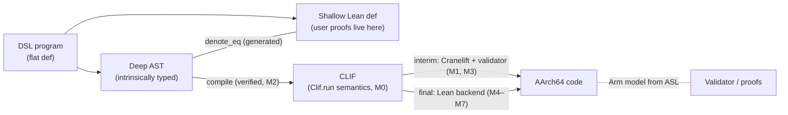

# Plan: a verified compiler for a Lean-embedded DSL, via CLIF to AArch64

*Status: design plan, September 2026. Hand-off document for an engineer or AI picking up the work.*

## 0. How to use this document

- Read sections 1–4 before writing code. Section 4 is the work plan; each milestone lists deliverables, exit criteria, and references.
- Everything marked **\[verify\]** was true when this plan was written but may have changed: crate versions, file paths inside repos, tool status. Check before relying on it.
- Ground rules for the implementation:
  - No `sorry` in merged proofs. Every milestone that claims a theorem must show `#print axioms <thm>` listing only `propext`, `Classical.choice`, `Quot.sound` (plus `Lean.ofReduceBool` where `bv_decide` is used).
  - Never add an `axiom` to stand in for a spec. Model things with `def`s; if a model can be wrong, it should be *checkable* (tested or proven against an external source), not assumed.
  - Pin external dependencies (Cranelift version, Lean toolchain, Arm model) and treat upgrades as explicit migrations.

## 1. Goal and scope

Build a small language, embedded in Lean 4, whose programs are proven correct in Lean and compiled to AArch64 machine code by a compiler that is itself formally verified end to end.

The path is DSL → CLIF (Cranelift IR) → AArch64. Cranelift is used as the working backend at first. Its stages are then replaced one at a time by verified Lean components, until a single end-to-end theorem holds from DSL semantics to Arm machine semantics.

**In scope now:**

- the DSL
- a CLIF semantics in Lean
- a verified DSL → CLIF emitter
- Cranelift as the interim backend, with per-function validation
- a Lean AArch64 backend built incrementally

**Deferred (do not start until M7):**

- **DSL → Rust emission** (a fast path through rustc/LLVM, checked by a Charon/Aeneas round trip).
- **Mid-end CLIF → CLIF optimisations.**
- **SIMD variants.**
- **x86-64.** It lacks an authoritative formal ISA source; AArch64 has Arm's ASL.
- **A RISC-V target for a zkVM guest.**

**Single target triple:** `aarch64-unknown-linux-gnu`. Do not model Apple's AArch64 ABI; it differs, for example x18 is reserved there.

## 2. Architecture



The theorem chain at the end:

```lean
theorem compile_correct (f : FlatFn σ τ) (h : f.checked) :
    Clif.run (compile f) = denote f
theorem backend_correct (f : FlatFn σ τ) (h : f.checked) :
    Arm.run (emit (regalloc (isel (compile f)))) ≈ denote f
```

Users only ever prove things about the shallow definitions. They never see CLIF or Arm.

## 3. Design decisions (settled; don't relitigate without a reason)

### 3.1 The DSL

- **A restricted fragment of Lean `do`-notation**, entered via a custom command (working name `flat def`). It is not a separate language with its own parser.
- **Two linked forms per program.** `flat def` elaborates to:
  1. a deep AST: an intrinsically typed `inductive`, indexed by context and type, so ill-typed programs cannot be represented;
  2. an ordinary shallow Lean `def`;
  3. a generated theorem `denote ast = shallowDef`.

  Compilers read (1); users prove things about (2). **Risk:** for large bodies, `rfl` on `denote_eq` may be slow. Generate the proof by `simp [denote]` if needed, and measure on the largest realistic function early.
- **Exactly one effect: `M := Except Err`.** No `IO`, no other monads, no `partial`.
- **Total by construction.** Structural recursion; bounded `for i in [0:n]` loops only, compiled as folds. `while` requires `termination_by` or explicit fuel.
- **Value semantics with an affine rule.** Mutation is functional update (`s := s.set k v`). After a value has been updated, the old binding is dead, and the checker rejects any later use. Copies must be written as `.clone`. This is what makes in-place compilation sound, and it makes deallocation points static.
- **Explicit arithmetic.** Machine integers are `BitVec n` or `UIntN`. `+%` wraps; `+?` is checked and throws. A bare `+` on machine integers is rejected.
- **Fixed-size types only.** For example `Vector UInt8 32`. No general dependent types; only simple generics.
- **Abstract collections.** Types such as `Map K V` are specified by their laws in Lean. The initial implementation is runtime extern calls. The long-term plan is to implement them in the DSL itself on top of an array/arena primitive. Iteration order must be deterministic (no hash-order dependence).
- **Contracts.** `requires` / `ensures` clauses become theorem obligations. Definitions are `@[irreducible]` outside their own module, so callers see only the contract lemma. The frontend generates `@[simp]` equation lemmas.
- **No giant matches.** Large dispatches, such as an opcode table, are tables of separately defined functions.

### 3.2 Lowering conventions

- **`throw e` lowers to a returned error tag, never to a CLIF trap.** CLIF supports multiple return values. Traps compile to `udf` and raise SIGILL, which is not the proven semantics. Reserve traps for provably unreachable cases.
- **Memory-operation flags are proof obligations.** `notrap` and `aligned` may only be emitted when the emitter can justify them, which it can via fixed-size types and checked indices. In the CLIF semantics these flags are preconditions, not behaviour.
- **Runtime calls use the default C ABI for the target triple.**

### 3.3 The CLIF semantics (`Clif.run`)

- **Executable, not relational.** It must be possible to compute through it in proofs and to run test vectors on it.
- **Only the subset the emitter produces:**
  - typed SSA values;
  - blocks with parameters;
  - `jump` / `brif` / `br_table` / `return`;
  - integer and bitwise ops as `BitVec` definitions;
  - byte-addressed memory with load/store;
  - calls, whose meaning comes from callee semantics or runtime specs;
  - explicit trap results.
- **The allowed subset is a named, versioned artifact.** Maintain an explicit list of opcodes the emitter may produce.

### 3.4 The Lean backend (final state)

- **Instruction selection** interprets Cranelift's existing ISLE lowering rules, exported to Lean as data. Each rule used is a theorem about CLIF meaning versus Arm meaning. You do not write ISLE from scratch.
- **Register allocation** follows CompCert's approach: an untrusted allocator plus a checker proven in Lean.
- **Encoding** is proven via `decode (encode i) = i` against an ASL-derived decoder.
- **Branch range is checked, never silently truncated.** *Implemented in M5:* encoding fails with a compile error when a branch target is out of range (`Insn.encode_inRange` / `encode_error_of_out_of_range`).
- **Register-width convention: an i8/i16/i32 value occupies the low `w` bits of a 64-bit register; the upper bits are unspecified** (`Holds ty s r v`). This is Cranelift's convention. *Finding from the isel probe (2026-09-27):* a `CanonReg w` "upper bits zero" invariant is false for rule outputs (e.g. `iadd` at i8 leaves bits 8..31 dirty). Rules that need clean bits re-extend their operands themselves, so every obligation stays local to its rule. See `docs/contracts/backend-proof.md`.

## 4. Milestones

Each milestone leaves a working toolchain. Components are replaced one at a time, and the previous path is kept as a cross-check.

### M0: CLIF semantics in Lean

**Deliverables**

- `Clif` syntax as a Lean `inductive`.
- A CLIF text printer and parser.
- `Clif.run`.
- A harness that runs Cranelift's `.clif` filetests (`; run:` lines) through `Clif.run`.

**Exit criteria**

- The filetests covering the chosen opcode subset pass.
- Results agree with Cranelift's interpreter (`test interpret`) on the same files.
- Every opcode in the subset has been cross-read against its VeriISLE spec in `inst_specs.isle`, where one exists.

**References:** CLIF IR docs; Cranelift filetests; `cranelift-reader`; the Cranelift interpreter; VeriISLE CLIF specs `cranelift/codegen/src/spec/inst_specs.isle` (see §7).

### M1: DSL → CLIF, compiled by Cranelift

**Deliverables**

- The `flat def` command, the fragment checker (including the affine rule), deep and shallow elaboration, and `denote`.
- An unproven `compile : FlatFn → Clif.Function`.
- `lake exe emit`, which writes `.clif` files.
- The `clif2obj` driver (Appendix A), producing `aarch64` objects.
- CI running the tests on AArch64 hardware or under `qemu-aarch64`.
- A tiny runtime providing the collection externs.

**Exit criteria**

- Four-way differential testing agrees on a corpus: `denote`, `Clif.run`, the Cranelift interpreter, and native execution.
- The corpus includes loops, checked arithmetic that overflows, error paths, and calls into the runtime.

**Driver settings (verification-friendly)**

- `opt_level=none`
- `enable_verifier=true`
- `regalloc_checker=true`
- `is_pic=true`

**Known result:** at `opt_level=none`, checked adds lower to `adds` / `cset` / `uxtb` / `cbnz` rather than `b.hs`. This is expected, and it is slow.

### M2: Prove the emitter

**Deliverables**

- `compile_correct`.
- Automatic generation of `denote_eq` for each program.
- Proofs that the `notrap` / `aligned` flags are justified.

**Exit criteria**

- `#print axioms compile_correct` is clean.
- DSL → CLIF is now verified.

### M3: Arm model and per-function validator

*Status (2026-09-27):* the Arm model is done (LNSym port, co-simulated against qemu). The
validator is **optional** now that the FV compiler is all-Lean. It is paused on branch
`agent/validator` and only needed to ship Cranelift's own machine code with assurance.

**Deliverables**

- An AArch64 semantics in Lean, derived from Arm's ASL. Evaluate LNSym versus a Sail Arm export during M1 and decide by M3; this choice gates everything after it.
- A validator that symbolically executes the AArch64 code Cranelift emits and checks it against the function's CLIF. It uses `bv_decide` / SAT, with the state relation covering the ABI, the register mapping, and memory.
- Relocation dumps from `clif2obj`, via `code.buffer.relocs()` \[verify API\], so that calls through the GOT are treated as abstract calls governed by the callee's contract.

**Exit criteria**

- Every function in the corpus validates.
- At this point shipped binaries have per-function verified assurance, even though Cranelift itself is unverified.

**Optional:** emit Cranelift proof-carrying-code facts for loads and stores as an independent memory-safety check (§7). Check whether PCC is stable in the pinned version.

### M3b (optional): Lean-optimised CLIF ≡ Cranelift-optimised CLIF

*Added 2026-09-27; reframed the same day.* The FV compiler's mid-end is implemented in Lean
and proven (see "Lean mid-end" under M7). This optional check compares, one function at a time,
the optimised CLIF from the Lean mid-end with the optimised CLIF from Cranelift. Because Lean's is
proven equivalent to the input, a successful check shows Cranelift's is too.

- If the Lean mid-end uses the same exported Cranelift `simplify` rules, the two optimised CLIFs
  are nearly identical and the check is mostly syntactic (matching value numbers). Where they
  differ, fall back to skeleton alignment plus `bv_decide` on the pure values.
- On its own this covers Cranelift's mid-end only. Shipping Cranelift's machine code also needs
  M3 (optional).
- Inputs: cg_clif dumps `.unopt.clif` and `.opt.clif` for each function (see
  `docs/research/rust-clif-survey.md`).

### M4: Own AArch64 backend, simplest version

**Deliverables**

- An ISLE → Lean exporter, built on the `cranelift-isle` crate's parser and AST.
- Proofs of the aarch64 `lower` rules the emitter's subset needs: per-width case splits closed by `bv_decide`, with ISLE `if` conditions as hypotheses. Cross-check against VeriISLE's ASL-derived specs (`cranelift/codegen/src/isa/aarch64/spec/`) and its CI results.
- A Lean instruction selector that interprets the rules; exhaustive matching over the subset gives coverage.
- A stack-slot "allocator": every value lives in a frame slot and is loaded before each use and stored after it. The correctness proof is near-trivial.
- Assembly text output, assembled by `llvm-mc` / `as`. The assembler is a temporarily trusted component.

**Exit criteria**

- Behaviour matches Cranelift's output on the whole corpus.
- Instruction selection is proven.

### M5: Proven encoder

**Deliverables**

- Lean encoding for the emitted instructions.
- `decode (encode i) = i` against the ASL-derived decoder.

**Exit criteria**

- Output bytes match `llvm-mc` for everything emitted.
- The assembler is removed.

### M6: Real register allocation

**Deliverables**

- An untrusted allocator. *Decision (2026-09-27): use the `regalloc2` crate unchanged (0.15.2, the version Cranelift 0.136.1 uses), driven from Lean through `rust/crates/lean-regalloc`, instead of a hand-written linear scan.*
- A checker proven in Lean, following Rideau & Leroy's approach.

**Exit criteria**

- The checker accepts all corpus allocations.
- Performance is measured against both Cranelift and the stack-slot baseline.

### M7: End-to-end theorem

*Status (2026-09-28): **proven.*** `E2E.backend_correct_final` (FV/E2E/Final.lean) states that for every
in-subset CLIF function compiled by the Lean backend (isel by the exported ISLE rules, regalloc2 plus the
proven checker, the Lean encoder and layout), the Arm run from an AAPCS64 entry refines `Clif.run`:
returns agree, traps agree, and there is no claim on stuck or out-of-fuel runs. `#print axioms`:
`propext`, `Classical.choice`, `Quot.sound` plus `bv_decide` certificates only; no `sorry` and no
hand-written axioms.

Remaining hypotheses are assumptions, not open proofs:
- `FormsCovered`, decided per function by `formsCoveredB` (913/913 in the test suites);
- the callee contracts `CalleeOk` and `XCallsOk`;
- link-time facts (`hsym`, `hslot`);
- per-run entry conditions (`AbiEntry`, `StackAvail`, `BodyEntry`, `ArgsIn`, `ClifEntry`, `Rel.holds`, `TrapsExplicit`).

The compiler enforces the side conditions with proven-sound validators: `lowerCheck`, `prepCheck`, `checkAlloc`, `ctlCheck`, `FormOk` and the branch-range check. The exact list is in `docs/contracts/e2e.md`.

**Deliverables**

- `backend_correct`, composed from the M4, M5 and M6 theorems. It holds under an explicit resource precondition (no stack or memory exhaustion), as CompCert's does.
  *Restated (2026-09-27):* the frontend is pluggable and trusted for now (the `flat def` DSL, or Rust via rustc_codegen_cranelift), so the theorem is stated over in-subset CLIF programs instead of being composed with `compile f`. Roughly: `∀ p, p ∈ subset → Arm.run (emit (regalloc (isel p))) ≈ Clif.run p`. M2 (`compile_correct`) is paused; partial work is on branch `agent/m2proof`.
- Cranelift, and the optional M3 validator and M3b check, are kept as cross-checks, not trust anchors.

**Lean mid-end (part of the FV compiler; after the backend proofs are underway):**
- Export Cranelift's `simplify` rules (`codegen/src/opts/*.isle`) with `isle2lean` and prove each one against `Clif.run` before enabling it.
- Implement GVN, DCE and LICM as proven Lean passes.
- The end-to-end theorem then covers the mid-end too:
  `Arm.run (emit (regalloc (isel (opt p)))) ≈ Clif.run p`.

**Then:** SIMD, RISC-V, and a verified frontend (the DSL's `compile_correct`, or a Rust path).

## 5. Trusted base by milestone

| After | Trusted |
| --- | --- |
| M1 | Everything: the emitter, Cranelift, the driver, the runtime |
| M2 | Cranelift (all stages), the CLIF printer and parser, the runtime |
| M3 | The Arm model, the validator, the CLIF semantics' fidelity, the linker/loader, the runtime. Cranelift is **untrusted**: a bug in it now shows up as a validation failure, not as a silently wrong binary. |
| M7 | Lean kernel; `bv_decide`'s compiled LRAT checker; Lean's compiler and C compiler (they run the compiler); Arm model fidelity; object writing, linking and loading; the runtime/allocator shim; OS and hardware |

**Never covered:**

- **That a program's spec says what was intended.** That is the job of the users' contract proofs.
- **Timing side channels.** Constant-time behaviour needs a separate preservation proof.

## 6. Known gaps, risks, open questions

**Why Cranelift alone is not a verified compiler.**

*Update to earlier assumptions, from Cranelift `main` at commit `11eac9d` (26 Sep 2026):*

- The ISLE verifier (now called **VeriISLE**, the successor to Crocus) runs in Cranelift CI incrementally whenever ISLE sources change.
- It verifies *chains* of rules ("expansions"), not isolated rules.
- It checks aarch64 against specs derived from Arm's ASL via ASLp (OOPSLA 2025 paper, §7).
- Its default aarch64 run excludes vector operations and expensive divisions.
- x64 coverage is minimal: the README's example is the `iadd` base case.
- It also has a mid-end (`simplify`) configuration.

This is much stronger than a prototype. It is still not an end-to-end theorem, because the following remain unverified:

- the Rust helper extractors and constructors that have hand-written specs
- the generated matcher and rule priorities (verify how expansions treat priority/overlap)
- the lowering context (load sinking, side-effect ordering)
- ABI and frame code
- register allocation (the regalloc2 checker is translation validation, run mainly in fuzzing)
- `MachBuffer` (branch relaxation, fixups, constant pools)
- instruction encoding

**Implications for this plan**

- **M0:** cross-check `Clif.run` against VeriISLE's CLIF specs (`cranelift/codegen/src/spec/inst_specs.isle`).
- **M4:** reuse VeriISLE's ASL-derived aarch64 specs and its expansion results as a cross-check for the Lean rule proofs. The Lean versions add kernel-checked proofs tied to the *same* `Clif.run` used by `compile_correct`, so the theorems compose.
- **The emitter's opcode subset:** prefer opcodes whose expansions VeriISLE verifies by default.

**`if` clauses.** A May 2025 Zulip thread reported that the then-upstream verifier ignored ISLE `if` conditions. The verifier has since been reworked \[verify whether this still applies\]. The Lean port models conditions as hypotheses either way.

**Cranelift churn.** Releases are roughly monthly and break things. The text format has shifted (trap code names, `br_table` syntax).

- Versions seen while writing this plan: 0.130.2 builds on Rust 1.91; 0.136.1 needs Rust 1.96 \[verify\].
- On each version bump, re-run the filetests through `Clif.run`, VeriISLE on the rules you rely on, and the differential corpus.

**Arm model size.** A full Sail Arm model is very large. It may be necessary to extract only the instructions the backend emits. Decide during M1.

**x86-64.** There is no ASL equivalent. If x86 is ever needed, use ACL2 x86isa or the K framework semantics, restricted to the emitted subset and cross-validated on hardware. Expect EFLAGS and partial-register-write issues.

**`denote_eq` performance** at scale (§3.1).

**Runtime.** It is currently extern Rust. The end state is collections written in the DSL, plus a small allocator and shim written in CLIF or assembly. Affine ownership means the emitter can insert frees statically, which is one more emitter pass to prove.

## 7. Reference index

All GitHub links below were checked to resolve on 26 Sep 2026. In-repo paths can move, so re-check them against the pinned version.

### Cranelift and CLIF

- **Overview and design goals** (no undefined behaviour in the IR; verification focus): [https://cranelift.dev/](https://cranelift.dev/)
- **Source**, inside the Wasmtime monorepo: [https://github.com/bytecodealliance/wasmtime/tree/main/cranelift](https://github.com/bytecodealliance/wasmtime/tree/main/cranelift)
- **CLIF IR reference:** [https://github.com/bytecodealliance/wasmtime/blob/main/cranelift/docs/ir.md](https://github.com/bytecodealliance/wasmtime/blob/main/cranelift/docs/ir.md)
- **Filetests**, `.clif` files with `test interpret` / `test run` and `; run:` lines (a semantics oracle): [https://github.com/bytecodealliance/wasmtime/tree/main/cranelift/filetests/filetests](https://github.com/bytecodealliance/wasmtime/tree/main/cranelift/filetests/filetests)
- **CLIF interpreter**, the de facto reference semantics: [https://github.com/bytecodealliance/wasmtime/tree/main/cranelift/interpreter](https://github.com/bytecodealliance/wasmtime/tree/main/cranelift/interpreter)
- **Crates used by the driver:** `cranelift-codegen`, `cranelift-reader`, `cranelift-module`, `cranelift-object` on docs.rs. Settings are documented at `cranelift_codegen::settings::Flags`, including `opt_level`, `enable_verifier`, `regalloc_checker` and the PCC flag.
- **Proof-carrying code:** [https://docs.wasmtime.dev/api/cranelift_codegen/ir/pcc/index.html](https://docs.wasmtime.dev/api/cranelift_codegen/ir/pcc/index.html). For background see the Bytecode Alliance post "Wasmtime and Cranelift in 2023", [https://bytecodealliance.org/articles/wasmtime-and-cranelift-in-2023](https://bytecodealliance.org/articles/wasmtime-and-cranelift-in-2023)
- **regalloc2 and its checker:** [https://github.com/bytecodealliance/regalloc2](https://github.com/bytecodealliance/regalloc2) (see `src/checker.rs`)
- **`rustc_codegen_cranelift`**, not used in this plan, listed for context: [https://github.com/rust-lang/rustc_codegen_cranelift](https://github.com/rust-lang/rustc_codegen_cranelift)

### ISLE and its verification

- **ISLE design**, Chris Fallin, "Cranelift's Instruction Selector DSL, ISLE: Term-Rewriting Made Practical": [https://cfallin.org/blog/2023/01-20/cranelift-isle/](https://cfallin.org/blog/2023/01-20/cranelift-isle/)
- **ISLE compiler crate**, whose parser and AST the exporter builds on: [https://github.com/bytecodealliance/wasmtime/tree/main/cranelift/isle/isle](https://github.com/bytecodealliance/wasmtime/tree/main/cranelift/isle/isle)
- **aarch64 rules:**
  - `cranelift/codegen/src/isa/aarch64/lower.isle`
  - `cranelift/codegen/src/isa/aarch64/inst.isle`
- **Mid-end rules:** `cranelift/codegen/src/opts/*.isle`
- **VeriISLE**, the successor to Crocus: [https://github.com/bytecodealliance/wasmtime/blob/main/cranelift/isle/veri/README.md](https://github.com/bytecodealliance/wasmtime/blob/main/cranelift/isle/veri/README.md)
  - ASL-derived aarch64 specs: `cranelift/codegen/src/isa/aarch64/spec/*.isle`, generated by `cranelift/isle/veri/isaspec` via ASLp (`cranelift/isle/veri/aslp`)
  - CLIF instruction specs: `cranelift/codegen/src/spec/inst_specs.isle`
  - Mid-end specs: `cranelift/codegen/src/spec/opt.isle`
  - CI job: `.github/workflows/main.yml` (search for `isle-veri`)
- **Papers:**
  - McLoughlin, Sheng, Fallin, Parno, Brown, VanHattum, "Scaling Instruction-Selection Verification against Authoritative ISA Semantics", OOPSLA 2025, [https://doi.org/10.1145/3764383](https://doi.org/10.1145/3764383)
  - VanHattum et al., "Lightweight, Modular Verification for WebAssembly-to-Native Instruction Selection" (Crocus), ASPLOS 2024, [https://doi.org/10.1145/3617232.3624862](https://doi.org/10.1145/3617232.3624862). Artifact: [https://github.com/avanhatt/asplos24-ae-crocus](https://github.com/avanhatt/asplos24-ae-crocus)

### ISA semantics (AArch64)

- **LNSym**, an Arm semantics and symbolic simulation in Lean: [https://github.com/leanprover/LNSym](https://github.com/leanprover/LNSym)
- **Sail Arm**, translated from Arm's ASL: [https://github.com/rems-project/sail-arm](https://github.com/rems-project/sail-arm)
- **Sail language and backends** (check the state of its Lean backend): [https://github.com/rems-project/sail](https://github.com/rems-project/sail)
- **Isla**, symbolic execution over Sail ISA models, useful as prior art for the validator: [https://github.com/rems-project/isla](https://github.com/rems-project/isla)
- **s2n-bignum**, verified x86 and Arm assembly in HOL Light (prior art for machine-code proofs): [https://github.com/awslabs/s2n-bignum](https://github.com/awslabs/s2n-bignum)

### Lean tooling

- **Lean language reference**, including `bv_decide`, `grind`, `simp` and the `do`-notation desugaring: [https://lean-lang.org/doc/reference/latest/](https://lean-lang.org/doc/reference/latest/)
- **Lean-MLIR**, verified peephole rewrites with `bv_decide`, a model for the M4 rule proofs: [https://github.com/opencompl/lean-mlir](https://github.com/opencompl/lean-mlir)
- For monadic verification-condition generation, check Lean's `Std.Do` / `mvcgen` in the pinned toolchain \[verify\].

### Verified-compiler prior art

- **CompCert**, especially its validated register allocation (Rideau and Leroy, "Validating register allocation and spilling", CC 2010): [https://github.com/AbsInt/CompCert](https://github.com/AbsInt/CompCert)
- **CakeML:** [https://github.com/CakeML/cakeml](https://github.com/CakeML/cakeml)
- **Jasmin**, a high-assurance crypto language with a verified compiler and SIMD control: [https://github.com/jasmin-lang/jasmin](https://github.com/jasmin-lang/jasmin)

### Deferred paths (for later)

- **Aeneas and Charon**, for the Rust round trip: [https://github.com/AeneasVerif/aeneas](https://github.com/AeneasVerif/aeneas), [https://github.com/AeneasVerif/charon](https://github.com/AeneasVerif/charon). For scale evidence see "Scaling Verification of Cryptographic Software with Aeneas, Rust, and Lean" (SymCrypt), [https://arxiv.org/abs/2609.15648](https://arxiv.org/abs/2609.15648)
- **sail-riscv**, for a future RISC-V target: [https://github.com/riscv/sail-riscv](https://github.com/riscv/sail-riscv)
- **PolkaVM**, relocation-driven jump tables and a RISC-V recompiler (inspected at commit `dddfddb`): [https://github.com/paritytech/polkavm](https://github.com/paritytech/polkavm)

## Appendix A: `clif2obj` driver (working starting point)

This was built and run on 26 Sep 2026 with **Cranelift 0.130.2 and rustc 1.91**. Cranelift 0.136.x needs Rust 1.96, and the API may differ slightly \[verify\].

It was tested on the example in Appendix B with target `aarch64-unknown-linux-gnu`, and disassembled with `aarch64-linux-gnu-objdump -dr`. Cross-compiling needs the `all-arch` feature.

**Still to add:**

- relocation dumps (M3)
- the error-tag lowering convention, which is the emitter's job

`Cargo.toml`:

```toml
[package]
name = "clif2obj"
version = "0.1.0"
edition = "2021"
rust-version = "1.91"

[dependencies]
cranelift-codegen = { version = "0.130", features = ["all-arch"] }
cranelift-reader = "0.130"
cranelift-module = "0.130"
cranelift-object = "0.130"
anyhow = "1"
target-lexicon = "0.13"
```

`src/main.rs`:

```rust
//! clif2obj: compile a .clif file (emitted from Lean) to an object file,
//! with verification hooks on, and dump per-function machine code for
//! end-to-end validation.
//!
//! usage: clif2obj <input.clif> <target-triple> <out.o> <dump-dir>

use anyhow::{anyhow, Context as _, Result};
use cranelift_codegen::ir::{ExternalName, UserExternalName};
use cranelift_codegen::isa;
use cranelift_codegen::settings::{self, Configurable};
use cranelift_codegen::Context;
use cranelift_module::{Linkage, Module};
use cranelift_object::{ObjectBuilder, ObjectModule};
use std::{fs, str::FromStr};

fn main() -> Result<()> {
    let args: Vec<String> = std::env::args().collect();
    let [_, input, triple, out, dump_dir] = args.as_slice() else {
        return Err(anyhow!("usage: clif2obj <input.clif> <triple> <out.o> <dump-dir>"));
    };

    // Conservative, verification-friendly settings.
    let mut flags = settings::builder();
    flags.set("opt_level", "none")?;        // no mid-end rewrites until each rule is checked
    flags.set("enable_verifier", "true")?;  // CLIF well-formedness
    flags.set("regalloc_checker", "true")?; // regalloc2 symbolic checker on every function
    flags.set("is_pic", "true")?;
    let isa = isa::lookup(target_lexicon::Triple::from_str(triple).map_err(|e| anyhow!(e))?)?
        .finish(settings::Flags::new(flags))?;

    let src = fs::read_to_string(input)?;
    let funcs = cranelift_reader::parse_functions(&src).context("parsing CLIF")?;

    let mut module = ObjectModule::new(ObjectBuilder::new(
        isa, "flat", cranelift_module::default_libcall_names(),
    )?);
    fs::create_dir_all(dump_dir)?;

    // Declare every defined function first, so calls between them resolve.
    let mut ids = std::collections::HashMap::new();
    for f in &funcs {
        let name = test_name(&f.name)?;
        ids.insert(name.clone(), module.declare_function(&name, Linkage::Export, &f.signature)?);
    }

    let mut ctx = Context::new();
    for mut f in funcs {
        let name = test_name(&f.name)?;
        // Rewrite `fn0 = %foo(...)` references into module symbols. Anything not
        // defined in this file is an import (e.g. the Rust runtime's collections).
        for (_, ext) in f.dfg.ext_funcs.clone().iter() {
            let callee = ext_name(&ext.name)?;
            let sig = f.dfg.signatures[ext.signature].clone();
            let id = match ids.get(&callee) {
                Some(id) => *id,
                None => module.declare_function(&callee, Linkage::Import, &sig)?,
            };
            ids.insert(callee, id);
        }
        let refs: Vec<_> = f.dfg.ext_funcs.keys().collect();
        for fr in refs {
            let id = ids[&ext_name(&f.dfg.ext_funcs[fr].name)?];
            let r = f.params.ensure_user_func_name(UserExternalName::new(0, id.as_u32()));
            f.dfg.ext_funcs[fr].name = ExternalName::user(r);
        }

        ctx.clear();
        ctx.func = f;
        ctx.set_disasm(true);
        module
            .define_function(ids[&name], &mut ctx)
            .map_err(|e| anyhow!("{name}: {e:?}"))?;

        // Dump what the end-to-end validator checks against the CLIF.
        let code = ctx.compiled_code().ok_or_else(|| anyhow!("no code for {name}"))?;
        fs::write(format!("{dump_dir}/{name}.bin"), code.code_buffer())?;
        if let Some(d) = &code.vcode {
            fs::write(format!("{dump_dir}/{name}.vcode"), d)?;
        }
    }

    fs::write(out, module.finish().emit()?)?;
    Ok(())
}

fn test_name(n: &impl std::fmt::Display) -> Result<String> {
    // Parsed CLIF uses test-case names like `%foo`; strip the sigil.
    let s = n.to_string();
    s.strip_prefix('%').map(str::to_owned).ok_or_else(|| anyhow!("unexpected name {s}"))
}

fn ext_name(n: &ExternalName) -> Result<String> {
    match n {
        ExternalName::TestCase(t) => test_name(t),
        other => Err(anyhow!("expected a %name callee, got {other:?}")),
    }
}
```

## Appendix B: example CLIF and observed AArch64 output

```
function %sum_balances(i64, i64) -> i64 {
    fn0 = %balance_of(i64) -> i64

block0(v0: i64, v1: i64):            ; v0 = base ptr, v1 = count
    v2 = iconst.i64 0
    jump block1(v1, v0, v2)

block1(v3: i64, v4: i64, v5: i64):   ; loop header: remaining, ptr, acc
    brif v3, block2, block3(v5)

block2:
    v6 = load.i64 notrap aligned v4
    v7 = call fn0(v6)
    v8, v9 = uadd_overflow v5, v7    ; checked +?
    trapnz v9, int_ovf               ; NOTE: final emitter should return an error tag instead
    v10 = iadd_imm v4, 8
    v11 = iadd_imm v3, -1
    jump block1(v11, v10, v8)

block3(v12: i64):
    return v12
}
```

**Observed at `opt_level=none`**

- The call goes through the GOT: `adrp` / `ldr` with `R_AARCH64_ADR_GOT_PAGE` and `R_AARCH64_LD64_GOT_LO12_NC` relocations against `balance_of`.
- The checked add lowers to `adds` / `cset` / `uxtb` / `cbnz`.
- The trap is `udf #49439`.

## Appendix C: Lean skeleton (shapes, not final code)

```lean
-- DSL: deep embedding (intrinsically typed)
inductive Ty | u8 | u64 | u256 | bool | vec (n : Nat) (t : Ty) | ...
inductive Stmt : Ctx → Ty → Type
structure FlatFn (σ : List Ty) (τ : Ty) where body : Stmt σ τ
def denote : FlatFn σ τ → Args σ → M τ
def FlatFn.checked : FlatFn σ τ → Prop        -- affine rule, fragment rules

-- CLIF
structure Clif.Function where ...
def Clif.run : Clif.Function → Args σ → M τ     -- executable
def Clif.print : Clif.Function → String
def Clif.parse : String → Except String Clif.Function

-- Compiler
def compile : FlatFn σ τ → Clif.Function
theorem compile_correct (f : FlatFn σ τ) (h : f.checked) :
    Clif.run (compile f) = denote f

-- Backend (M4–M7)
def isel : Clif.Function → Arm.VCode             -- interprets exported ISLE rules
def regalloc : Arm.VCode → Arm.Code               -- untrusted + proven checker
def emit : Arm.Code → ByteArray                    -- decode ∘ encode = id
theorem backend_correct (f : FlatFn σ τ) (h : f.checked) :
    Arm.run (emit (regalloc (isel (compile f)))) ≈ denote f
```