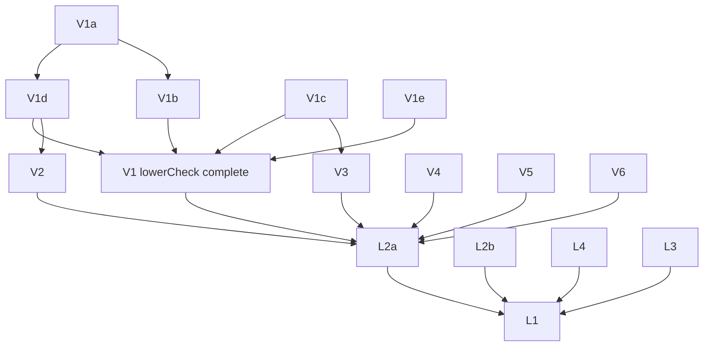

# What remains to be proven

Goal: **the compiler itself is formally verified.** Its correctness is one set of theorems proven once, for
every input program, with no per-program certificates: no validator verdict as a theorem premise, no
per-crate `native_decide` proof files, no external tool whose output must be checked for the result to be
correct. This file lists everything between today's state and that goal, split into work packages (WPs)
that agents can take independently. It supersedes the proof items in `docs/PLAN.md` "Next steps" item 4;
`docs/DEFERRED.md` keeps the detailed background for several WPs and is referenced from them.

Written 2026-10-05 against `main` = `18062c8`.

## 1. Target

### 1.1 The theorems we want

Per function (`Clif.Function` in, `FnBin` out):

```lean
-- correctness, no checker premise; InScope is a decidable predicate on the INPUT only
theorem compile_correct : InScope f → compileFn f = .ok fb → <runs of fb refine runs of f>
-- totality: an in-scope function always compiles
theorem compile_total   : InScope f → ∃ fb, compileFn f = .ok fb
```

Per executable (CLIF program + data + outside objects in, ELF bytes out):

```lean
theorem compileExe_correct :
  InScopeP P → compileExe P outside = .ok elf → <every ABI entry into a program function of elf,
  under the outside-code contracts, refines the whole-program CLIF run>
theorem compileExe_total : InScopeP P → ∃ elf, compileExe P outside = .ok elf
```

### 1.2 What "no per-program certificate" means here (decision)

Every check the compiler runs today falls in one of five kinds. The goal admits the first two only.

| Kind | Example | Allowed in the goal? |
| --- | --- | --- |
| **Proven pass:** the pass is proven correct directly | encoder (`Insn.decode_encode`), `prepare` on `PrepDomain` (`Prep.prepare_correct`) | yes |
| **Internal check with a proven fallback:** the compiler runs a check and on rejection uses a path that's proven directly; the theorem has no premise about the check | mid-end: every validator failure keeps the last accepted function (`FV/Opt/Optimize.lean:150-156`), so `optimize_sim_proven` has no checker premise | yes; rejections cost only code quality |
| **Validator as a premise:** the theorem assumes the check returned `true` for this program | `lowerCheck`, `prepCheck`, `checkAlloc`, `formsCoveredB` (`Compiled`/`FormsCovered`, `FV/E2E/Statement.lean:144-153`, `FV/E2E/Final.lean:162`); `okB`, `BinOk` (`goodN` was one until L4: now `goodN_iff`, the input condition "no call cycle reachable") | **no**: needs a completeness proof (the check never fails on what the compiler produces for in-scope input), a direct proof of the pass, or a fallback |
| **Internal rejection without fallback:** compilation fails | branch out of range (`FV/Backend/Encode.lean:315-327`), `ctlCheck` (the allocator-frame limit is gone, V5) | allowed for correctness, but **violates totality**: each must be removed, proven unreachable, or moved into `InScope` as a condition on the input |
| **Per-program proof via `native_decide`** | `crate-proofs/Crates/*.lean`: `link_ok`, `bin_ok`, `stack_ok` (`FVTest/E2E/LinkCheckMain.lean:307-432`; since L4 `stack_ok` evaluates an input condition and the bound, `stackB_isSome_iff`) | **no**: disappears once linking, binary and stack checks are proven complete or replaced (WPs L1–L4) |

An external program (regalloc2, rust-lld) may stay in the loop only as an oracle whose result is checked
and, on rejection, replaced by a directly proven Lean path (kind 2). Correctness then never depends on it.

### 1.3 Trusted by design (not part of this file's goal)

- the frontend: rustc + rustc_codegen_cranelift produce the CLIF; the theorems are relative to it;
- Lean's kernel; `bv_decide`'s LRAT check and `Lean.ofReduceBool` in the **fixed** rule/encoder proofs
  (proven once, not per program; see T6 to reduce it);
- the Arm model and `Clif.run` as specifications (fidelity is tested, not proven: T4, T5);
- the contracts of code outside the program (std, musl, cg_clif-fallback functions), the OS loader.

## 2. Where each stage stands

| Stage | Implemented in | Verified today by | Kind (§1.2) | WP |
| --- | --- | --- | --- | --- |
| mid-end `simplify` rules | Lean (ISLE data) | 1012 + 19 rule theorems; unproven rules disabled (`ruleAllow := .proven`) | proven | R1–R9 (coverage) |
| mid-end passes (GVN, DCE, LICM, simplify driver, unreachable, `Opt.check`) | Lean | `editOk`, `simpOk`, `wfCert`, `unreachableOk`, `keepsBackendSubset` + soundness | fallback | M1 (quality only) |
| i128 legalisation | Lean | `Opt.Legal.check` + `check_complete` on `Pre f` (`FV/Opt/Proof/LegalComplete.lean:1718`) | validator, complete on `Pre` | S6 |
| instruction selection | Lean (ISLE data) | `LowerRulesCorrect` etc., proven once | proven | — |
| lowering driver | Lean `lowerFunction` | `lowerCheck`, complete on `Dominated`/`LowerScope` (`lowerCheck_complete`) | validator, complete on decidable input conditions | V1 done |
| form coverage | Lean (ISLE data) | `formsCoveredB`, complete on `LowerScope` (`formsCovered_complete`) | validator, complete on decidable input conditions | V3 done |
| `prepare` | Lean | `prepCheck`, complete on `PrepDomain`, which `lowerFunction` always produces (`prepDomain_of_lower`) | validator, complete | V2 done |
| register allocation | **external Rust** (regalloc2 0.15.2 via `lean-regalloc`), Lean fallback `spillAlloc` | `checkAlloc` (`FV/Backend/RegallocCheck.lean:423-441`) on regalloc2's output; on rejection `spillAlloc` (`allocResult`, `E2E.backend_correct_final_alloc`), accepted by `checkAlloc` for every in-scope function (`E2E.spillAccepted`, proven) | fallback; its acceptance proven | V4 (a) done; (b) open |
| frame, control lowering | Lean `lowerRFunc` | internal rejections (`ctlCheck`, operand/move shapes; no frame-size limit since V5); a rejection of regalloc2's allocation falls back to `spillAlloc`, which `lowerRFunc` provably lowers (`E2E.lowerRFunc_spillAlloc`) | fallback; its lowering proven | V5 done |
| emission, layout | Lean | branch range check, no relaxation | rejection | V6 |
| encoder | Lean | `Insn.decode_encode` (`FV/Backend/Proof/Encode.lean:57-60`) | proven | — |
| linking (program level) | `cargo fv` object merge + **rust-lld** | **`okB`** (`FV/E2E/LinkCheck.lean:716-777`) per crate by `native_decide` | **validator premise + oracle + per-program proof** | L1, L2 |
| executable bytes | **rust-lld** | **`BinOk`** (`FV/E2E/BinCheck.lean:539-543`) per crate by `native_decide` | **validator premise + oracle + per-program proof** | L2 |
| executable semantics | — | `E2E.ExecBytes.binary_correct_exec`: the executable's own words (outside calls and TLS by hooks), under `RunOk` (per-state facts of the model's run, not yet exported by M6; witnessed jointly with the other premises, `binary_correct_exec_witness`) | partial | L3 |
| stack bound | Lean `budMap` | `budOkW` proven for `budMap`'s budgets (`budOkW_budMap`), no run-time check; `goodN`/`stackB` characterised as "no call cycle reachable" (`goodN_iff`, `stackB_isSome_iff`); per crate the input condition and the bound still by `native_decide` (`stack_ok`) | input condition + per-program evaluation (until L1) | L4 done |

Mid-end note: the mid-end is already certificate-free in the sense of §1.2, so M1 is optional.

## 3. Work packages: removing per-program certificates (critical path)

Each WP lists: **Now**, **Deliver**, **Depends**, **Size** (from the cited feasibility notes; `[est]` = the
author's estimate, not measured), **Risk**.

### V1. `lowerCheck` completeness — **done** (`6db15bd`, #4)

- **Done:** `lowerCheck_complete : Dominated f → LowerScope f → lowerFunction f = .ok vc → lowerCheck f vc = true`
  (`FV/Backend/Proof/LowerComplete.lean`), `E2E.Compiled.of_lower` (`FV/E2E/LowerDirect.lean`);
  `Dominated`/`LowerScope` decided by `dominatedB`/`lowerScopeB` (all 1148 in-scope functions). V1a changed `inFix`
  to a fuel-bounded worklist and made `lowerFunction`'s alias resolution class-preserving (identical output).
  Details: `docs/contracts/e2e.md` "Validator completeness".

- **Remaining from V1:** `Dominated` and `LowerScope` should join `InScope` (L1/L2a); not proven to follow
  from Cranelift's verifier rules. The compiler still runs `lowerCheck` as a runtime double-check.
- **Original plan (kept for reference):**
- **Sub-packages (can run in parallel after V1a):**
  - **V1a.** Rewrite `inFix` (the must-availability worklist, `partial` today) with fuel, as `reachable`/`rpo` are.
    No behaviour change: check the filetests and `lean-e2e-check` counts. Small.
  - **V1b.** Dataflow completeness: under `Dominated`, the fixpoint contains every dominating definition. 1.5–2k lines.
  - **V1c.** Def-set property of the ISLE rules: every rule's emitted code defines only fresh vregs (≥ `nextVreg`)
    or the statement's result vregs. Prefer a decided property over the exported rule data (like
    `excludedUnmatchable`) to per-rule lemmas. 2–4k lines, or one decision procedure + its soundness.
  - **V1d.** Simulation of `lowerFunction`'s imperative loop by `lowBlocks` (bookkeeping, in the style of
    `PrepareComplete.prepare_facts`). 1–1.5k lines.
  - **V1e.** Alias chase: `resolve` (fuel-bounded array chase) agrees with `gnTable`/`chase` (acyclic alias
    chains). 0.5–1k lines. Plus the remaining conjuncts (`ctxOk`, `brIdxOk`, flags, `callsStackOkB`,
    `entryOkB`): 0.5k lines.

### V2. `PrepDomain` of the lowering output — **done** (`6db15bd`, #4: `prepDomain_of_lower`)

- **Now:** `prepCheck_complete` needs `PrepDomain vc`; `prepDomainB` holds on all 1067 corpus/runtest
  functions, but nobody proved `lowerFunction` always produces it.
- **Deliver:** `lowerFunction f = .ok vc → PrepDomain vc` (non-empty, labels = block indices, branch
  arguments only on `jump`/edge blocks). Removes the `prepCheck` premise everywhere.
- **Depends:** shares the loop invariant with V1d; do it inside V1d or right after. **Size:** small–medium `[est]`.

### V3. Form coverage (`formsCoveredB`) — **done** (#5)

- **Done:** `formsCovered_complete : LowerScope f → lowerFunction f = .ok vc →
  prepare vc = .ok vcp → FormsCovered cx vcp` (`FV/Backend/Proof/FormsCoverComplete.lean`) and
  `E2E.backend_correct_final_of_lower` (`FV/E2E/FinalDirect.lean`): `backend_correct_final` from the
  pipeline's results and `dominatedB`/`lowerScopeB`, without `Compiled` and `hcov`; only `checkAlloc`
  remains. Decided once over the rule data: an abstract interpretation of the ISLE rules (`IselCov*.lean`,
  summary table `covTab` from `FVTest/Backend/IselCovGen.lean`, 12 `native_decide` checks).
  The ISLE-level lemmas use `LogicImmComplete` (every logical immediate `ImmLogic.ofNat?` accepts is
  encodable), proven by `logicImmComplete` (`FV/Backend/Proof/LogicImmComplete.lean`, kernel `decide` over
  the 5334 (element size, run, rotation) triples).
- **Remaining:** the compiler still runs `formsCoveredB` in `lean-e2e-check` as a double-check.

### V4. Register allocation without trusting regalloc2 — (a) **done** (#56, allocation no longer a premise); (b) open as #57

- **Done (a), 2026-10-05:** the fallback `spillAlloc : VCode → RFunc` (`FV/Backend/SpillAlloc.lean`: every
  vreg in its own stack slot, operands moved into registers that meet their constraints around each
  instruction, all callee-saved registers saved, block arguments as a two-phase parallel copy through
  temporary slots, a `try_call`'s results stored at the start of its successors). The backend lowers
  `allocResult vcp ra` (regalloc2's answer if `checkAlloc` accepts it, else `spillAlloc`; `lowerAlloc`,
  `lowerAlloc_eq`); a rejection, a failure or the absence of regalloc2 is no longer a compile error;
  `lean-backend --regalloc spill` forces the fallback. `E2E.backend_correct_final_alloc`
  (`FV/E2E/AllocDirect.lean`) is `backend_correct_final_of_lower` with `rf := allocResult vcp ra` for any
  answer `ra` and no `checkAlloc` premise, under the explicit, program-independent hypothesis
  `SpillAccepted` (`checkAlloc vcp (spillAlloc vcp) = .ok ()` for every `vcp` that `lowerFunction` and
  `prepare` produce from `Dominated`/`LowerScope` input). Route (a1) (an `RFunc`, reusing the checker's
  soundness and the whole M6/M5 proof) rather than (a2) (a direct proof of `StackAlloc.allocate`, which
  would need a second VCode→`AFunc` simulation with its own frame and call conventions, and which rejects
  the LL/SC loops, `try_call` and `tls_value`).
- **Evidence:** `lean-e2e-check`: `checkAlloc` accepts the spill allocation of 1148/1148 in-scope
  functions; `lowerRFunc` lowers 1148/1148 (since V5 for any frame size).
  Filetests with the fallback forced: `docs/contracts/regalloc.md` "Results" (g).
- **(a) done: `SpillAccepted` proven** (`E2E.spillAccepted`, `FV/E2E/SpillKillFree.lean`, 2026-10-05;
  the first statement, PR #54, was false: `E2E.not_ctlSpillHyp`, two `sret` parameters; the proven one
  takes `InSubset` and `ArityOk`). `E2E.backend_correct_final_alloc_proven` is the backend's final
  theorem for the allocation it lowers (regalloc2's if `checkAlloc` accepts it, else `spillAlloc`)
  with neither a `SpillAccepted` nor a `checkAlloc` premise. The steps:
  1. *Avoid the checker's fixpoint* — **done**. The downstream premise is `AllocChecked vcp rf`
     (`RegallocSound.lean`: verified in-states `CheckedAt` — `Checked` with the entry in-state named and
     unconstrained — whose entry state is `EntryOk`), not `checkAlloc vcp rf = .ok ()`
     (`allocChecked_of_checkAlloc`); `RL.Wf.check` is `AllocChecked`, `CompiledA` is `Compiled` with
     it (`Compiled.toA`), and the chain has `_ex` variants (`regLevelCorrect_world_ex`,
     `regLevelCorrect_backend_ex`, `backend_correct_of_layers_ex`, `backend_correct_ex`,
     `backend_correct_of_rules_ex`, `backend_correct_m4_ex`, `backend_correct_final_ex`,
     `backend_correct_final_of_lower_ex`); the old statements are corollaries. Proving the iteration
     complete was not needed: the spill allocation's in-states are given explicitly.
  2. *Definedness* — **avoided**. The register-level theorem chooses `ρ₀` (`RegLevelCorrectEx`,
     `RegLevelCorrect.ex`; `backend_correct_of_layers_ex` instantiates `IselSim`/`PrepareCorrect`
     with it): `checkedAt_sound` needs only that the initial store and `ρ₀` satisfy the entry in-state,
     and for an `EntryOk` state (callee-saved registers hold their entry values, each vreg in at most
     one location) `entryRho` picks such a `ρ₀` from the initial frame (`Inv_entryRho`,
     `allocChecked_sound`). So the spill allocation may start with every home holding its vreg. Not
     covered: the link-level theorems (`LinkWorld`, `PairDriver`) fix one VCode outcome for all
     activations and keep `checkAlloc` (a choice of `ρ₀` per activation would need definedness).
  3. *Instruction-local facts* for `spillLocs`: `operands` succeeds; two fixed uses of one register
     carry one vreg; fixed defs are pairwise distinct; enough scratch registers; no late uses; branch
     arguments and parameters have equal counts and classes, distinct parameters; a `try_call`'s
     successors have one predecessor and no parameters. Per `MInst` constructor, plus facts about the
     call ABI register lists produced by the lowering. **Partly done** (`FV/Backend/Proof/SpillLocal*.lean`):
     the facts are `OpsOk`/`SpillInstOk`/`EdgesOk`/`ClassesOk` (`SpillLocalOk`); under `OpsOk` the
     checker's static checks accept `spillLocs` (`checkStatic_spill`), the loads leave every use's home
     value in its register (`loads_run`), a kept def's register holds exactly its vreg after
     `transferOp` (`transferOp_kept`, `transferOp_nonReg`). Every covered straight-line form meets
     `SpillInstOk` (`spillInstOk_of_formOk`), as do the LL/SC loops, `ElfTlsGetAddr`, `JTSequence` and
     `Rets` on x0..x7 with distinct defs/registers; `prepare` keeps it. `spillLocalOk_of_pipeline` holds
     under the open, program-independent `SpillLocalHyp`: the lowering's control forms meet
     `SpillInstOk` (`CtlSpillHyp`: needs which call/`Args`/`Rets`/branch shapes the ISLE and driver
     runs emit, with fresh distinct defs), vreg classes are consistent (`ClassesHyp`: needs the
     lowering's `classes` bookkeeping), and the CFG facts (`EdgesHyp`: from `LowerShape`'s edge
     blocks and `prepare`'s splitting).
     **`ClassesHyp` proven** (`classesHyp`, `FV/Backend/Proof/SpillClasses.lean`, `SpillCls*.lean`: a
     flow-level abstract interpretation over the exported rules with checked `emit`s, `clsTab`, shows every
     emitted register has the class the lowering state records; alias resolution keeps classes).
     **`EdgesHyp` proven under the new decidable input condition `ArityOk`** (`edgesHyp_of`,
     `SpillEdges*.lean`; `SpillArity.lean`: every branch destination passes as many arguments as its target
     has parameters, which `lowerFunction` does not check for argument-less `brif`/`br_table` edges;
     `lean-e2e-check`: `arityOkB` 1148/1148).
     **`CtlSpillHyp` is false as stated** (`E2E.not_ctlSpillHyp`: two `sret` parameters are both fixed
     to x8); with the ABI condition of `InSubset` (`AbiSigsOk`: `abiSigs`/`indSigs`, at most one `sret`)
     it holds: `E2E.ctlSpillHyp` (`FV/Backend/Proof/SpillCtl*.lean`, `ctlSpillHyp_of`): every `CtlShape`
     meets `SpillInstOk`; the driver's `Args`, the `tryCall` (`clobberAll` unreachable: a `try_call`
     signature is `system_v`), edge `jump`s and the alias renaming are proven, and the ISLE inversion
     `IselCtlHyp` is `Driver.iselCtlHyp` (`FV/Backend/Proof/IselShp*.lean`, 2026-10-05): V3's abstract
     interpreter, parametric in its transfer functions, re-run with an `emit` precondition checking the
     shapes of `CondBr`/`TrapIf`/`TestBitAndBranch` (`apreS`), oracles for the helpers with fresh defs
     (`load_ext_name_got/near`, `atomic_rmw/cas_loop`, `elf_tls_get_addr`), table `shpTab` (641 entries,
     `FVTest/Backend/IselShpGen.lean`, 11 `native_decide` checks); the call, `try_call` and `br_table`
     root rules (1031–1036, 1140) by hand (`root_hand`). `IselCtlHyp`'s `try_call` clause is restricted
     to `f`'s terminators: for an arbitrary `try_call_indirect` on an unused signature declaration with
     two `sret` parameters it is false (rule 1036). So step 3 is **done**: `E2E.spillLocalAll`
     (`InSubset`, `Dominated`, `LowerScope`, `ArityOk` give `SpillLocalOk` of the prepared VCode).
  4. *The dataflow invariant* — **stated** (`FV/Backend/Proof/SpillInvariant.lean`), the invariant
     proof done. What remains is
     availability, not definedness: `SpillAvail vc D` (sets `D b` of vregs whose home holds them on
     entry to block `b`: all at the entry; every use available where it is read, `availAt`; every edge
     delivers its target's set, `edgeAvail`), a VCode-level must-analysis killed only by unstored
     terminator defs, scratch defs past `keptDefs` and parameters with unavailable arguments.
     **`Spill.SpillStep4` proven** (`Spill.spillStep4`, `FV/Backend/Proof/SpillStep4*.lean`, 2026-10-05):
     with a CFG, `SpillLocalOk` and `SpillAvail`, the in-states `inState` ("homes of `D b` hold their
     vregs, save slots their entry values (block 0: the registers), a `try_call` successor's live def
     registers their defs") verify, i.e. `AllocChecked vc (spillAlloc vc)`: per instruction
     `inst_runs` (restores, loads, the instruction, stores), `pre_runs` (saves, entry stores),
     `argMoves_runs` (the two-phase copy), `edge_noargs`/`edge_args` (the checker's `edge` feeds the
     successor's in-state; a `try_call` successor's single predecessor pins its successor number,
     `preds_single`). The statement gained the premise `∃ succs preds, vc.cfg = .ok (succs, preds)`:
     without it, it is false (a block not ending in a terminator meets `SpillLocalOk` and `SpillAvail`
     vacuously, but `CheckedAt` needs a CFG); the pipeline's output has one (`cfg_ok_of_prepare`).
     Assembly: `spillAccepted_of : SpillStep4 → SpillLocalAll → SpillAvailable →
     SpillAccepted`, `spillAccepted_of_step4 : SpillStep4 → SpillAvailable → SpillAccepted`,
     `spillAccepted_of_avail : SpillAvailable → SpillAccepted`, then `backend_correct_final_alloc`
     (premise `arityOkB f = true`).
     **`SpillAvailable` reduced to a syntactic fact** (`FV/Backend/Proof/SpillAvail.lean`,
     `FV/E2E/SpillAvail.lean`): with `D := Spill.killD` (everything at the entry block, elsewhere the
     vregs no instruction kills), `spillAvail_of_killFree` gives `SpillAvail` from `EdgesOk` and
     `Spill.killFreeB` (no instruction reads a killed vreg — the LL/SC scratch defs past `keptDefs`,
     `JTSequence`'s temporaries, a `try_call`'s results — and a killed branch argument is stored by its
     block's entry stores, `entryStored`); `spillAvailable_of_killFree : SpillKillFree → SpillAvailable`,
     `spillAccepted_of_killFree`, witness `spillKillFree_witness` (an LL/SC loop).
     **`SpillKillFree` proven** (`E2E.spillKillFree`, 2026-10-05): (a) the ISLE runs
     (`Kill.KillRunsHyp`, `Kill.killRunsHyp`, `FV/Backend/Proof/Kill*.lean`): a *uniform* invariant of
     the ISLE interpreter, no abstract domain (`Isle.Interp.uSound`/`uRoot`, `KillGen.lean`): every
     value of a run holds no `AtomicRMWLoop`/`AtomicCASLoop`/`JTSequence` data and its registers outside
     a call's defs are CLIF values' vregs or vregs of the run not killed so far (`KP`, state-dependent,
     monotone under the run relation `RsK`: new kills are fresh); emitted uses likewise (`IsK`). The
     killing forms are built only inside `atomic_rmw_loop`, `atomic_cas_loop`, `br_table_impl`
     (oracles, run inversions in `KillOracle.lean`); the reachable term tables `killTabS`/`killTabB`
     (`KillTab.lean`, `native_decide`) contain no killing variant and no `invalid_reg` (only the `nop`
     rule 587, a hand rule with no results, and the I128 rules 636/637, which never match, apply it);
     every extern constructor but `invalid_reg` keeps the invariant (`kp_ctor`, `KillCtor.lean`;
     `MInst.ofV`'s uses are among the value's registers, `ofV_kill`); a `try_call`'s results live only
     in call defs (`V.regsD`), so its code never reads them, and its call defines exactly them in
     order (`Kill.tryDefsExact`). Route chosen over register-identity tracking (≈8k lines estimated):
     the property is uniform over values once the three killing forms are oracles. (b) the driver
     (`Kill.killFreeB_lower`, `KillAssemble.lean`): disjoint vreg ranges of the runs, alias resolution
     (`gn x` is `x` or a statement's result register), `try_call` edge blocks (single predecessor,
     `termEdgeDefs` keeps the result vregs on the normal edge and all defs on handler edges);
     (c) `prepare` keeps `killFreeB` (`Spill.killFreeB_prepare`, `KillPrep.lean`: retargeting keeps
     operands, a single-predecessor target is never split). `lean-e2e-check`: `killFreeB` 1148/1148
     (19 with killed vregs) remains as a double-check.
- **Option (b), later:** a real allocator (linear scan) written in Lean, proven directly or with
  `checkAlloc` completeness for its output. Removes the Rust tool entirely. Large `[est]`.

### V5. Frame and control-lowering rejections (totality) — **done**

- **Before:** `lowerRFunc` rejected allocator frames ≥ 32 KiB (no SIMD&FP register-offset form in the model),
  ran `ctlCheck`, and failed on operands outside registers, a missing instruction, `MInst.assign` or
  `RAFrame.moveInsts` failures; the final theorem took `ha : lowerRFunc vcp rf = .ok af` as a premise.
- **Done (2026-10-05): lowering after allocation is total for in-scope input.**
  - *Large frames.* `lowerRFunc` no longer rejects allocator frames of 32 KiB or more. A slot at offset
    `off ≥ 32768` is addressed through x16 (`slotStoreAt`/`slotLoadAt`, `FV/Backend/Regalloc.lean`):
    `movz`/`movk x16` (the chunks of `loadConst64`), `add x16, sp, x16, sxtx`, then `str`/`ldr` (x or q) at
    `[x16]` — every instruction one line, all forms already in the Arm model (no model change; x16 is not
    allocatable and outside the world). Below 32 KiB the code is unchanged (encode-check 0 differ). Proofs:
    `FV/Backend/Proof/RegallocSlotsFar.lean` (`execAll_spAddrX16`, `exec_*_x16`,
    `exec_slotStoreAt_*`/`exec_slotLoadAt_*`), `RegallocMoves.lean` (`lower_move` for any offset,
    `MoveOk.pcx`), `RegLevelMove.lean` (`OneLine` of the new forms); `lowerRFunc_ok` lost its
    `size < 32768` conjunct. No frame-size condition remains (offsets are taken mod 2^64, and a frame that
    runs fits below `sp` by `StackAvail`). Test: `corpus/clif-regress/large_frame.clif` (4500 values live
    at once).
  - *Fallback composition* (`FV/Backend/Regalloc.lean`): `allocResult vcp ra` is regalloc2's allocation only
    if `checkAlloc` accepts it **and** `lowerRFunc` lowers it, else `spillAlloc vcp`; `lowerAlloc` computes
    `lowerRFunc vcp (allocResult vcp ra)` without lowering twice (`lowerAlloc_eq_lowerRFunc`). The compiler's
    runtime `checkAlloc` double-check of the spill allocation (`lowerSpill`) is gone: its acceptance is
    proven (`AllocChecked`, `E2E.spillAccepted`), and a rejection would have broken totality;
    `lean-e2e-check` still decides it. Default output unchanged (regalloc2 is accepted and lowered on the
    whole corpus).
  - *`lowerRFunc` lowers the spill allocation* (`FV/E2E/SpillLower.lean`, `FV/E2E/SpillCtlCheck.lean`,
    `FV/Backend/Proof/AssignOk.lean`): `lowerRFunc_of` (the converse of `lowerRFunc_ok`); every item of
    `spillAlloc` is a move between a register and a register/spill slot/callee-save slot the frame lays out,
    or an instruction whose operand locations are `spillLocs` (all registers, one per operand:
    `assign_ok_of_operands`); `ctlCheck_spill` (block 0: the saves, then `Args`, which has no uses, then no
    `op 0`; no edge into block 0 from `EdgesOk.entry`); `ctlInsts_pipeline` (`ctlInstOk` on every
    instruction of the pipeline's output, `Args` first in block 0, from the ISLE shapes `CtlShape` and the
    driver's walk). Assembly: `E2E.lowerRFunc_spillAlloc`, `E2E.lowerAlloc_total`.
  - *Final theorem* (`FV/E2E/AllocTotal.lean`): `E2E.backend_correct_final_total` — for in-scope input
    (`InSubset`, `dominatedB`, `lowerScopeB`, `arityOkB`) and every answer `ra` of regalloc2,
    `∃ af, lowerAlloc vcp ra = .ok af ∧` (emission and layout succeed → refinement). No premise about
    allocation or lowering remains; `lean-e2e-check` "spill lowering" line: 1149 of 1149 lowered.
    Non-vacuity: `E2E.backend_correct_final_total_witness`.
- **Remaining for totality:** emission and layout (`emitFunc`, `layout`: branch range), V6.

### V6. Branch range (totality)

- **Now:** no branch relaxation; out-of-range branches reject the function (`PLAN.md` §3.4).
- **Deliver:** branch relaxation (inverted conditional branch over an unconditional `b`, as Cranelift's
  `MachBuffer` veneers do) with its layout proof, or an input-side size bound in `InScope` that implies
  every branch is in range. **Size:** medium `[est]`.

### L1. The executable compiler as one Lean function

- **Now:** the executable is produced by `cargo fv` (Rust) + rust-lld; the theorem's link and binary facts
  come from per-crate generated proof files (`native_decide`).
- **Deliver:** `compileExe` in Lean: per-function pipeline + layout + data/GOT + ELF, taking the outside
  objects as input; `compileExe_correct` (§1.1) composed from `backend_correct_program`,
  `binary_correct_of_checks` and the WPs below. With L2–L4 complete, `cargo fv` calls `compileExe` and the
  crate-proof generator (`link-check --lean`, `crate-proofs/`) is retired.
- **Depends:** L2, L4 for the check-free version; can start with the checks as internal validators
  (compile error on rejection), which already removes the proof files. **Size:** medium `[est]`.

### L2. Linking without validators

- **Now:** `okB` checks per crate (static: pipeline success, the backend validators, ABI and signature
  checks; inter-function: call registers, frames, return addresses, indirect-call scope; global: distinct
  names, image readback, symbol injectivity), `FV/E2E/LinkCheck.lean:716-777`. `BinOk` checks what
  rust-lld wrote.
- **Deliver:**
  - **L2a.** Split `okB` into (i) properties of the input program, moved into a decidable `InScopeP`
    (no `return_call`, signature rules, indirect-call scope, …) and (ii) properties of our own outputs,
    proven complete from V1–V6 (pipeline success, `raCall`/`callRegs`/`blrRegs`, frame fits, …). Medium `[est]`.
  - **L2b.** A static linker in Lean for the executable: layout of program functions and data, relocation
    of Lean-compiled code (its own `bl`/`adrp`/GOT forms, all known), the GOT, the symbol table, plus
    copying outside objects (std/musl from their archives) with their relocations applied per the AArch64
    ELF ABI. Prove that its output satisfies `BinOk` for the program part by construction (no check). The
    outside part's correctness is only that its bytes are the relocated input bytes (their behaviour stays
    under the contracts). Large `[est]`; the relocation types LLVM's std objects use need surveying first.
- **Depends:** L2a on V1–V6; L2b independent of them. **Risk:** L2b scope (archive handling, all
  relocation types std uses, TLS layout, `.eh_frame`).

### L3. Executable-bytes simulation (M9 item 1b)

- **Now:** `binary_correct_of_checks` is about the model machine run from `modelOf r`, proven to differ from
  the executable only at relocated words; GOT pairs, calls and TLS are hooks (`docs/PLAN.md` M9, "One gap
  remains").
- **Deliver:** running the executable's own instructions (resolved `adrp`/`ldr`, `bl`, the TLS local-exec
  sequence) refines the hooked model machine, per pair and through `linkedCall` by induction on the depth.
  Removes the four trusted hook items listed in PLAN.md M9.
- **Depends:** none (L2b changes which forms occur; agree the forms first). **Size:** medium–large.
- **Partly done** (2026-10-06, `agent/exec-bytes`; `FV/E2E/ExecBytes.lean`, `FV/E2E/ExecWords.lean`; e2e.md
  "The executable's own words"): `E2E.ExecBytes.binary_correct_exec` (`_of_good`): the executable machine
  `step I B file` (fetch from the file, decode, `exec_inst`; outside calls and the TLS site by the base
  hooks) run from `r` refines the CLIF run (`ExecRefines`: `ArmRefines` with the CLIF bytes compared outside
  `RelocAt I`), by simulation of the model through the linked calls (`act_sim`), word semantics proven
  against the decoder, static control flow proven for every input. Trusted items (1) and (2) are gone;
  (3) and the GOT slot's value are in the explicit hypothesis `RunOk` (per-state facts of the model's run:
  D1 `cf`, D2 `insn`/`call`/`tls`, D4 `got`, plus `err`, `program`, `site`, `blr`, `plain`); (4) TLS stays
  trusted (T1).
- **Remaining: discharge `RunOk` from the M6 proof.** Plan:
  1. Extend `RL.Good` (`FV/E2E/RegLevelSim.lean`, now `¬ PostCall ∨ sp = spB`) to the `StepOk` facts of an
     intermediate state `u`: no error and the program (as `StRel`/`InterOk`), the pc at an instruction line
     (not past a TLSDESC `ldr`), `cf` as "`pc (step u) = pc u + 4` or no second word", D2 as "the step at `u`
     reads only world, frame and jump-table bytes", D4 at a GOT `ldr`. Every `realizes_*` case already proves
     `∀ i < n, R.Good (iterN R.step i s)` for its segment (RegLevelOp/Move/Branch/Goto/JT/Call/Tls/Try/
     Atomic/Frame/Next/Args, about 13 files): straight-line segments from `iterN_execLines_pc` (pc + 4),
     jumps land on labels (never second words, as `first_not_second`), returns after calls
     (`ret_not_second`), D2 from the address facts each case has (world addresses are not code; jump-table
     words carry no relocation, `FnAsm.layout_relocs`). About 1–1.5k lines.
  2. Export it: `regLevelCorrect_world` (`RegLevelCorrect.lean`, exports only the `PostCall` part today) →
     `LinkWorld`/`PairDriver` → `LinkArm` (the depth induction gives `Reach.nest`) → `crate_correct` →
     `StackBound` → `binary_correct`, as a variant of `ArmRefines` carrying "every state before the return
     is `Good`", from which `RunOk` follows. About 0.5–0.8k lines.
  3. D4: GOT slots in the kept set `G` (`StRel.gkeep`): an input field with the slots, a `BinCheck` check
     that the slot's 8 bytes are `ro`/`relro`, and the outside-code contract (`BaseOk`/`CalleeOk`) keeping
     `G` ("outside code does not write the program's code or GOT"). About 0.3k lines.
  4. Non-vacuity: **done for the hypothesis form** (`crate-proofs/Crates/BinaryExecWitness.lean`,
     `binary_correct_exec_witness`): every premise of `binary_correct_exec`, `RunOk` included, on the
     a_arith executable's `wrapping_add` (the model's five-step run computed, `StepOk` at each state;
     `stepOk_plain` is the generic `StepOk` of an unhooked instruction of a function without
     relocations given the instruction's `Sim` preservation). With the exported invariant, the
     witness of the discharged theorem takes `RunOk` from it instead.

### L4. Stack bound without a per-program check

- **Done** (2026-10-06, `agent/stack-complete`; `FV/E2E/StackBound.lean`, "Completeness"; e2e.md "Stack
  bound"): `budOkW_budMap`: with distinct names (part of `okB`) `budMap`'s budgets meet `budOkW`, so
  `stackR`'s run-time check is gone and `budget_of` takes only `okB`; `budC_isSome_iff`/`goodN_iff`/
  `stackB_isSome_iff`: a function has a budget iff no call cycle of the call graph (`Calls`,
  `CycleFrom`) is reachable from it. Users from the input condition: `crate_correct_stack_acyclic`,
  `crate_correct_stack_all`, `E2E.Binary.binary_correct_of_checks_acyclic` (non-vacuity:
  `Crates.BinaryWitness.acyclic`, `binary_witness`). Recursive functions keep the depth-indexed theorem
  (`binary_correct_depth`): that is the scope.
- **Per crate, still `native_decide`:** `stack_ok : stackB input = some S` (or `stack_entriesK`
  for a recursive program), now the evaluation of the input condition "no reachable call cycle"
  plus the number `S`, not a check of untrusted output; it disappears with the crate-proof files
  (L1). `decide` cannot replace it (kernel evaluation of the crate's call graph and, for `S`, of
  the pipeline's frame sizes).

### Result of the critical path

V1–V6 remove every premise of `Compiled`/`FormsCovered` and make `compileFn` total on `InScope`; L1–L4
do the same for executables and retire the per-crate proof files. Dependencies:



Parallel from day one: V1a, V1c, V1e, V3, V4, V5, V6, L2b, L3, L4.

## 4. Work packages: widening what the theorems cover (scope)

These don't remove certificates; they shrink the set of functions reported "unverified" (today
`lean-e2e-check`: 1149 accepted, 97 out of scope) and the cg_clif fallbacks. Independent of §3 unless noted.

### R1–R9. Mid-end rule proofs (the deferred `simplify` rules)

1031 of 1193 rule roots are proven; the rest are disabled in the proven configuration. Status and recipe:
`docs/DEFERRED.md` "Mid-end `simplify` rule proofs", per-rule reasons in `docs/contracts/midend.md`
"Rule proofs" (lines ~570-610). One agent per family; files `FV/Opt/Proof/Rule<Family>.lean`, allow-list in
`FV/Opt/RuleAllow.lean`, import in `FV/Opt/Proof/RuleAll.lean`.

| WP | Family | Left | Main obstacle |
| --- | --- | --- | --- |
| R1 | arithmetic | 42 | `iabs` has no `bv_decide` normal form (38–46); `iconst_u`/`iconst_s ty k` under a type variable leaves `makeInst` stuck (50, 333–349, 587–603); `imm64_power_of_two` has no spec (181); timeouts (200, 206, 251–288 `imul` by odd constants, 615–622 64-bit products); `simp` type mismatch (410–428) |
| R2 | icmp | 29 | module builds out of memory at 16–24 GB although per-rule proofs pass (63, 70, 160, 175, 254–289, 365, 368): split modules; `GraphOk.make_val` unification (49, 77, 91); counterexample after timeouts (155–184, 386–402) |
| R3 | selects | 18 | `iabs` again (97–100); literal-match facts lost under `simp_all` (188–202); timeouts (81, 85); 15 nondeterministic in the full build |
| R4 | shifts | 19 | rotate regrouping through `iadd_uextend`/`isub_uextend` (239–266: ~50 of 125 per-type goals fail, 128-bit rotations); 161, 170, 184, 193, 315. **84 and 88 are false**: keep them disabled, or adopt the masked rules of kevaundray/wasmtime#2 in the exported data and prove those |
| R5 | spaceship | 20 | the 20 `select` rules: two made `icmp`s under `sextend_maybe` blow up the term (>10 min/rule) |
| R6 | cprop | 7 | 269 (`imm64_neg` of a sign-cast immediate, `makeInst` stuck); 320–379 never run with the current templates (cheapest first step) |
| R7 | bitops | 6 | 79 (needs 64-bit and/not immediate specs), 157/170 (byte-swap timeouts), 126/127/129 (multi-result `truthy` needs a spec) |
| R8 | extends | 3 | 40, 42, 44 timeouts at 16M heartbeats |
| R9 | skeleton | 18 | power-of-two and `div_const` division sequences need specs for Cranelift's magic-number helpers; `icmp.isle` 461–475; `skeleton.isle` 80 |

Shared infrastructure that unblocks several families (do first or in a separate WP **R0**): a `bif` normal
form or dedicated lemma for `Sem.iabs` (R1, R3); reduction of `makeInst` for type-variable constants
(R1, R6); specs for `imm64_power_of_two`, `truthy` and the `div_const` helpers (R1, R7, R9); splitting the
icmp/selects modules (R2, R3).

### M1. Mid-end validators: completeness (optional, quality only)

`editOk`, `simpOk`, `wfCert`, `unreachableOk`, `keepsBackendSubset` fall back safely, so they're not
certificates. Completeness would prove the optimiser never silently skips a pass on in-scope input.
Large, low priority.

### S1–S12. Scope extensions

| WP | Extension | Notes / where recorded |
| --- | --- | --- |
| S1 | Optimiser with `call_indirect` and `try_call`/`try_call_indirect` | excluded by `backend_correct_opt_proven` (`FV/E2E/OptProven.lean:29-30`) |
| S2 | Legalisation + optimisation composed; legalised functions in the linking theorem | DEFERRED "i128 legalisation" |
| S3 | Whole-program refinement of the original i128 source program | DEFERRED "Linking", first "Remaining" item: per-function `check_refines` under a linked environment, by depth induction |
| S4 | i128 gaps: `umulhi`/`smulhi`, `try_call`, overflow ops, atomics, stack-passed i128, i128 indirect signatures, `try_call_indirect` | DEFERRED "i128 legalisation", "Completeness of `Opt.Legal.check`" |
| S5 | Stack-passed arguments of `call_indirect`/`try_call_indirect` (≤ 8 register params today) | `FV/E2E/Statement.lean:84-87` |
| S6 | A decidable `Pre` for legalisation (`noSelf`, `defs`, `ids`) so `check` is provably redundant on `InScope` | DEFERRED "Completeness of `Opt.Legal.check`" |
| S7 | `vmctx`/`sarg` parameters; `sret` return register (x0 holds the pointer) | DEFERRED "`sret`" |
| S8 | `return_call`; recursion through a pointer; a function calling itself under its own name; indirect callees with stack-passed or `sret` params | DEFERRED "Linking", "Remaining" |
| S9 | Trapping helpers (`__*ti3` division by zero) and traps inside program callees | DEFERRED "i128 legalisation"; `TrapsExplicit` |
| S10 | Unwinding: landing pads, LSDA, `.eh_frame`, `try_call`'s exceptional edge | `docs/contracts/e2e.md` (try_call covers normal returns only) |
| S11 | Floats (f32/f64 in `Clif.run`, Arm FP instructions co-simulated, rules + proofs, FP register class in `checkAlloc`/V4) | PLAN.md "Next steps" 2; the largest fallback reason |
| S12 | SIMD | after S11 |

## 5. Trusted-base reduction (optional for the goal, listed for completeness)

| WP | Item | Notes |
| --- | --- | --- |
| T1 | TLS: TLSDESC hook vs lld's local-exec rewrite | overlaps L3; `binary_correct_exec` still runs the TLS site by `Hb.tls` (no `tpidr_el0` in the Arm model) |
| T2 | Atomics on a single-core model (`ldar`/`stlr` plain, exclusive store always succeeds, `dmb` no-op) | `docs/decisions/arm-model.md` "Atomics"; a multi-core memory model is a project of its own |
| T3 | std/musl contracts: compile std through `cargo fv` (`-Zbuild-std`) | needs S11, S12, inline asm |
| T4 | Arm model fidelity (ASL-derived, qemu co-simulation) | testing, not proof |
| T5 | `Clif.run` fidelity (Cranelift interpreter + native runs) | testing, not proof |
| T6 | `Lean.ofReduceBool`/`native_decide` in the fixed proofs (bv_decide certificates, encoder facts) | replace with kernel-checked reflection where feasible; per-program uses disappear with L1–L4 |
| T7 | `normalize.py`, `clif-data-export` (frontend-side tools) | part of the trusted frontend today |

## 6. Not needed for the goal

- M3 validator for Cranelift's own machine code (`agent/validator`, paused), M3b, DSL `compile_correct`
  (`agent/m2proof`, paused): the Lean backend replaced them.
- A verified frontend (rustc/cg_clif): out of scope (§1.3).

## 7. How to take a WP

- One agent per WP or sub-package, in its own worktree: `scripts/agent-worktree.sh <name> [base]` →
  `/home/kev/work/clifv-wt/<name>`, branch `agent/<name>`. Absolute paths under the worktree. Never push,
  merge, rebase, `git stash`, or pattern-kill processes. Temp files in `/tmp/<name>_*`.
- Every lake/cargo command through `FV_MEMCAP=<N>G scripts/memcap.sh`; full FV build
  `LEAN_NUM_THREADS=2 FV_MEMCAP=22G`; check the log for "Build completed successfully".
- No `sorry`, `admit`, hand-written `axiom`, `trace_state`. Allowed axioms: `propext`, `Classical.choice`,
  `Quot.sound`, and generated `*._native.bv_decide.ax_*` / `*._native.native_decide.ax_*` in fixed proofs.
- Every new top-level theorem gets a non-vacuity witness (they have caught six unsatisfiable premises).
- A WP that removes a premise keeps the old theorem and adds the premise-free variant; cutover of the
  callers and docs (`docs/contracts/e2e.md`, `docs/PLAN.md` status, this file) in the same branch.
- Gates before "merge-ready: …": `lake build FV FVTest lean-backend lean-e2e-check link-check`;
  `lake build` in `crate-proofs/`; `#print axioms` of the E2E theorems; `scripts/lean-backend-filetests.sh`
  (corpus 114/114, runtests ≥ 4672/0/0); `scripts/lean-backend-encode-check.sh` (0 differ);
  `lean-e2e-check` (≥ 1149 accepted, 0 rejected); if CLIF semantics change, `scripts/clif-filetests.sh` at
  its baseline and `scripts/opt-difftest.sh` with 0 failures.
- When a WP lands, mark it here (`**done** (commit)`) and update §2.

## 8. Issues and claiming

Every WP has a GitHub issue (label `work-package`, plus `critical-path`, `rule-proofs`, `scope` or
`trusted-base`). The issue is the claim: **before starting a WP, check that its issue has no `claimed`
label**; list the free ones with
`gh issue list --repo eth-act/clifv --label work-package --search "-label:claimed"`.

- **Claim:** `gh issue edit <N> --repo eth-act/clifv --add-label claimed`, then comment
  `Claimed by <agent or person>, branch agent/<name>`. Agents may do this themselves (it isn't a git
  push); everything else in §7 still applies.
- **Release** (stopping before done): remove the label and comment what's done and what's left.
- **Done:** comment with the merge commit, close the issue, and mark the WP here and in the table below.
- Prefer WPs whose dependencies (listed in each issue) are done; §3 "Parallel from day one" lists the ones
  with none.

| WP | Issue | Status |
| --- | --- | --- |
| V1+V2 | [#4](https://github.com/eth-act/clifv/issues/4) `lowerCheck` completeness (+ V2, `PrepDomain` of the lowering output) | **done** (`6db15bd`) |
| V3 | [#5](https://github.com/eth-act/clifv/issues/5) Form coverage (`formsCoveredB`) | **done** (#5) |
| V4 | [#6](https://github.com/eth-act/clifv/issues/6) Register allocation without trusting regalloc2 | (a) **done** (#56): `backend_correct_final_alloc_proven`, no allocation premise |
| V4b | [#57](https://github.com/eth-act/clifv/issues/57) A real register allocator in Lean (removes regalloc2) | open |
| V5 | [#7](https://github.com/eth-act/clifv/issues/7) Frame and control-lowering rejections (totality) | **done**: `backend_correct_final_total` (no allocation/lowering premise, no frame-size limit) |
| V6 | [#8](https://github.com/eth-act/clifv/issues/8) Branch range (totality) | open |
| L2a | [#9](https://github.com/eth-act/clifv/issues/9) Linking without validators: split `okB` into input conditions + properties proven by construction | open |
| L2b | [#10](https://github.com/eth-act/clifv/issues/10) Static linker in Lean for the executable (BinOk by construction) | open |
| L3 | [#11](https://github.com/eth-act/clifv/issues/11) Executable-bytes simulation (M9 item 1b) | open |
| L4 | [#12](https://github.com/eth-act/clifv/issues/12) Stack bound without a per-program check | **done** (`agent/stack-complete`): `budOkW_budMap`, `goodN_iff`, `stackB_isSome_iff`, `binary_correct_of_checks_acyclic` |
| L1 | [#13](https://github.com/eth-act/clifv/issues/13) The executable compiler as one Lean function | open |
| R0 | [#14](https://github.com/eth-act/clifv/issues/14) Mid-end rule proofs: shared infrastructure (iabs normal form, makeInst for type-variable constants, helper specs, module splitting) | open |
| R1 | [#15](https://github.com/eth-act/clifv/issues/15) Mid-end rule proofs: arithmetic (42 rules left) | open |
| R2 | [#16](https://github.com/eth-act/clifv/issues/16) Mid-end rule proofs: icmp (29 rules left) | open |
| R3 | [#17](https://github.com/eth-act/clifv/issues/17) Mid-end rule proofs: selects (18 rules left) | open |
| R4 | [#18](https://github.com/eth-act/clifv/issues/18) Mid-end rule proofs: shifts (19 rules left) | open |
| R5 | [#19](https://github.com/eth-act/clifv/issues/19) Mid-end rule proofs: spaceship (20 rules left) | open |
| R6 | [#20](https://github.com/eth-act/clifv/issues/20) Mid-end rule proofs: cprop (7 rules left) | open |
| R7 | [#21](https://github.com/eth-act/clifv/issues/21) Mid-end rule proofs: bitops (6 rules left) | open |
| R8 | [#22](https://github.com/eth-act/clifv/issues/22) Mid-end rule proofs: extends (3 rules left) | open |
| R9 | [#23](https://github.com/eth-act/clifv/issues/23) Mid-end rule proofs: skeleton (18 rules left) | open |
| M1 | [#24](https://github.com/eth-act/clifv/issues/24) Mid-end validators: completeness (optional, quality only) | open |
| S1 | [#25](https://github.com/eth-act/clifv/issues/25) Optimiser with `call_indirect` and `try_call`/`try_call_indirect` | open |
| S2 | [#26](https://github.com/eth-act/clifv/issues/26) Legalisation + optimisation composed; legalised functions in the linking theorem | open |
| S3 | [#27](https://github.com/eth-act/clifv/issues/27) Whole-program refinement of the original i128 source program | open |
| S4 | [#28](https://github.com/eth-act/clifv/issues/28) i128 gaps: `umulhi`/`smulhi`, `try_call`, overflow ops, atomics, stack-passed i128, i128 indirect signatures, `try_call_indirect` | open |
| S5 | [#29](https://github.com/eth-act/clifv/issues/29) Stack-passed arguments of `call_indirect`/`try_call_indirect` (≤ 8 register params today) | open |
| S6 | [#30](https://github.com/eth-act/clifv/issues/30) A decidable `Pre` for legalisation (`noSelf`, `defs`, `ids`) so `check` is provably redundant on `InScope` | open |
| S7 | [#31](https://github.com/eth-act/clifv/issues/31) `vmctx`/`sarg` parameters; `sret` return register (x0 holds the pointer) | open |
| S8 | [#32](https://github.com/eth-act/clifv/issues/32) `return_call`; recursion through a pointer; a function calling itself under its own name; indirect callees with stack-passed or `sret` params | open |
| S9 | [#33](https://github.com/eth-act/clifv/issues/33) Trapping helpers (`__*ti3` division by zero) and traps inside program callees | open |
| S10 | [#34](https://github.com/eth-act/clifv/issues/34) Unwinding: landing pads, LSDA, `.eh_frame`, `try_call`'s exceptional edge | open |
| S11 | [#35](https://github.com/eth-act/clifv/issues/35) Floats (f32/f64 in `Clif.run`, Arm FP instructions co-simulated, rules + proofs, FP register class in `checkAlloc`/V4) | open |
| S12 | [#36](https://github.com/eth-act/clifv/issues/36) SIMD | open |
| T1 | [#37](https://github.com/eth-act/clifv/issues/37) Trusted base: TLS: TLSDESC hook vs lld's local-exec rewrite | open |
| T2 | [#38](https://github.com/eth-act/clifv/issues/38) Trusted base: Atomics on a single-core model (`ldar`/`stlr` plain, exclusive store always succeeds, `dmb` no-op) | open |
| T3 | [#39](https://github.com/eth-act/clifv/issues/39) Trusted base: std/musl contracts: compile std through `cargo fv` (`-Zbuild-std`) | open |
| T4 | [#40](https://github.com/eth-act/clifv/issues/40) Trusted base: Arm model fidelity (ASL-derived, qemu co-simulation) | open |
| T5 | [#41](https://github.com/eth-act/clifv/issues/41) Trusted base: `Clif.run` fidelity (Cranelift interpreter + native runs) | open |
| T6 | [#42](https://github.com/eth-act/clifv/issues/42) Trusted base: `Lean.ofReduceBool`/`native_decide` in the fixed proofs (bv_decide certificates, encoder facts) | open |
| T7 | [#43](https://github.com/eth-act/clifv/issues/43) Trusted base: `normalize.py`, `clif-data-export` (frontend-side tools) | open |
