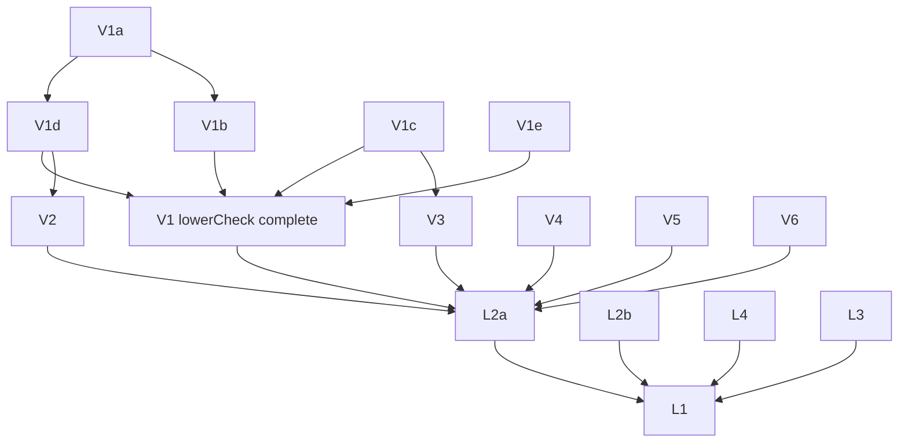

# What remains to be proven

Goal: **the compiler itself is formally verified.** Its correctness is one set of theorems proven once, for
every input program, with no per-program certificates: no validator verdict as a theorem premise, no
per-crate `native_decide` proof files, no external tool whose output must be checked for the result to be
correct. This file lists everything between today's state and that goal, split into work packages (WPs)
that agents can take independently. It supersedes the proof items in `docs/PLAN.md` "Next steps" item 4;
`docs/DEFERRED.md` keeps the detailed background for several WPs and is referenced from them.

Written 2026-10-05 against `main` = `18062c8`.

## 1. Target

### 1.1 The theorems we want

Per function (`Clif.Function` in, `FnBin` out):

```lean
-- correctness, no checker premise; InScope is a decidable predicate on the INPUT only
theorem compile_correct : InScope f → compileFn f = .ok fb → <runs of fb refine runs of f>
-- totality: an in-scope function always compiles
theorem compile_total   : InScope f → ∃ fb, compileFn f = .ok fb
```

Per executable (CLIF program + data + outside objects in, ELF bytes out):

```lean
theorem compileExe_correct :
  InScopeP P → compileExe P outside = .ok elf → <every ABI entry into a program function of elf,
  under the outside-code contracts, refines the whole-program CLIF run>
theorem compileExe_total : InScopeP P → ∃ elf, compileExe P outside = .ok elf
```

### 1.2 What "no per-program certificate" means here (decision)

Every check the compiler runs today falls in one of five kinds. The goal admits the first two only.

| Kind | Example | Allowed in the goal? |
| --- | --- | --- |
| **Proven pass:** the pass is proven correct directly | encoder (`Insn.decode_encode`), `prepare` on `PrepDomain` (`Prep.prepare_correct`) | yes |
| **Internal check with a proven fallback:** the compiler runs a check and on rejection uses a path that's proven directly; the theorem has no premise about the check | mid-end: every validator failure keeps the last accepted function (`FV/Opt/Optimize.lean:150-156`), so `optimize_sim_proven` has no checker premise | yes; rejections cost only code quality |
| **Validator as a premise:** the theorem assumes the check returned `true` for this program | `lowerCheck`, `prepCheck`, `checkAlloc`, `formsCoveredB` (`Compiled`/`FormsCovered`, `FV/E2E/Statement.lean:144-153`, `FV/E2E/Final.lean:162`); `okB`, `BinOk`, `goodN` | **no**: needs a completeness proof (the check never fails on what the compiler produces for in-scope input), a direct proof of the pass, or a fallback |
| **Internal rejection without fallback:** compilation fails | branch out of range (`FV/Backend/Encode.lean:315-327`), allocator frame ≥ 32 KiB (`FV/Backend/Regalloc.lean:325`), `ctlCheck` | allowed for correctness, but **violates totality**: each must be removed, proven unreachable, or moved into `InScope` as a condition on the input |
| **Per-program proof via `native_decide`** | `crate-proofs/Crates/*.lean`: `link_ok`, `bin_ok`, `stack_ok` (`FVTest/E2E/LinkCheckMain.lean:307-432`) | **no**: disappears once linking, binary and stack checks are proven complete or replaced (WPs L1–L4) |

An external program (regalloc2, rust-lld) may stay in the loop only as an oracle whose result is checked
and, on rejection, replaced by a directly proven Lean path (kind 2). Correctness then never depends on it.

### 1.3 Trusted by design (not part of this file's goal)

- the frontend: rustc + rustc_codegen_cranelift produce the CLIF; the theorems are relative to it;
- Lean's kernel; `bv_decide`'s LRAT check and `Lean.ofReduceBool` in the **fixed** rule/encoder proofs
  (proven once, not per program; see T6 to reduce it);
- the Arm model and `Clif.run` as specifications (fidelity is tested, not proven: T4, T5);
- the contracts of code outside the program (std, musl, cg_clif-fallback functions), the OS loader.

## 2. Where each stage stands

| Stage | Implemented in | Verified today by | Kind (§1.2) | WP |
| --- | --- | --- | --- | --- |
| mid-end `simplify` rules | Lean (ISLE data) | 1012 + 19 rule theorems; unproven rules disabled (`ruleAllow := .proven`) | proven | R1–R9 (coverage) |
| mid-end passes (GVN, DCE, LICM, simplify driver, unreachable, `Opt.check`) | Lean | `editOk`, `simpOk`, `wfCert`, `unreachableOk`, `keepsBackendSubset` + soundness | fallback | M1 (quality only) |
| i128 legalisation | Lean | `Opt.Legal.check` + `check_complete` on `Pre f` (`FV/Opt/Proof/LegalComplete.lean:1718`) | validator, complete on `Pre` | S6 |
| instruction selection | Lean (ISLE data) | `LowerRulesCorrect` etc., proven once | proven | — |
| lowering driver | Lean `lowerFunction` | **`lowerCheck`** (`FV/Backend/Proof/DriverCheck.lean:729-744`) | **validator premise** | V1 |
| form coverage | — | **`formsCoveredB`** (`FV/Backend/Proof/RegallocCover.lean`) | **validator premise** | V3 |
| `prepare` | Lean | `prepCheck`, complete on `PrepDomain` (`FV/Backend/Proof/PrepareComplete.lean:1700`) | validator, complete on a domain not yet derived | V2 |
| register allocation | **external Rust** (regalloc2 0.15.2 via `lean-regalloc`) | **`checkAlloc`** (`FV/Backend/RegallocCheck.lean:423-441`) | **validator premise + oracle** | V4 |
| frame, control lowering | Lean `lowerRFunc` | internal rejections (frame ≥ 32 KiB, `ctlCheck`) | rejection | V5 |
| emission, layout | Lean | branch range check, no relaxation | rejection | V6 |
| encoder | Lean | `Insn.decode_encode` (`FV/Backend/Proof/Encode.lean:57-60`) | proven | — |
| linking (program level) | `cargo fv` object merge + **rust-lld** | **`okB`** (`FV/E2E/LinkCheck.lean:716-777`) per crate by `native_decide` | **validator premise + oracle + per-program proof** | L1, L2 |
| executable bytes | **rust-lld** | **`BinOk`** (`FV/E2E/BinCheck.lean:539-543`) per crate by `native_decide` | **validator premise + oracle + per-program proof** | L2 |
| executable semantics | — | theorem is about the hooked model machine `modelOf r` (`FV/E2E/Binary.lean:565-578`) | gap | L3 |
| stack bound | Lean `budMap` | **`budOkW`/`goodN`** (`FV/E2E/StackBound.lean:145-214`) per crate by `native_decide` | **validator premise + per-program proof** | L4 |

Mid-end note: the mid-end is already certificate-free in the sense of §1.2, so M1 is optional.

## 3. Work packages: removing per-program certificates (critical path)

Each WP lists: **Now**, **Deliver**, **Depends**, **Size** (from the cited feasibility notes; `[est]` = the
author's estimate, not measured), **Risk**.

### V1. `lowerCheck` completeness

- **Now:** `lowerCheck f vc = true` is `Compiled.lowerOk`. Not attempted; feasibility note in
  `docs/DEFERRED.md` "Completeness of the lowering validator `lowerCheck`", estimate 6–10k lines.
- **Deliver:** `lowerCheck_complete : Dominated f → InScope f → lowerFunction f = .ok vc → lowerCheck f vc = true`,
  where `Dominated` (every use dominated by its definition) is a decidable input condition joining
  `InScope`. Then `Compiled.of_lower…` without the `lowerCheck` premise, like `Compiled.of_prepDomain`.
- **Sub-packages (can run in parallel after V1a):**
  - **V1a.** Rewrite `inFix` (the must-availability worklist, `partial` today) with fuel, as `reachable`/`rpo` are.
    No behaviour change: check the filetests and `lean-e2e-check` counts. Small.
  - **V1b.** Dataflow completeness: under `Dominated`, the fixpoint contains every dominating definition. 1.5–2k lines.
  - **V1c.** Def-set property of the ISLE rules: every rule's emitted code defines only fresh vregs (≥ `nextVreg`)
    or the statement's result vregs. Prefer a decided property over the exported rule data (like
    `excludedUnmatchable`) to per-rule lemmas. 2–4k lines, or one decision procedure + its soundness.
  - **V1d.** Simulation of `lowerFunction`'s imperative loop by `lowBlocks` (bookkeeping, in the style of
    `PrepareComplete.prepare_facts`). 1–1.5k lines.
  - **V1e.** Alias chase: `resolve` (fuel-bounded array chase) agrees with `gnTable`/`chase` (acyclic alias
    chains). 0.5–1k lines. Plus the remaining conjuncts (`ctxOk`, `brIdxOk`, flags, `callsStackOkB`,
    `entryOkB`): 0.5k lines.
- **Risk:** V1b and V1c (DEFERRED says so).

### V2. `PrepDomain` of the lowering output

- **Now:** `prepCheck_complete` needs `PrepDomain vc`; `prepDomainB` holds on all 1067 corpus/runtest
  functions, but nobody proved `lowerFunction` always produces it.
- **Deliver:** `lowerFunction f = .ok vc → PrepDomain vc` (non-empty, labels = block indices, branch
  arguments only on `jump`/edge blocks). Removes the `prepCheck` premise everywhere.
- **Depends:** shares the loop invariant with V1d; do it inside V1d or right after. **Size:** small–medium `[est]`.

### V3. Form coverage (`formsCoveredB`)

- **Now:** `FormsCovered` (every VCode instruction is a control form or a proven straight-line `FormOk`
  form) is a separate premise `hcov`; `formsCoveredB_iff` only decides it.
- **Deliver:** for in-scope input, every instruction `lowerFunction` + `prepare` + `lowerRFunc` can emit is
  covered. Either decide "every emitted form of every closure rule is covered" over the rule data, or
  extend `FormOk` to the missing forms (regalloc-proof.md "Status update (M6Insts2)" notes the
  xzr-destination imm/extended add/sub problem).
- **Depends:** the def-set analysis of V1c can share the traversal of the rule data. **Size:** medium `[est]`.

### V4. Register allocation without trusting regalloc2

- **Now:** regalloc2 (Rust) is an untrusted oracle and `checkAlloc_sound` validates its output; acceptance
  is the premise `Compiled.check`. A completeness proof is impossible for an external tool.
- **Deliver, option (a), recommended first:** a fallback allocator in Lean, proven directly, used when
  `checkAlloc` rejects (or when the oracle is absent). `FV/Backend/StackAlloc.lean` (every value in a
  stack slot) is the starting point; it's not covered by any theorem today. Theorem: `allocate vc = .ok af
  → <af refines vc>` without `checkAlloc`. Then the pipeline is "regalloc2 if `checkAlloc` accepts, else
  `StackAlloc`", and the theorem has no premise. The fallback also gives totality.
- **Option (b), later:** a real allocator (linear scan) written in Lean, proven directly or with
  `checkAlloc` completeness for its output. Removes the Rust tool entirely. Large `[est]`.
- **Depends:** none for (a). **Size:** (a) medium `[est]`. **Risk:** (a) the StackAlloc frame may hit the
  32 KiB limit on big functions (V5).

### V5. Frame and control-lowering rejections (totality)

- **Now:** `lowerRFunc` rejects allocator frames ≥ 32 KiB (no SIMD&FP register-offset form in the model)
  and runs `ctlCheck` (`FV/Backend/Regalloc.lean:284-339`).
- **Deliver:** prove `ctlCheck` passes on `prepare` output (its shapes hold by construction, per the comment
  at `Regalloc.lean:299-308`); remove the frame limit by materialising large offsets (add the needed
  address forms to the model and their rules/proofs), or make it an `InScope` condition computable from
  the input. **Size:** small (`ctlCheck`) + medium (large frames) `[est]`.

### V6. Branch range (totality)

- **Now:** no branch relaxation; out-of-range branches reject the function (`PLAN.md` §3.4).
- **Deliver:** branch relaxation (inverted conditional branch over an unconditional `b`, as Cranelift's
  `MachBuffer` veneers do) with its layout proof, or an input-side size bound in `InScope` that implies
  every branch is in range. **Size:** medium `[est]`.

### L1. The executable compiler as one Lean function

- **Now:** the executable is produced by `cargo fv` (Rust) + rust-lld; the theorem's link and binary facts
  come from per-crate generated proof files (`native_decide`).
- **Deliver:** `compileExe` in Lean: per-function pipeline + layout + data/GOT + ELF, taking the outside
  objects as input; `compileExe_correct` (§1.1) composed from `backend_correct_program`,
  `binary_correct_of_checks` and the WPs below. With L2–L4 complete, `cargo fv` calls `compileExe` and the
  crate-proof generator (`link-check --lean`, `crate-proofs/`) is retired.
- **Depends:** L2, L4 for the check-free version; can start with the checks as internal validators
  (compile error on rejection), which already removes the proof files. **Size:** medium `[est]`.

### L2. Linking without validators

- **Now:** `okB` checks per crate (static: pipeline success, the backend validators, ABI and signature
  checks; inter-function: call registers, frames, return addresses, indirect-call scope; global: distinct
  names, image readback, symbol injectivity), `FV/E2E/LinkCheck.lean:716-777`. `BinOk` checks what
  rust-lld wrote.
- **Deliver:**
  - **L2a.** Split `okB` into (i) properties of the input program, moved into a decidable `InScopeP`
    (no `return_call`, signature rules, indirect-call scope, …) and (ii) properties of our own outputs,
    proven complete from V1–V6 (pipeline success, `raCall`/`callRegs`/`blrRegs`, frame fits, …). Medium `[est]`.
  - **L2b.** A static linker in Lean for the executable: layout of program functions and data, relocation
    of Lean-compiled code (its own `bl`/`adrp`/GOT forms, all known), the GOT, the symbol table, plus
    copying outside objects (std/musl from their archives) with their relocations applied per the AArch64
    ELF ABI. Prove that its output satisfies `BinOk` for the program part by construction (no check). The
    outside part's correctness is only that its bytes are the relocated input bytes (their behaviour stays
    under the contracts). Large `[est]`; the relocation types LLVM's std objects use need surveying first.
- **Depends:** L2a on V1–V6; L2b independent of them. **Risk:** L2b scope (archive handling, all
  relocation types std uses, TLS layout, `.eh_frame`).

### L3. Executable-bytes simulation (M9 item 1b)

- **Now:** `binary_correct_of_checks` is about the model machine run from `modelOf r`, proven to differ from
  the executable only at relocated words; GOT pairs, calls and TLS are hooks (`docs/PLAN.md` M9, "One gap
  remains").
- **Deliver:** running the executable's own instructions (resolved `adrp`/`ldr`, `bl`, the TLS local-exec
  sequence) refines the hooked model machine, per pair and through `linkedCall` by induction on the depth.
  Removes the four trusted hook items listed in PLAN.md M9.
- **Depends:** none (L2b changes which forms occur; agree the forms first). **Size:** medium–large.

### L4. Stack bound without a per-program check

- **Now:** `budMap` computes per-function budgets (untrusted), `budOkW`/`goodN` check them, per crate by
  `native_decide` (`FV/E2E/StackBound.lean:145-214`).
- **Deliver:** `budOkW_complete`: on a call graph with no cycle reachable from `f`, `budMap`'s result passes,
  so `goodN I f = true` follows from an input condition. Recursive functions keep the depth-indexed
  theorem (`binary_correct_depth`); state that explicitly as the scope. **Size:** small–medium `[est]`.

### Result of the critical path

V1–V6 remove every premise of `Compiled`/`FormsCovered` and make `compileFn` total on `InScope`; L1–L4
do the same for executables and retire the per-crate proof files. Dependencies:



Parallel from day one: V1a, V1c, V1e, V3, V4, V5, V6, L2b, L3, L4.

## 4. Work packages: widening what the theorems cover (scope)

These don't remove certificates; they shrink the set of functions reported "unverified" (today
`lean-e2e-check`: 1148 accepted, 97 out of scope) and the cg_clif fallbacks. Independent of §3 unless noted.

### R1–R9. Mid-end rule proofs (the deferred `simplify` rules)

1031 of 1193 rule roots are proven; the rest are disabled in the proven configuration. Status and recipe:
`docs/DEFERRED.md` "Mid-end `simplify` rule proofs", per-rule reasons in `docs/contracts/midend.md`
"Rule proofs" (lines ~570-610). One agent per family; files `FV/Opt/Proof/Rule<Family>.lean`, allow-list in
`FV/Opt/RuleAllow.lean`, import in `FV/Opt/Proof/RuleAll.lean`.

| WP | Family | Left | Main obstacle |
| --- | --- | --- | --- |
| R1 | arithmetic | 42 | `iabs` has no `bv_decide` normal form (38–46); `iconst_u`/`iconst_s ty k` under a type variable leaves `makeInst` stuck (50, 333–349, 587–603); `imm64_power_of_two` has no spec (181); timeouts (200, 206, 251–288 `imul` by odd constants, 615–622 64-bit products); `simp` type mismatch (410–428) |
| R2 | icmp | 29 | module builds out of memory at 16–24 GB although per-rule proofs pass (63, 70, 160, 175, 254–289, 365, 368): split modules; `GraphOk.make_val` unification (49, 77, 91); counterexample after timeouts (155–184, 386–402) |
| R3 | selects | 18 | `iabs` again (97–100); literal-match facts lost under `simp_all` (188–202); timeouts (81, 85); 15 nondeterministic in the full build |
| R4 | shifts | 19 | rotate regrouping through `iadd_uextend`/`isub_uextend` (239–266: ~50 of 125 per-type goals fail, 128-bit rotations); 161, 170, 184, 193, 315. **84 and 88 are false**: keep them disabled, or adopt the masked rules of kevaundray/wasmtime#2 in the exported data and prove those |
| R5 | spaceship | 20 | the 20 `select` rules: two made `icmp`s under `sextend_maybe` blow up the term (>10 min/rule) |
| R6 | cprop | 7 | 269 (`imm64_neg` of a sign-cast immediate, `makeInst` stuck); 320–379 never run with the current templates (cheapest first step) |
| R7 | bitops | 6 | 79 (needs 64-bit and/not immediate specs), 157/170 (byte-swap timeouts), 126/127/129 (multi-result `truthy` needs a spec) |
| R8 | extends | 3 | 40, 42, 44 timeouts at 16M heartbeats |
| R9 | skeleton | 18 | power-of-two and `div_const` division sequences need specs for Cranelift's magic-number helpers; `icmp.isle` 461–475; `skeleton.isle` 80 |

Shared infrastructure that unblocks several families (do first or in a separate WP **R0**): a `bif` normal
form or dedicated lemma for `Sem.iabs` (R1, R3); reduction of `makeInst` for type-variable constants
(R1, R6); specs for `imm64_power_of_two`, `truthy` and the `div_const` helpers (R1, R7, R9); splitting the
icmp/selects modules (R2, R3).

### M1. Mid-end validators: completeness (optional, quality only)

`editOk`, `simpOk`, `wfCert`, `unreachableOk`, `keepsBackendSubset` fall back safely, so they're not
certificates. Completeness would prove the optimiser never silently skips a pass on in-scope input.
Large, low priority.

### S1–S12. Scope extensions

| WP | Extension | Notes / where recorded |
| --- | --- | --- |
| S1 | Optimiser with `call_indirect` and `try_call`/`try_call_indirect` | excluded by `backend_correct_opt_proven` (`FV/E2E/OptProven.lean:29-30`) |
| S2 | Legalisation + optimisation composed; legalised functions in the linking theorem | DEFERRED "i128 legalisation" |
| S3 | Whole-program refinement of the original i128 source program | DEFERRED "Linking", first "Remaining" item: per-function `check_refines` under a linked environment, by depth induction |
| S4 | i128 gaps: `umulhi`/`smulhi`, `try_call`, overflow ops, atomics, stack-passed i128, i128 indirect signatures, `try_call_indirect` | DEFERRED "i128 legalisation", "Completeness of `Opt.Legal.check`" |
| S5 | Stack-passed arguments of `call_indirect`/`try_call_indirect` (≤ 8 register params today) | `FV/E2E/Statement.lean:84-87` |
| S6 | A decidable `Pre` for legalisation (`noSelf`, `defs`, `ids`) so `check` is provably redundant on `InScope` | DEFERRED "Completeness of `Opt.Legal.check`" |
| S7 | `vmctx`/`sarg` parameters; `sret` return register (x0 holds the pointer) | DEFERRED "`sret`" |
| S8 | `return_call`; recursion through a pointer; a function calling itself under its own name; indirect callees with stack-passed or `sret` params | DEFERRED "Linking", "Remaining" |
| S9 | Trapping helpers (`__*ti3` division by zero) and traps inside program callees | DEFERRED "i128 legalisation"; `TrapsExplicit` |
| S10 | Unwinding: landing pads, LSDA, `.eh_frame`, `try_call`'s exceptional edge | `docs/contracts/e2e.md` (try_call covers normal returns only) |
| S11 | Floats (f32/f64 in `Clif.run`, Arm FP instructions co-simulated, rules + proofs, FP register class in `checkAlloc`/V4) | PLAN.md "Next steps" 2; the largest fallback reason |
| S12 | SIMD | after S11 |

## 5. Trusted-base reduction (optional for the goal, listed for completeness)

| WP | Item | Notes |
| --- | --- | --- |
| T1 | TLS: TLSDESC hook vs lld's local-exec rewrite | overlaps L3 |
| T2 | Atomics on a single-core model (`ldar`/`stlr` plain, exclusive store always succeeds, `dmb` no-op) | `docs/decisions/arm-model.md` "Atomics"; a multi-core memory model is a project of its own |
| T3 | std/musl contracts: compile std through `cargo fv` (`-Zbuild-std`) | needs S11, S12, inline asm |
| T4 | Arm model fidelity (ASL-derived, qemu co-simulation) | testing, not proof |
| T5 | `Clif.run` fidelity (Cranelift interpreter + native runs) | testing, not proof |
| T6 | `Lean.ofReduceBool`/`native_decide` in the fixed proofs (bv_decide certificates, encoder facts) | replace with kernel-checked reflection where feasible; per-program uses disappear with L1–L4 |
| T7 | `normalize.py`, `clif-data-export` (frontend-side tools) | part of the trusted frontend today |

## 6. Not needed for the goal

- M3 validator for Cranelift's own machine code (`agent/validator`, paused), M3b, DSL `compile_correct`
  (`agent/m2proof`, paused): the Lean backend replaced them.
- A verified frontend (rustc/cg_clif): out of scope (§1.3).

## 7. How to take a WP

- One agent per WP or sub-package, in its own worktree: `scripts/agent-worktree.sh <name> [base]` →
  `/home/kev/work/clifv-wt/<name>`, branch `agent/<name>`. Absolute paths under the worktree. Never push,
  merge, rebase, `git stash`, or pattern-kill processes. Temp files in `/tmp/<name>_*`.
- Every lake/cargo command through `FV_MEMCAP=<N>G scripts/memcap.sh`; full FV build
  `LEAN_NUM_THREADS=2 FV_MEMCAP=22G`; check the log for "Build completed successfully".
- No `sorry`, `admit`, hand-written `axiom`, `trace_state`. Allowed axioms: `propext`, `Classical.choice`,
  `Quot.sound`, and generated `*._native.bv_decide.ax_*` / `*._native.native_decide.ax_*` in fixed proofs.
- Every new top-level theorem gets a non-vacuity witness (they have caught six unsatisfiable premises).
- A WP that removes a premise keeps the old theorem and adds the premise-free variant; cutover of the
  callers and docs (`docs/contracts/e2e.md`, `docs/PLAN.md` status, this file) in the same branch.
- Gates before "merge-ready: …": `lake build FV FVTest lean-backend lean-e2e-check link-check`;
  `lake build` in `crate-proofs/`; `#print axioms` of the E2E theorems; `scripts/lean-backend-filetests.sh`
  (corpus 114/114, runtests ≥ 4672/0/0); `scripts/lean-backend-encode-check.sh` (0 differ);
  `lean-e2e-check` (≥ 1148 accepted, 0 rejected); if CLIF semantics change, `scripts/clif-filetests.sh` at
  its baseline and `scripts/opt-difftest.sh` with 0 failures.
- When a WP lands, mark it here (`**done** (commit)`) and update §2.
