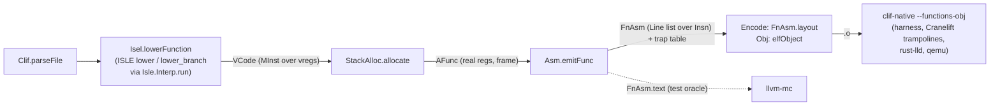

# Contract: the Lean AArch64 backend (`FV/Backend`, milestone M4, unproven)

Producer: M4 backend. Consumers: M4 proofs (ISLE rules, extern helpers, allocator), M5
(the encoder, `docs/contracts/encoder.md`, which replaced `llvm-mc`), M6 (real allocator + checker replaces `StackAlloc`), M7
(`backend_correct`). Inputs: `docs/contracts/clif.md` (`Clif.Program`, `Clif.parseFile`,
`Clif.run`), `docs/contracts/isle.md` (exported rules, closure, `Isle.Interp.run`),
`docs/contracts/drivers.md` (`clif-native`), `docs/contracts/arm.md` (Arm model).

Owner decision (PLAN.md §0 delegated): the backend works end to end **before** any proof, and
is differentially tested against Cranelift; proofs come next. The code is written for them:
total functions, no `partial`, explicit state, data-driven rules.

## Status (kept current for resumption)

Complete (2026-09-27); no `sorry`, no `axiom`, no warnings in `FV/Backend`, `FVTest/Backend`.

- [x] `FV/Backend/{MInst,Isel,StackAlloc,Asm}.lean`, umbrella `FV/Backend.lean`
- [x] M5 (2026-09-27): `FV/Backend/{Encode,Obj}.lean` encode the final instruction list and
      write the ELF object; no assembler in the pipeline (`docs/contracts/encoder.md`)
- [x] `lake exe lean-backend` (`FVTest/Backend/Main.lean`)
- [x] `clif-native --functions-obj/--functions-table` (`docs/contracts/drivers.md`)
- [x] `scripts/lean-backend-filetests.sh` (Lean-written objects; `--asm` for the `llvm-mc`
      path, same results): corpus **114/114** run lines pass and agree with
      Cranelift-native; `extrt` (Rust runtime) 22/22; runtests **2791 pass, 0 fail,
      0 disagree** (48 files entirely in E: 1416 runs; 11 more files partly)
- [x] `lake exe lean-backend-armrun` (`FVTest/Backend/ArmRun.lean`): Arm-model runs agree with
      `Clif.run` (corpus 25 functions / 73 runs; 14 runtest files 221 functions / 883 runs)
- [x] `FVTest/Backend/Names.lean`: ISLE names the backend builds values from exist
- [x] every fired ISLE rule is in the emitter-subset closure (checked by `lean-backend` on
      every run: 244 distinct closure rules fire over corpus + runtests, 128 on the corpus)

## Pipeline



`Backend.compileFunction k f = emitFunc k (← allocate (← lowerFunction f))`;
`Backend.compileFile : Clif.ParsedFile → FileAsm` compiles every function, reports the others
with a reason, and also drops (with reason) any function that calls a function of the file
that is not compiled (its code would reference an undefined symbol).

## Modules and data types

### `FV/Backend/MInst.lean`

- `Reg := vreg n cls | x n | xzr | sp | v n` (`RegClass := int | float`): virtual vs real
  registers; `xzr`/`sp` are the two meanings of encoding 31.
- `CTy`: Cranelift `Type` values (`int bits | float bits | vec laneBits lanes isFloat |
  invalid`), with `bits`, `laneBits`, `isInt`, `isVector`, `ofName?` (`$I8`…), `regClass?`.
- Operand types, named and ordered as in `inst.isle`: `OperandSize`, `ALUOp`, `ALUOp3`,
  `MoveWideOp`, `BfmOp`, `BitOp`, `Cond` (+ `invert`), `ExtendOp`, `ShiftOp`,
  `ShiftOpAndAmt`, `Imm12`, `ImmLogic` (value + size; encoding by the assembler),
  `MoveWideConst`, `NZCV`, `ScalarSize`, `VectorSize`, `VecMisc2`, `VecLanesOp`, `VecALUOp`,
  `TestBitAndBranchKind`, `AMode` (all 13 non-label modes; `unsignedOffset` holds the scaled
  byte offset), `CondBrKind` (+ `invert`), `CallDest`, `CallInfo`, `LoadOp`, `StoreOp`.
- `MInst`: the subset the E closure emits (`AluRRR`, `AluRRRR`, `AluRRImm12`,
  `AluRRImmLogic`, `AluRRImmShift`, `AluRRRShift`, `AluRRRExtend`, `BitRR`, `ULoad*`/`SLoad*`
  (`load`), `Store*` (`store`), `MovWide`, `Extend`, `BitfieldMove`, `CSet`, `CCmp`,
  `CCmpImm`, `MovToFpu`, `MovFromVec`, `VecMisc`, `VecLanes`, `VecRRR`, `Call`/`CallInd`
  (`call`), `Jump`, `CondBr`, `TestBitAndBranch`, `TrapIf`, `Udf`, `JTSequence`,
  `LoadExtNameGot`, `LoadExtNameNear`, `EmitIsland`) plus what Rust helpers and the driver
  emit (`Mov`, `MovK`, `LoadAddr`, `Args`, `Rets`). Operands: `uses`, `defs`, `mapRegs`,
  `isTerm`.
- Immediate constructors (transcriptions of `imms.rs`/`args.rs`): `Imm12.ofNat?`,
  `ImmLogic.ofNat?`, `ImmLogic.invert`, `MoveWideConst.ofNat?`, `simm9?`, `uimm12Scaled?`,
  `shiftImm?`.
- The interpreter's value domain `V` (`int | bool | ty | inst | value | reg | regs | regsVec |
  label | labels | values | blockCalls | data ty k fields | op Opnd`) and opaque operands
  `Opnd`; `MInst.ofV : V → Option MInst` (and `V.amode?`, `V.condBrKind?`, enum decoders by
  ISLE variant name).

### `FV/Backend/Isel.lean`

- `Ctx` (read-only DFG view: `IInfo` per CLIF instruction — `InstructionData` value, results,
  result types, the `Clif.Inst` —, value types/defs, one pre-assigned vreg per value, stack
  slot offsets), `LState` (vreg counter and classes, `emitted`, outgoing-argument size).
- `instData`: `Clif.Inst → InstructionData` value (`UnaryImm`, `Unary`, `Binary`,
  `IntCompare`, `Load`, `Store`, `StackAddr`, `Call`), and the E check (error with reason for
  anything else). `termData` for terminators (`Jump`, `Brif`, `BranchTable`, `MultiAry`
  return, `Trap`).
- `sem ctx : Isle.Sem V LState`: `int` literals kept in their ISLE type's range (`normInt`),
  `$Type` constants (`CTy.ofName?`), data = `V.data`, `ctor := externCtor ctx`,
  `extract := externExtract ctx`.
- ABI: `argLocs` (x0..x7 then 8-byte-minimum naturally aligned stack slots, 16-aligned
  total), `retRegs` (x0..x7), `sigParamBytes`, `slotLayout`.
- `lowerFunction : Clif.Function → Except String VCode`; `VCode` = blocks of `MInst` over
  vregs, vreg classes, slot bytes, outgoing size, fired rules.

### `FV/Backend/StackAlloc.lean`

`Frame.compute`, `Frame.allocInst`, `allocate : VCode → Except String AFunc`;
`AInst := inst MInst | prologue | epilogueRet`.

### `FV/Backend/Asm.lean`

`Insn` (one instruction = one assembly line = one word; shared by printer and encoder),
`Lbl`, `Line`, `MInst.lines` (one allocated instruction → lines, following `emit.rs`),
`memFinalize`, `prologueLines`/`epilogueLines`, `emitFunc : Nat → AFunc → Except String FnAsm`
(`FnAsm`: name, index, lines, size in bytes, trap sites), `Insn.asm`, `FnAsm.text`.

### `FV/Backend/Encode.lean`, `FV/Backend/Obj.lean`

`Insn.toArmInst`, `armBits`, `Insn.encode`, `Insn.reloc?`, `FnAsm.layout : FnAsm → Except
String FnBin`, `elfObject` — see `docs/contracts/encoder.md`.

### `FV/Backend.lean`

`compileFunction`, `compileFile`, `FileAsm` (functions, unsupported, fired rules;
`FileAsm.text` assembly), `FileAsm.tableJson` (the `--functions-table` file),
`FileAsm.layout`/`FileAsm.object` (encoded functions / ELF object), `FnBin.relocsJson`,
`FnBin.trapsJson`.

## Instruction selection

`lower` runs once per non-terminator instruction and `lower_branch` once per branch (`return`
and `trap` go through `lower`), each with `Isle.Interp.run Isle.Aarch64.program (sem ctx) {}`
from the current `LState`. Driver rules (`machinst/lower.rs`):

- **Value registers and aliases.** Every CLIF value `vN` has vreg `N` from the start; the
  registers `lower` returns for the results are recorded as aliases of those
  (`set_vreg_alias`), resolved when the function is done. A real-register result (none occur
  in E) would get a `mov` instead.
- **Order.** Blocks in layout order; instructions **top-down**, every instruction lowered
  (Cranelift: bottom-up, skipping pure dead instructions, sinking a load into its unique
  user). Consequences: `is_sinkable_inst` always returns `None`, `sink_inst` is never
  reached, `opportunistic_def` is a no-op; each is a behaviour the Rust helper can have, so
  the rule choice is one Cranelift could make. A `notrap` load whose result is unused is
  still executed (its validity is the program's precondition, PLAN.md §3.2).
- **`def_inst` looks through any instruction** (`dfg.value_def`), like Rust, so constants
  defined in other blocks are rematerialised by immediate-form rules; the original
  definition is still lowered.
- **Block parameters.** A branch's arguments are copied into fresh temporaries, then the
  temporaries into the target's parameter vregs (`mov` pairs: a parallel copy). For `jump`
  the moves precede the lowered branch; `brif`/`br_table` targets with arguments get an edge
  block (moves + `b target`), as Cranelift's critical-edge splitting does.
- **Entry.** `Args` (register parameters) and stack-parameter loads
  (`ULoadN rd [fp, #16 + off]`, the typed load `gen_load_stack` uses) start the entry block.
- **E only.** Functions outside `clif-subset-v1` E (i128, floats/vectors, non-E opcodes,
  big-endian accesses, non-64-bit addresses, `return_call`, special parameters, calling
  conventions other than `system_v`/`fast`, more than 8 results) are rejected with the
  reason. `fast` is accepted because Cranelift 0.136.1 treats it exactly like `system_v` on
  aarch64 (`compute_arg_locs` and `get_regs_clobbered_by_call` distinguish only `tail`,
  `winch`, `preserve_all`, `apple_aarch64`).
- **Closure.** `lean-backend` reports any fired rule outside `Isle.Aarch64.Closure.rules`;
  none does. Match semantics (priorities, if-lets, partial terms, extractor failure) are the
  interpreter's (`docs/contracts/isle.md`).

### Extern helpers (trusted transcriptions)

Every extern term of the closure (119) is implemented by an arm of `Backend.externCtor` /
`Backend.externExtract` keyed by the ISLE term name, transcribed from the Rust function in the
third column (cranelift-codegen 0.136.1; paths under `cranelift/codegen/src/`; numerics from
the build's generated `isle_numerics.rs`). These are **trusted** until M4 proves them against
the VeriISLE `spec` where one exists (column 4). Notes mark helpers whose Lean version is not a
line-by-line port. Identity/plumbing helpers (`value_reg`, `output`, `box_external_name`, the
`*_into_*` conversions, …) have no note.

| ISLE term | kind | Rust function, location | VeriISLE spec | Lean / note |
| --- | --- | --- | --- | --- |
| `def_inst` | extractor | `def_inst` isle_prelude.rs:1160 | yes | DFG `value_def(v).inst()` (`Ctx.defInst?`) |
| `value_type` | extractor | `value_type` machinst/isle.rs:45 | yes | `Ctx.valueType?` |
| `i64_sextend_imm64` | ctor | `i64_sextend_imm64` isle_prelude.rs:314 | yes |  |
| `ty_bits` | ctor | `ty_bits` isle_prelude.rs:345 | yes |  |
| `ty_bytes` | ctor | `ty_bytes` isle_prelude.rs:361 | yes |  |
| `little_or_native_endian` | extractor | `little_or_native_endian` isle_prelude.rs:848 | yes |  |
| `fits_in_16` | extractor | `fits_in_16` isle_prelude.rs:420 | yes |  |
| `fits_in_32` | extractor | `fits_in_32` isle_prelude.rs:429 | yes |  |
| `fits_in_64` | extractor | `fits_in_64` isle_prelude.rs:449 | yes |  |
| `ty_int_ref_scalar_64` | ctor | `ty_int_ref_scalar_64` isle_prelude.rs:458 | yes |  |
| `ty_int_ref_scalar_64_extract` | extractor | `ty_int_ref_scalar_64_extract` isle_prelude.rs:467 | yes |  |
| `ty_32_or_64` | extractor | `ty_32_or_64` isle_prelude.rs:492 | yes |  |
| `ty_int` | extractor | `ty_int` isle_prelude.rs:543 | yes |  |
| `u64_from_imm64` | extractor | `u64_from_imm64` isle_prelude.rs:664 | yes |  |
| `nonzero_u64_from_imm64` | extractor | `nonzero_u64_from_imm64` isle_prelude.rs:760 | yes |  |
| `offset32_to_i32` | ctor | `offset32_to_i32` isle_prelude.rs:812 | yes |  |
| `i32_to_offset32` | ctor | `i32_to_offset32` isle_prelude.rs:817 | yes |  |
| `signed_cond_code` | ctor | `signed_cond_code` isle_prelude.rs:862 | yes |  |
| `unsigned_cond_code` | ctor | `unsigned_cond_code` isle_prelude.rs:878 | yes |  |
| `trap_code_division_by_zero` | ctor | `trap_code_division_by_zero` isle_prelude.rs:748 | yes |  |
| `trap_code_integer_overflow` | ctor | `trap_code_integer_overflow` isle_prelude.rs:752 | yes |  |
| `value_reg` | ctor | `value_reg` machinst/isle.rs:50 | yes |  |
| `value_regs` | ctor | `value_regs` machinst/isle.rs:55 | yes |  |
| `output_none` | ctor | `output_none` machinst/isle.rs:75 | yes |  |
| `output` | ctor | `output` machinst/isle.rs:80 | yes |  |
| `output_vec` | ctor | `output_vec` machinst/isle.rs:90 | no |  |
| `temp_writable_reg` | ctor | `temp_writable_reg` machinst/isle.rs:95 | yes | fresh vreg, class from `CTy.regClass?` (`alloc_tmp`) |
| `opportunistic_def` | ctor | `opportunistic_def` machinst/isle.rs:118 | no | **no-op** (Rust ignores it in many states; only an optimisation) |
| `put_in_reg` | ctor | `put_in_reg` machinst/isle.rs:123 | yes | pre-assigned value vreg (`Ctx.valReg`), no use counting |
| `put_in_regs` | ctor | `put_in_regs` machinst/isle.rs:128 | yes | same, one register |
| `put_in_regs_vec` | ctor | `put_in_regs_vec` machinst/isle.rs:133 | no | same, per value |
| `value_regs_get` | ctor | `value_regs_get` machinst/isle.rs:143 | yes |  |
| `single_target` | extractor | `single_target` machinst/isle.rs:779 | no |  |
| `two_targets` | extractor | `two_targets` machinst/isle.rs:787 | no |  |
| `jump_table_targets` | extractor | `jump_table_targets` machinst/isle.rs:795 | no |  |
| `jump_table_size` | ctor | `jump_table_size` machinst/isle.rs:809 | no |  |
| `value_list_slice` | extractor | `value_list_slice` machinst/isle.rs:153 | no |  |
| `writable_reg_to_reg` | ctor | `writable_reg_to_reg` machinst/isle.rs:191 | yes |  |
| `first_result` | extractor | `first_result` machinst/isle.rs:201 | no |  |
| `is_second_result` | extractor | `is_second_result` machinst/isle.rs:217 | yes |  |
| `inst_data_value` | extractor | `inst_data_value` machinst/isle.rs:237 | no | `(type of first result or INVALID, InstructionData)`; data built by `instData`/`termData` |
| `i64_from_iconst` | extractor | `i64_from_iconst` machinst/isle.rs:247 | no | sign-extends from the result type |
| `is_sinkable_inst` | ctor | `is_sinkable_inst` machinst/isle.rs:595 | yes | **always `None`** (no load sinking; valid Rust behaviour when the use is not unique/colour-adjacent) |
| `maybe_uextend` | extractor | `maybe_uextend` machinst/isle.rs:611 | yes |  |
| `emit` | ctor | `emit` isa/aarch64/lower/isle.rs:503 | yes | `MInst.ofV` then push to `LState.emitted` |
| `sink_inst` | ctor | `sink_inst` machinst/isle.rs:606 | yes | unreachable (never after `is_sinkable_inst = None`); unmodeled |
| `box_external_name` | ctor | `box_external_name` machinst/isle.rs:392 | no |  |
| `func_ref_data` | extractor | `func_ref_data` machinst/isle.rs:368 | no | `(signature, name, Near if colocated else Far, patchable = false)` |
| `abi_sig` | ctor | `abi_sig` machinst/isle.rs:480 | no | the callee's `Clif.Signature` |
| `abi_stackslot_addr` | ctor | `abi_stackslot_addr` machinst/isle.rs:541 | no | `LoadAddr rd (SlotOffset (slot offset + off))`, slot offsets from `slotLayout` (`Callee::new`) |
| `abi_stackslot_offset_into_slot_region` | ctor | `abi_stackslot_offset_into_slot_region` machinst/isle.rs:554 | no | `slotLayout` offset + both offsets |
| `gen_return` | ctor | `gen_return` machinst/isle.rs:643 | no | emits `Rets` with `retRegs` (x0..x7; > 8 unsupported, as Cranelift without implicit sret); no extension (SysV aarch64 `get_ext_mode` = none) |
| `gen_call_output` | ctor | `gen_call_output` machinst/isle.rs:647 | no | fresh int vreg per return value |
| `gen_call_args` | ctor | `gen_call_args` machinst/isle.rs:651 | no | `argLocs`: x0..x7, then stack stores to `SPOffset` (`Store8..64`, trusted flags) |
| `gen_call_rets` | ctor | `gen_call_rets` machinst/isle.rs:659 | no | `retRegs` pairs |
| `try_call_none` | ctor | `try_call_none` machinst/isle.rs:671 | no |  |
| `safe_divisor_from_imm64` | ctor | `safe_divisor_from_imm64` machinst/isle.rs:765 | yes |  |
| `use_fp16` | ctor | `use_fp16` isa/aarch64/lower/isle.rs:221 | yes | `false` (default ISA flags) |
| `move_wide_const_from_u64` | ctor | `move_wide_const_from_u64` isa/aarch64/lower/isle.rs:229 | yes | `MoveWideConst.ofNat?` |
| `move_wide_const_from_inverted_u64` | ctor | `move_wide_const_from_inverted_u64` isa/aarch64/lower/isle.rs:239 | yes | `MoveWideConst.ofNat?` |
| `imm_logic_from_u64` | ctor | `imm_logic_from_u64` isa/aarch64/lower/isle.rs:243 | yes | `ImmLogic.ofNat?`: same accepted set as VIXL `IsImmLogical` (bitmask-immediate definition), encoding left to the assembler |
| `imm_size_from_type` | ctor | `imm_size_from_type` isa/aarch64/lower/isle.rs:247 | yes |  |
| `imm_logic_from_imm64` | ctor | `imm_logic_from_imm64` isa/aarch64/lower/isle.rs:255 | yes | `ImmLogic.ofNat?` (I32 for types < 32 bits) |
| `imm_shift_from_imm64` | ctor | `imm_shift_from_imm64` isa/aarch64/lower/isle.rs:542 | yes |  |
| `imm_shift_from_u8` | ctor | `imm_shift_from_u8` isa/aarch64/lower/isle.rs:264 | yes |  |
| `imm12_from_u64` | extractor | `imm12_from_u64` isa/aarch64/lower/isle.rs:260 | yes | `Imm12.ofNat?` |
| `u8_into_uimm5` | ctor | `u8_into_uimm5` isa/aarch64/lower/isle.rs:523 | yes |  |
| `u8_into_imm12` | ctor | `u8_into_imm12` isa/aarch64/lower/isle.rs:527 | yes | `Imm12.ofNat?` |
| `u64_into_imm_logic` | ctor | `u64_into_imm_logic` isa/aarch64/lower/isle.rs:547 | yes | `ImmLogic.ofNat?`, failure = Rust `unwrap` panic |
| `branch_target` | ctor | `branch_target` isa/aarch64/lower/isle.rs:670 | no |  |
| `targets_jt_space` | ctor | `targets_jt_space` isa/aarch64/lower/isle.rs:674 | no |  |
| `lshl_from_imm64` | ctor | `lshl_from_imm64` isa/aarch64/lower/isle.rs:301 | yes | `shiftImm?` then mask |
| `ashr_from_u64` | ctor | `ashr_from_u64` isa/aarch64/lower/isle.rs:316 | no | `shiftImm?` then mask |
| `integral_ty` | extractor | `integral_ty` isa/aarch64/lower/isle.rs:327 | yes |  |
| `extended_value_from_value` | extractor | `extended_value_from_value` isa/aarch64/lower/isle.rs:490 | yes | `get_as_extended_value`: def is `uextend`/`sextend` (pure, so `get_value_as_source_or_const` always sees it) |
| `put_extended_in_reg` | ctor | `put_extended_in_reg` isa/aarch64/lower/isle.rs:495 | yes |  |
| `get_extended_op` | ctor | `get_extended_op` isa/aarch64/lower/isle.rs:499 | yes |  |
| `nzcv` | ctor | `nzcv` isa/aarch64/lower/isle.rs:519 | yes |  |
| `cond_br_zero` | ctor | `cond_br_zero` isa/aarch64/lower/isle.rs:507 | yes |  |
| `cond_br_not_zero` | ctor | `cond_br_not_zero` isa/aarch64/lower/isle.rs:511 | no |  |
| `cond_br_cond` | ctor | `cond_br_cond` isa/aarch64/lower/isle.rs:515 | yes |  |
| `zero_reg` | ctor | `zero_reg` isa/aarch64/lower/isle.rs:474 | yes |  |
| `writable_zero_reg` | ctor | `writable_zero_reg` isa/aarch64/lower/isle.rs:531 | yes |  |
| `a64_extr_imm` | ctor | `a64_extr_imm` isa/aarch64/lower/isle.rs:905 | yes |  |
| `load_constant_full` | ctor | `load_constant_full` isa/aarch64/lower/isle.rs:355 | yes | `Backend.loadConstantFull`: same movz/movn choice and movk sequence |
| `is_pic` | ctor | `is_pic` isa/aarch64/lower/isle.rs:922 | no | `true` (clif2obj settings) |
| `uimm12_scaled_from_i64` | ctor | `uimm12_scaled_from_i64` isa/aarch64/lower/isle.rs:880 | yes | `uimm12Scaled?` |
| `uimm12_scaled_nonzero_from_i64` | ctor | `uimm12_scaled_nonzero_from_i64` isa/aarch64/lower/isle.rs:886 | yes | `uimm12Scaled?` |
| `simm9_from_i64` | ctor | `simm9_from_i64` isa/aarch64/lower/isle.rs:876 | yes | `simm9?` |
| `cond_code` | ctor | `cond_code` isa/aarch64/lower/isle.rs:647 | yes | `condOfIntCC` (`lower_condcode`) |
| `invert_cond` | ctor | `invert_cond` isa/aarch64/lower/isle.rs:651 | yes | `Cond.invert` |
| `gen_call_info` | ctor | `gen_call_info` isa/aarch64/lower/isle.rs:79 | no | `CallInfo`; outgoing area := max(outgoing, stack-arg space) |
| `gen_call_ind_info` | ctor | `gen_call_ind_info` isa/aarch64/lower/isle.rs:100 | no | same, register destination |
| `shift_masked_imm` | ctor | `shift_masked_imm` isa/aarch64/lower/isle.rs:868 | yes |  |
| `shift_mask` | ctor | `shift_mask` isa/aarch64/lower/isle.rs:535 | yes | `ImmLogic.ofNat?` |
| `bfm_immr` | ctor | `bfm_immr` isa/aarch64/lower/isle.rs:270 | yes |  |
| `bfm_imms` | ctor | `bfm_imms` isa/aarch64/lower/isle.rs:282 | yes |  |
| `negate_imm_shift` | ctor | `negate_imm_shift` isa/aarch64/lower/isle.rs:551 | yes |  |
| `rotr_mask` | ctor | `rotr_mask` isa/aarch64/lower/isle.rs:558 | yes | `ImmLogic.ofNat?` |
| `rotr_opposite_amount` | ctor | `rotr_opposite_amount` isa/aarch64/lower/isle.rs:562 | yes |  |
| `test_and_compare_bit_const` | ctor | `test_and_compare_bit_const` isa/aarch64/lower/isle.rs:893 | no |  |
| `i32_checked_add` | ctor | `i32_checked_add` isle_numerics.rs:1664 (generated) | yes |  |
| `i64_checked_neg` | ctor | `i64_checked_neg` isle_numerics.rs:2795 (generated) | yes |  |
| `u64_eq` | ctor | `u64_eq` isle_numerics.rs:2819 (generated) | yes |  |
| `u64_gt` | ctor | `u64_gt` isle_numerics.rs:2855 (generated) | yes |  |
| `u64_wrapping_add` | ctor | `u64_wrapping_add` isle_numerics.rs:2882 (generated) | yes |  |
| `u64_wrapping_sub` | ctor | `u64_wrapping_sub` isle_numerics.rs:2909 (generated) | yes |  |
| `u64_wrapping_shl` | ctor | `u64_wrapping_shl` isle_numerics.rs:3043 (generated) | yes |  |
| `u64_is_odd` | ctor | `u64_is_odd` isle_numerics.rs:3130 (generated) | yes |  |
| `u8_into_u32` | ctor | `u8_into_u32` isle_numerics.rs:4165 (generated) | yes |  |
| `u8_into_u64` | ctor | `u8_into_u64` isle_numerics.rs:4183 (generated) | yes |  |
| `u16_into_u64` | ctor | `u16_into_u64` isle_numerics.rs:4397 (generated) | yes |  |
| `i32_into_i64` | ctor | `i32_into_i64` isle_numerics.rs:4501 (generated) | yes |  |
| `u32_into_u64` | ctor | `u32_into_u64` isle_numerics.rs:4631 (generated) | yes |  |
| `i32_from_i64` | extractor | `i64_from_i32` isle_numerics.rs:4730 (generated) | no |  |
| `i64_cast_unsigned` | ctor | `i64_cast_unsigned` isle_numerics.rs:4756 (generated) | yes |  |
| `u8_from_u64` | extractor | `u64_from_u8` isle_numerics.rs:4812 (generated) | no |  |
| `value_array_2` | ctor | `pack_value_array_2` isle_prelude.rs:937 | no |  |
| `value_array_2` | extractor | `unpack_value_array_2` isle_prelude.rs:931 | no |  |
| `block_array_2` | ctor | `pack_block_array_2` isle_prelude.rs:959 | no |  |
| `block_array_2` | extractor | `unpack_block_array_2` isle_prelude.rs:953 | no |  |

Extra extern extractors that the interpreter reaches while *trying* root rules outside the
closure (the type or flag test fails before the rule could match), with the same Rust
semantics: the `Type → Option Type` predicates of `tyPred` (`fits_in_*`, `ty_int_ref_*`,
`ty_8_or_16`, `ty_16_or_32`, `ty_16/32/64/128`, `ty_scalar`, `ty_scalar_float`,
`ty_float_or_vec`, `ty_vector_float`, `ty_vector_not_float`, `ty_vec64/128(_int)`,
`ty_dyn*` (always none: no dynamic vectors), `lane_fits_in_32`, `int_fits_in_32`,
`integral_ty`, `valid_atomic_transaction`), `multi_lane`, `dynamic_lane`, `not_i64x2`,
`use_lse`/`use_dotprod`/`use_i8mm` (ISA flags off by default), `sign_return_address_disabled`
and `tls_model` (default `none`).

## ABI (Cranelift aarch64 `system_v`, `isa/aarch64/abi.rs`)

- Arguments: `x0..x7` in order; then stack slots of `max(size, 8)` bytes, naturally aligned,
  at `[sp + off]` of the caller (outgoing area, stores emitted by `gen_call_args`), read by the
  callee at `[fp + 16 + off]`; total rounded up to 16. No sign/zero extension (SysV
  `get_ext_mode` = none; narrow values have undefined upper bits, as in Cranelift).
- Results: `x0..x7` in order (so multiple results, e.g. the error-tag ABI's `(i8 tag,
  payload…)`, come back in `x0, x1, …`); more than 8 is unsupported, as in Cranelift without
  `enable_multi_ret_implicit_sret`.
- Callee-saved registers `x19..x28`, `v8..v15` (low halves) are never written, so none are
  saved; `x29`/`x30` are saved by the prologue.
- Calls: colocated callees `bl sym`; others (`is_pic`) `adrp x, :got:sym`,
  `ldr x, [x, :got_lo12:sym]`, `blr x` (the ISLE rules' choice, through
  `load_ext_name`/`gen_call_ind_info`). The static link (`rust-lld -static`) resolves both.

## Stack-slot allocation and frame (`StackAlloc`)

Every vreg has its own slot; around each instruction its used vregs are loaded into scratch
registers, the instruction runs on them, its defined vregs are stored back.

| Registers | Use |
| --- | --- |
| `x0..x7` | arguments/results at `Args`, `Rets`, calls only |
| `x9..x15` | integer scratch (7; the widest instruction needs 4) |
| `v16..v31` | float/vector scratch (popcnt's `fmov`/`cnt`/`addv`/`umov` path) |
| `x9` | `blr` target of `CallInd` (loaded after the argument registers) |
| `x16` (`x17`) | address temporary for large offsets (`mem_finalize`, prologue), as Cranelift's `spilltmp`/`tmp2` |
| `x29`, `x30`, `sp` | frame pointer, link register, stack pointer |

Frame (grows down; `sp` 16-aligned everywhere):

```
fp + 16 + off   incoming stack arguments
fp + 8, fp      saved x30, x29                      <- x29
                vreg slots: float/vector 16 bytes each (16-aligned), then int 8 bytes each
sp + outgoing   explicit CLIF stack slots, Cranelift's layout (slot id order,
                each aligned to max(8, align)); `SlotOffset` is relative to here
sp              outgoing stack-argument area (max over the function's calls)
```

Prologue `stp x29, x30, [sp, #-16]!; mov x29, sp; sub sp, sp, #size` (`movz/movk x16` +
`sub sp, sp, x16, uxtx` if `size` is not an `imm12`); epilogue `mov sp, x29;
ldp x29, x30, [sp], #16; ret`. Spill code is `ldr`/`str` (`ldur`/`stur` for offsets < 256,
`[sp, x16, sxtx]` beyond the scaled range), which never changes NZCV, so `cmp` + `b.cond` and
`cmp` + `JTSequence` stay adjacent in effect. Special cases: `movk` (tied `rd`/`rn`) loads
`rn` into `rd`'s scratch; terminators have no stores after them; `Rets` loads `x0..` then runs
the epilogue.

## Final instructions and assembly (`Asm`)

The allocated instructions are expanded into a `Line` list over `Insn`; the encoder
(`docs/contracts/encoder.md`) and the assembly printer both consume it. The printed form: one
`.text` section; per function `.globl`, `.type`, `.p2align 2`, block labels `.L<k>_b<l>`,
out-of-line trap labels `.L<k>_t<n>` (Cranelift's deferred traps, after the body), jump
tables `.L<k>_jt<n>` (`.word target - table`, after the `br`). Each instruction is printed as
`emit.rs` emits it (e.g. `CondBr` = `b.cond`/`cbz`/`cbnz` + `b`; `TrapIf` = branch to an
out-of-line `udf`; `JTSequence` = `b.hs default; csel; adr; ldrsw [t1, w2, uxtw #2]; add;
br`; `Extend` = `and #1`/`mov w`/`sbfm`/`ubfm`; `AluRRR Extr` = `rorv`; `LoadAddr` via
`mem_finalize`). Every line is 4 bytes, so trap offsets and function sizes are computed in
Lean; `.ifne . - f - N / .error` guards make `llvm-mc` reject the file if they are wrong
(in the object path, `FnAsm.layout` checks the size and the encoder resolves the labels).
Traps are `udf #0xc11f` (Cranelift's `TRAP_OPCODE`); the trap table maps the offsets of
`udf`s and of loads/stores whose flags carry a trap code (the access instruction itself).

`lean-backend … --traps T.json` writes (schema also in `docs/contracts/drivers.md`):

```json
{"functions": [{"name": "f", "size": 120, "traps": [{"offset": 116, "code": "int_divz"}]}],
 "unsupported": [{"name": "g", "reason": "`select.i32 v0, v1, v2` is not in E"}]}
```

## Commands

```sh
lake build FV.Backend lean-backend lean-backend-armrun lean-backend-encode-test FVTest.Backend.Names
.lake/build/bin/lean-backend IN.clif OUT.o [--traps OUT.json] [--rules RULES.txt] [--dump DIR]
.lake/build/bin/lean-backend IN.clif OUT.s ...        # assembly instead (for llvm-mc, test oracle)
rust/target/release/clif-native IN.clif --functions-obj OUT.o --functions-table OUT.json [--link LIB]
scripts/lean-backend-filetests.sh [-v] [--asm] [--corpus | --runtests | FILE.clif...]   # default: both sets
scripts/lean-backend-encode-check.sh [-v] [--corpus | --runtests | --random | FILE.clif...]
.lake/build/bin/lean-backend-armrun [FILE.clif...]                               # default: corpus/clif
```

## Results (2026-09-27)

`scripts/lean-backend-filetests.sh` (exit status 0; identical with the Lean encoder's objects,
the default since M5, and with `--asm`):

| Set | Files | Lean pass | fail | error | unsupported (not E) | agree with Cranelift-native | disagree |
| --- | --- | --- | --- | --- | --- | --- | --- |
| `corpus/clif` | 42 (41 with run lines) | **114** | 0 | 0 | 0 | 114 | 0 |
| `corpus/clif/extrt` + flat-runtime | 8 | **22** | 0 | 0 | 0 | 22 | 0 |
| runtests (all 395 files) | 48 fully E, 11 partly, 336 none | **2791** | 0 | 0 | 10935 | 2791 | 0 |

(`clif-results compare` agrees: corpus 114/114 records agree, runtests 2798 agree — the
2791 plus 7 identical harness errors — 0 disagree, 0 unmatched.)

Runtest files entirely in E (every run passes): alias, amode-shared-base,
arithmetic-extends, bitops, bnot, br, br_table, brif, clz, const, ctz, div-checks, extend,
fibonacci, fold-bitops, global_value, icmp-eq-imm, icmp-eq, icmp-ne, icmp-of-icmp, icmp-sge,
icmp-sgt, icmp-sle, icmp-slt, icmp-uge, icmp-ugt, icmp-ule, icmp-ult, icmp, ineg,
inline-probestack, ireduce, long-jump, or-and-y-with-not-y, popcnt, s390x-lxa, sdiv,
shift-right-left, smulhi-aarch64, smulhi, spill-reload, stack-addr-64, stack, udiv, umulhi,
urem, x64-bmi1, x64-bmi2 (48 files, 1416 runs). Partly (E functions pass, others
unsupported): arithmetic (391/445), bitselect, call, extend-of-compare, rotl, rotr, shifts,
simd-umulhi, srem, srem_opts, stack-addr-32. Unsupported reasons in these files are all
outside E: `smin/umin/smax/umax`, `iconcat`, `select`, `bitselect`, `bmask`,
`windows_fastcall`, 32-bit addresses (which Cranelift's verifier also rejects).

Trap mapping (`clif-native/tests/traps.clif` through the Lean backend): `sdiv` by zero →
`int_divz`, `MIN/-1` → `int_ovf`, an out-of-bounds load → `heap_oob`, same as Cranelift.

Code size: the corpus is 171 372 bytes with the Lean backend vs 29 636 with Cranelift
(×5.8), the cost of the stack-slot allocator.

`lean-backend-armrun` (Arm model, code bytes from the Lean encoder, `Arm.run` from a state with the code at `0x10000`, the code
bytes also in data memory for jump tables, arguments per `argLocs`, `sp = 0x7fff0000`,
`x30` = sentinel): every compiled call-free, memory-free function with run lines;
results/traps compared with `Clif.run`:

| Inputs | Functions | Runs agree | Disagree |
| --- | --- | --- | --- |
| `corpus/clif` (default) | 25 (straight-line, loops, division traps guarded) | 73 | 0 |
| runtests br_table, brif, popcnt, div-checks, extend, clz, ctz, umulhi, smulhi, fibonacci, const, shifts, rotl, icmp | 221 (16 more outside E) | 883 | 0 |

## What proofs will need to reason about (design choices)

1. **Interpreter + `Sem`**: rule semantics are `Isle.Interp` (priority order, if-lets,
   partial terms); the extern table above is the trusted base until each helper has a Lean
   lemma or VeriISLE spec cross-check (33 of 119 have no spec).
2. **Value ↔ vreg map**: value `vN` ↦ vreg `N` ↦ its alias target (the lowering's result
   register); invariant: at every instruction boundary the slot of a vreg holds the CLIF
   value (low `ty.width` bits; upper bits unspecified for narrow types).
3. **Top-down, no sinking, no dead-code skipping** (above); `def_inst` sees every
   definition.
4. **Parallel copies** for block arguments through fresh temporaries; edge blocks for
   conditional branches with arguments.
5. **Flags**: only instructions emitted by the rules set/read NZCV; spill code never touches
   them.
6. **Frame**: fixed after the prologue (`sp` constant), slots disjoint, 16-byte alignment;
   CLIF stack slots laid out as Cranelift does (accesses outside a slot are `notrap`
   preconditions in `Clif.run`, and hit neighbouring slots natively, as with Cranelift).
7. **ABI**: AAPCS64 as above; callee-saved registers untouched.
8. **Encoding**: the Lean encoder (M5, `docs/contracts/encoder.md`; unproven, checked
   byte-for-byte against `llvm-mc` and by the decoder round trip). Functions must stay below
   ±1 MiB (conditional-branch range), ±32 KiB for `tbz` — no branch relaxation, as PLAN.md §3.4
   requires; the encoder rejects an out-of-range branch (the corpus is far below).
9. **Traps**: `udf #0xc11f` + the trap table; `TrapIf` branches to out-of-line `udf`s.

## Known gaps

- Unsupported: everything outside E (by design), including `tail` calling convention,
  `return_call`, i128, `select`. S-only opcodes can be added later: the ISLE rules exist, only
  `instData` and (for some) extern helpers are needed.
- `Arm.run` samples exclude calls and memory accesses (they need a linker and a heap in the
  model); memory-accessing and calling functions are covered by qemu only.
- Branch ranges are checked by the encoder but not relaxed (see 8): a function whose
  conditional branches exceed ±1 MiB fails to compile (encoding error).
