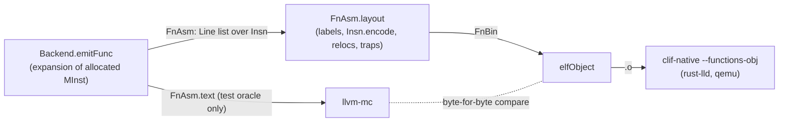

# Contract: the Lean machine-code encoder and object writer (`FV/Backend/{Encode,Obj}.lean`, M5)

Producer: M5 encoder. Consumers: the Lean backend pipeline (`docs/contracts/backend.md`),
`clif-native --functions-obj` (`docs/contracts/drivers.md`), `lean-backend-armrun`, the M5
proof (`decode ∘ encode`), M7 (`backend_correct`). Inputs: the final instruction list of the
backend (`Backend.Insn`, `FV/Backend/Asm.lean`) and the Lean Arm model's decoder
(`Arm.decode_raw_inst`, `docs/contracts/arm.md`).

Owner decision (PLAN.md §0): working end to end first, differentially tested, proofs after.
`llvm-mc` is no longer in the pipeline; it remains only as the test oracle. The M5 proofs are
in `FV/Backend/Proof/Encode*.lean` (section "M5 theorems").

## Status (kept current for resumption)

M5 proven (2026-09-27); no `sorry`, no hand-written `axiom`, no warnings in the new files.

- [x] `Backend.Insn`: one structured instruction type consumed by both the assembly printer
      (`Insn.asm`) and the encoder (`Insn.encode`) — `FV/Backend/Asm.lean`
- [x] `Insn.toArmInst` (fields per Arm ARM instruction page), `armBits` (C4.1 class diagrams),
      `Insn.encode`, `Insn.reloc?`, `Insn.decodeOk`, layout `FnAsm.layout` → `FnBin` —
      `FV/Backend/Encode.lean`
- [x] ELF64 relocatable object writer `elfObject` — `FV/Backend/Obj.lean`
- [x] `lean-backend IN.clif OUT.o` writes the object (no assembler); `--dump DIR` writes
      `name.bin`/`name.relocs.json`/`name.traps.json` (the `clif2obj` dump schema)
- [x] **M5 theorem** `Insn.decode_encode` for every `Insn` (all forms and aliases the backend
      emits) at every position, via `decode_armBits` for every encoding class —
      `FV/Backend/Proof/Encode{Base,DPI,BR,DPR,DPSFP,LDST,RES}.lean`, `Encode.lean`
- [x] semantic link: `Insn.sem`, `Insn.stepi_eq_sem`, loader level `FnAsm.stepi_eq_sem` —
      `FV/Backend/Proof/Encode.lean`, `EncodeStep.lean`
- [x] layout correctness (placement, labels, branches, jump tables, relocations, trap sites) —
      `FV/Backend/Proof/EncodeLayout.lean`
- [x] branch-range policy (bound + compile error), proved (`Insn.encode_inRange`,
      `Insn.encode_error_of_out_of_range`, `FV/Backend/Proof/EncodeBranch.lean`) and tested
      (`lean-backend-encode-test range`, including large functions)
- [x] byte-for-byte check against `llvm-mc`: **971/971** functions identical; decode check
      61 133 instructions (74 mnemonics); backend filetests corpus **114/114**, extrt 22/22,
      runtests **3085 pass / 0 fail / 0 disagree** (section "Tests and results")

## Pipeline



## API (namespace `Backend`)

### Shared instruction type (`FV/Backend/Asm.lean`)

- `Lbl := block l | trap n | jt n` (function-local labels; `Lbl.name k` = `.L<k>_b<l>` …).
- `Insn`: one line of assembly = one 4-byte word, over real registers (`Reg`: `x n`, `xzr`,
  `sp`, `v n`). Constructors follow the printed assembly, including aliases (`mov`, `cset`,
  `lsl/lsr/asr/ror #imm`), so `llvm-mc` checks the encoder's alias translation. Branch targets
  are `Lbl`s; symbol operands (`bl`, `adrp`, `:got:`, `:got_lo12:`, `:lo12:`) carry the symbol
  name (and addend).
- `Line := ins (i : Insn) (trap : Option TrapCode) | word (target base : Lbl) | label (l : Lbl)`
  (`word` = jump-table entry `.word target - base`, 4 bytes of data).
- `MInst.lines` (the `emit.rs` expansion of one allocated instruction), `emitFunc k af : FnAsm`
  (`name`, `k`, `lines`, `size`, `traps`), `FnAsm.text` (assembly; `.ifne` guards check
  offsets in `llvm-mc`).

### Encoder (`FV/Backend/Encode.lean`)

| Definition | Meaning |
| --- | --- |
| `Env := ⟨pc, lbl : Lbl → Option Nat⟩` | offset of the instruction and of the function's labels |
| `Insn.armFields env : Insn → Except String ArmInst` | encoding class + field values (structure literals); rejects invalid operands |
| `ArmInst.norm`, `Insn.toArmInst env i := ArmInst.norm <$> i.armFields env` | the same with the `_fixed` fields at the decoder's values (identity on `armFields`' literals) |
| `armBits : ArmInst → BitVec 32` | fields concatenated per C4.1 diagram, fixed bits literal |
| `Insn.encode env i := armBits <$> i.toArmInst env` | the machine word |
| `Insn.decodeOk env i : Bool` | `decode_raw_inst (armBits a) == some a` for `a = toArmInst env i` |
| `Insn.reloc? : Insn → Option (RelocType × String × Int)` | relocation of a symbol operand |
| `bitmaskEnc? is64 v` | `N:immr:imms` (inverse of `DecodeBitMasks`) |
| `Env.pcRel env what bits scale l` | PC-relative immediate of a label operand; the branch-range check |
| `labelOffsets` (error on a label defined twice), `lineOffset`, `codeLines`, `Line.encodeAt`, `encodeCode`, `codeRelocs`, `codeTraps` | the pieces of the layout |
| `FnAsm.layout : FnAsm → Except String FnBin` | label resolution, words, relocs, traps (checked equal to `emitFunc`'s table) |
| `FnBin := ⟨name, words, relocs, traps, insns⟩`, `wordsBytes` | what `name.bin`/`relocs.json`/`traps.json` hold |

`Reg.encZR`/`Reg.encSP`/`Reg.encV` enforce the meaning of register 31 per operand (e.g.
`xzr` as the base of `add (immediate)` is an error, not silently `sp`). Immediates, shift
amounts, lane indexes and **branch ranges** are checked (`uField`, `sField`, `Env.pcRel`): an
out-of-range `b.cond`/`cbz` (±1 MiB), `tbz` (±32 KiB), `b` (±128 MiB), `adr` (±1 MiB) is an
encoding error, so no branch is ever silently truncated (section "Branch-range policy").

### Object writer (`FV/Backend/Obj.lean`)

`elfObject : List (FnAsm × FnBin) → ByteArray`: ELF64, `ELFCLASS64`, little-endian,
`ET_REL`, `EM_AARCH64` (183). Sections: null, `.text` (`AX`, align 4, the functions
back to back), `.rela.text` (`SHT_RELA`, `SHF_INFO_LINK`, link `.symtab`, info `.text`,
24-byte entries), `.symtab` (null; local mapping symbols `$x`/`$d` at each switch between
instructions and jump-table data, as AAELF64 requires and `llvm-mc` emits; then one
`STT_FUNC`/`STB_GLOBAL` symbol per function with its size; then the undefined referenced
symbols, `STB_GLOBAL`), `.strtab`, `.shstrtab`. Relocations refer to the target's symbol
also for functions defined in the object (as `llvm-mc` does for global symbols), with the
RELA addend and a zero immediate field.

| Relocation | ELF code | Instruction | Cranelift name (`relocs.json`) |
| --- | --- | --- | --- |
| `R_AARCH64_CALL26` | 283 | `bl sym` | `Arm64Call` |
| `R_AARCH64_ADR_GOT_PAGE` | 311 | `adrp xd, :got:sym` | `Aarch64AdrGotPage21` |
| `R_AARCH64_LD64_GOT_LO12_NC` | 312 | `ldr xd, [xn, :got_lo12:sym]` | `Aarch64Ld64GotLo12Nc` |
| `R_AARCH64_ADR_PREL_PG_HI21` | 275 | `adrp xd, sym+a` | `Aarch64AdrPrelPgHi21` |
| `R_AARCH64_ADD_ABS_LO12_NC` | 277 | `add xd, xn, :lo12:sym+a` | `Aarch64AddAbsLo12Nc` |

Local branches, `adr` and jump-table words are resolved in Lean (no relocation), as
`llvm-mc` resolves them. Trap sites: `FnBin.traps` (offsets of `udf #0xc11f` and of
trapping loads/stores) go into the `--functions-table` JSON as before.

## Instruction / encoding table

"Class" is the Arm ARM (DDI 0487) C4.1 encoding class (= the model's `ArmInst` constructor,
encoded by `armBits`); "Page" is the instruction description in C6.2 (base) or C7.2
(SIMD&FP) whose field values `Insn.toArmInst` transcribes. Cranelift cross-reference:
`cranelift/codegen/src/isa/aarch64/inst/emit.rs`.

| `Insn` form (assembly) | Class (`ArmInst`) | Page / alias rule | Cranelift |
| --- | --- | --- | --- |
| `aluRRR add/sub/adds/subs` | `DPR.Add_sub_shifted_reg` (LSL #0) | ADD/SUB/ADDS/SUBS (shifted register) | `enc_arith_rrr` |
| `aluRRR and/orr/eor/ands/bic/orn/eon` | `DPR.Logical_shifted_reg` | AND/ORR/EOR/ANDS/BIC/ORN/EON (shifted register) | `enc_arith_rrr` |
| `aluRRR udiv/sdiv/lslv/lsrv/asrv/rorv` | `DPR.Data_processing_two_source` | UDIV, SDIV, LSLV, LSRV, ASRV, RORV | `enc_arith_rrr` |
| `aluRRR smulh/umulh` | `DPR.Data_processing_three_source` (Ra = 31) | SMULH, UMULH | `enc_arith_rrrr` |
| `aluRRR adc/adcs/sbc/sbcs` | `DPR.Add_sub_carry` | ADC, ADCS, SBC, SBCS | `enc_arith_rrr` |
| `aluRRRR madd/msub/smaddl/umaddl` | `DPR.Data_processing_three_source` | MADD, MSUB, SMADDL, UMADDL | `enc_arith_rrrr` |
| `aluImm12` | `DPI.Add_sub_imm` | ADD/ADDS/SUB/SUBS (immediate); CMP/CMN aliases | `enc_arith_rr_imm12` |
| `logicImm` | `DPI.Logical_imm` | AND/ORR/EOR/ANDS (immediate); `DecodeBitMasks` inverse | `enc_arith_rr_imml`, `ImmLogic::maybe_from_u64` |
| `shiftImm lsl/lsr/asr` | `DPI.Bitfield` | LSL/LSR/ASR (immediate) → UBFM/SBFM | `Inst::AluRRImmShift` |
| `shiftImm ror` | `DPI.Extract` | ROR (immediate) → EXTR Rd, Rs, Rs | `Inst::AluRRImmShift` |
| `aluRRRShift` | `DPR.Add_sub_shifted_reg` / `DPR.Logical_shifted_reg` | (shifted register) forms; ROR only for logical | `enc_arith_rrr` |
| `extr` | `DPI.Extract` | EXTR | `Inst::AluRRRShift` (`Extr`) |
| `aluRRRExtend` | `DPR.Add_sub_ext_reg` (imm3 = 0) | ADD/SUB/ADDS/SUBS (extended register) | `Inst::AluRRRExtend` |
| `bitRR` | `DPR.Data_processing_one_source` | RBIT, REV16, REV32, REV, CLZ, CLS; `BitOp.rev32` at 32 bits = REV Wd (opc 0b000010, sf 0, `emit.rs:971`, `bswap.i32`) | `enc_bit_rr` |
| `load`/`store` `unsignedOffset` | `LDST.Reg_unsigned_imm` | LDR*/STR* (immediate, unsigned offset) | `enc_ldst_uimm12` |
| `load`/`store` `unscaled` | `LDST.Reg_unscaled_imm` | LDUR*/STUR* | `enc_ldst_simm9` |
| `load`/`store` `spPreIndexed`/`spPostIndexed` | `LDST.Reg_imm_pre_indexed` / `Reg_imm_post_indexed` | LDR*/STR* (immediate, pre/post-index) | `enc_ldst_simm9` |
| `load`/`store` `regReg`/`regScaled`/`regScaledExtended`/`regExtended` | `LDST.Reg_reg_offset` | LDR*/STR* (register) | `enc_ldst_reg` |
| `ldp`/`stp` (sp pre/post-index) | `LDST.Reg_pair_pre_indexed` / `Reg_pair_post_indexed` | LDP/STP (64-bit) | `enc_ldst_pair` |
| `mov` (with `sp`) | `DPI.Add_sub_imm` (#0) | MOV (to/from SP) → ADD #0 | `Inst::Mov` |
| `mov` | `DPR.Logical_shifted_reg` (Rn = ZR) | MOV (register) → ORR | `Inst::Mov` |
| `movWide`, `movk` | `DPI.Move_wide_imm` | MOVZ, MOVN, MOVK | `enc_move_wide`, `enc_movk` |
| `bfm` | `DPI.Bitfield` | SBFM, UBFM | `enc_bfm` |
| `cset` | `DPR.Conditional_select` (op2 01) | CSET → CSINC Rd, ZR, ZR, invert(cond) | `enc_csel` |
| `csel` | `DPR.Conditional_select` | CSEL (standalone `MInst.csel`, `select`/min/max; also in `JTSequence`) | `enc_csel` |
| `ccmp`, `ccmpImm` | `DPR.Conditional_compare_reg` / `_imm` | CCMP (register / immediate) | `enc_ccmp`, `enc_ccmp_imm` |
| `fmovToFp` | `DPSFP.Conversion_between_FP_and_Int` | FMOV (general) | `Inst::MovToFpu` |
| `umov` | `DPSFP.Advanced_simd_copy` | UMOV | `Inst::MovFromVec` |
| `cnt` | `DPSFP.Advanced_simd_two_reg_misc` | CNT | `Inst::VecMisc` |
| `vecLanes addv/uaddlv` | `DPSFP.Advanced_simd_across_lanes` | ADDV, UADDLV | `enc_vec_lanes` |
| `addp` | `DPSFP.Advanced_simd_three_same` | ADDP (vector) | `enc_vec_rrr` |
| `b`, `bl` | `BR.Uncond_branch_imm` | B, BL (+ `R_AARCH64_CALL26`) | `enc_jump26` |
| `bcond` | `BR.Cond_branch_imm` | B.cond | `enc_cbr` |
| `cbz` | `BR.Compare_branch` | CBZ, CBNZ | `enc_cmpbr` |
| `tbz` | `BR.Test_branch` | TBZ, TBNZ | `enc_test_bit_and_branch` |
| `blr`, `br`, `ret` | `BR.Uncond_branch_reg` | BLR, BR, RET | `enc_br` … |
| `udf` | `RES.Udf` | UDF | `Inst::Udf` |
| `adr` | `DPI.PC_rel_addressing` (op 0) | ADR | `enc_adr` |
| `adrpGot`, `adrp` | `DPI.PC_rel_addressing` (op 1, imm 0) | ADRP (+ relocation; `R_AARCH64_ADR_GOT_PAGE` against function or, for `symbol_value`, undefined `STT_NOTYPE` data symbols) | `Inst::LoadExtNameGot/Near` |
| `ldrGotLo12` | `LDST.Reg_unsigned_imm` (imm12 0) | LDR (immediate, 64-bit) (+ relocation) | `Inst::LoadExtNameGot` |
| `addLo12` | `DPI.Add_sub_imm` (imm12 0) | ADD (immediate) (+ relocation) | `Inst::LoadExtNameNear` |

## Tests and results (2026-09-27)

Current run (after the M5 proofs, the functional layout and `Env.pcRel`; all exit 0):
`lean-backend-encode-check.sh` 446 files, **971/971** functions identical (1 073 relocations);
`decode` 116 files, 932 functions, **61 133** instructions (74 mnemonics), 0 failures;
`random` 39 forms, 7 839 instructions, 0 failures, bitmask 4 000 samples / 0 disagreements;
`range` **116/116** checks; `lean-backend-filetests.sh` corpus **114/114** (114 agree), extrt
22/22, runtests **3085 pass / 0 fail / 0 disagree**; `lean-backend-armrun` 25 functions,
73 runs agree. The numbers below are the first (pre-proof) run.

```sh
lake build FV.Backend lean-backend lean-backend-encode-test lean-backend-armrun
scripts/lean-backend-encode-check.sh [-v] [--corpus | --runtests | --random | --n N | --seed S | FILE.clif...]
.lake/build/bin/lean-backend-encode-test decode [FILE.clif...]   # default: corpus + extrt + runtests
.lake/build/bin/lean-backend-encode-test random OUT.s OUT.o [--n N] [--seed S]
.lake/build/bin/lean-backend-encode-test range                  # branch-range policy
lake build FV.Backend.Proof.EncodeStep                          # all M5 proofs (~1 min)
scripts/lean-backend-filetests.sh [-v] [--asm] [--corpus | --runtests | FILE.clif...]
.lake/build/bin/lean-backend-armrun [FILE.clif...]
```

1. **Byte-for-byte vs `llvm-mc`** (`scripts/lean-backend-encode-check.sh`, default = corpus,
   extrt, runtests, random): per compiled function, `.text` bytes, relocations (offset, type,
   symbol, addend) and the function symbol (value, size, type, binding) are compared exactly;
   per file also the mapping symbols and the undefined symbols. `llvm-mc` gets
   `-mattr=+fullfp16` (only `fmov h, w` needs it).

   | Set | Files | Functions | Identical | Words | Relocations |
   | --- | --- | --- | --- | --- | --- |
   | corpus/clif + extrt + all 395 runtests | 445 (110 with compiled functions) | 845 | **845** | 59 698 | 473 |
   | random (`--n 200`, seed 24301) | 1 | 39 (one per form) | **39** | 8 151 | 600 |
   | random (`--n 1000`, seeds 1, 2, 3, 12345, 99991) | 5 | 5 × 39 | **195** | 5 × 39 351 | 5 × 3 000 |
   | default run (all of the above sets at `--n 200`; exit 0) | 446 | 884 | **884** | 67 849 | 1 073 |

   A deliberately broken encoder (CSET without the condition inversion) makes 105 of the
   156 corpus/clif functions differ, so the comparison is sensitive.
2. **No-assembler backend suite** (`scripts/lean-backend-filetests.sh`, exit 0): corpus
   114 pass / 0 fail, 114 agree with Cranelift-native; extrt 22/22; runtests 2791 pass, 0 fail,
   0 disagree (identical to the `--asm` path). `clif-native/tests/traps.clif`: same trap
   mapping as Cranelift (`int_divz`, `int_ovf`, `heap_oob`) with and without the assembler.
3. **Decode check** (`lean-backend-encode-test decode`): files 110, functions 845, 59 683
   instructions (72 mnemonics) — every one satisfies `decode_raw_inst (armBits a) = some a`.
   Random: 39 forms × N instances all satisfy it; the bitmask encoder accepts exactly the
   values `ImmLogic.ofNat?` accepts (4 000 samples at N = 200, 1 328 valid).
   `FVTest/Backend/Encode/Examples.lean`: 27 concrete instances (one or more per class,
   register 31 in both roles, backward/forward branches, relocated forms) proven by `decide`
   in the kernel, plus one exact word (`stp x29, x30, [sp, #-16]!` = `0xa9bf7bfd`) and one
   rejected operand.
4. **Arm model runs** (`lean-backend-armrun`, now from Lean-encoded bytes): corpus 25
   functions / 73 runs agree; 14 runtest files 221 functions / 883 runs agree.
5. **Branch range** (`lean-backend-encode-test range`, `FVTest/Backend/Encode/Range.lean`):
   every label-relative form at the extreme in-range offsets (`reach - align`, `-reach`:
   encode, decode, resolve) and one step beyond (`reach`, `-reach - align`, misaligned:
   "branch out of range" / "not a multiple" errors); large functions of filler instructions
   (forward `tbz` over 8 190 / 8 191 instructions, backward `b.eq` over 262 144 / 262 145,
   forward `cbz` over 262 142 / 262 143: the first lays out with the exact offset, the second
   fails naming the function and offset); a generated CLIF function with 2 × 3 000 `iadd`s
   whose `brif` becomes a `tbz`/`tbnz` fails to lay out, a 2 × 100 one lays out.

The random generator covers every `Insn` constructor: all registers including 31 where the
role allows it (SP or ZR), every immediate range, all 16 conditions, all load/store modes
and sizes (GPR and Q), every arrangement, labels placed before and after branches, jump-table
words, and symbol operands with addends (also against a function defined in the object).

## M5 theorems (`FV/Backend/Proof/`)

### Round trip (`Encode.lean`)

```lean
-- every encoding class, every field value (`norm` resets the `_fixed` fields armBits ignores)
theorem Backend.decode_armBits (a : ArmInst) : decode_raw_inst (armBits a) = some a.norm

-- M5: for every Insn (all constructors and aliases) at every position
theorem Backend.Insn.decode_encode {env : Env} {i : Insn} {w : BitVec 32}
    (h : i.encode env = .ok w) :
    ∃ a, i.toArmInst env = .ok a ∧ decode_raw_inst w = some a
theorem Backend.Insn.decode_encode_of (ha : i.toArmInst env = .ok a)
    (hw : i.encode env = .ok w) : decode_raw_inst w = some a
theorem Backend.Insn.decodeOk_of_encode (h : i.encode env = .ok w) : i.decodeOk env = true

-- semantic link for M7
def Backend.Insn.sem (env : Env) (i : Insn) (s : ArmState) : Except String ArmState :=
  (exec_inst · s) <$> i.toArmInst env
theorem Backend.Insn.stepi_eq_sem (herr : r .ERR s = .None)
    (hfetch : fetch_inst (r .PC s) s = some w) (henc : i.encode env = .ok w) :
    i.sem env s = .ok (stepi s)
```

`Insn` is not the decoder's output type (aliases such as `mov`/`orr`, `cset`/`csinc`,
`lsl #`/`ubfm`), so PLAN.md §3.4's "decode (encode i) = i" is stated through `toArmInst`:
decoding the word gives exactly the instruction `toArmInst` specifies, and `Insn.sem` is its
meaning on the model. That `toArmInst`'s fields are the right ones for the intended operation
(alias rules, register-31 roles) is the M7 obligation on `Insn.sem`; it is also checked
byte-for-byte against `llvm-mc` (below).

Why no per-`Insn`-constructor case analysis: `armBits` never reads the model structures'
`_fixed` fields, and the decoder always fills them with their defaults, so the class lemmas
hold for `a.norm`; `toArmInst` returns `norm` of `armFields`' structure literals (`norm` is the
identity on them) and `norm` is idempotent (`ArmInst.norm_norm`). The class lemmas are
unconditional (every field value): in each group decoder, the patterns before the class's own
differ from it in at least one fixed bit.

### Per-form table

Every `Insn` form is covered by `Insn.decode_encode`; its word is decoded by the lemma of its
class (`decode_armBits_<Class>`, file `Encode<Group>.lean`):

| `Insn` forms | Class lemma(s) |
| --- | --- |
| `aluRRR` add/sub/adds/subs, `aluRRRShift` (add/sub) | `decode_armBits_Add_sub_shifted_reg` |
| `aluRRR` and/orr/eor/ands/bic/orn/eon, `aluRRRShift` (logical), `mov` (register) | `decode_armBits_Logical_shifted_reg` |
| `aluRRR` udiv/sdiv/lslv/lsrv/asrv/rorv | `decode_armBits_Data_processing_two_source` |
| `aluRRR` smulh/umulh, `aluRRRR` | `decode_armBits_Data_processing_three_source` |
| `aluRRR` adc/adcs/sbc/sbcs | `decode_armBits_Add_sub_carry` |
| `aluImm12` (incl. cmp/cmn), `mov` (to/from sp), `addLo12` | `decode_armBits_Add_sub_imm` |
| `logicImm` | `decode_armBits_Logical_imm` |
| `shiftImm` lsl/lsr/asr, `bfm` | `decode_armBits_Bitfield` |
| `shiftImm` ror, `extr` | `decode_armBits_Extract` |
| `aluRRRExtend` | `decode_armBits_Add_sub_ext_reg` |
| `bitRR` (rbit, rev16, rev32, rev, clz, cls) | `decode_armBits_Data_processing_one_source` |
| `load`/`store` unsignedOffset, `ldrGotLo12` | `decode_armBits_Reg_unsigned_imm` |
| `load`/`store` unscaled | `decode_armBits_Reg_unscaled_imm` |
| `load`/`store` spPreIndexed / spPostIndexed | `decode_armBits_Reg_imm_pre_indexed` / `_post_indexed` |
| `load`/`store` register modes | `decode_armBits_Reg_reg_offset` |
| `ldp`/`stp` | `decode_armBits_Reg_pair_pre_indexed` / `_post_indexed` |
| `movWide`, `movk` | `decode_armBits_Move_wide_imm` |
| `cset`, `csel` | `decode_armBits_Conditional_select` |
| `ccmp` / `ccmpImm` | `decode_armBits_Conditional_compare_reg` / `_imm` |
| `fmovToFp` | `decode_armBits_Conversion_between_FP_and_Int` |
| `umov` | `decode_armBits_Advanced_simd_copy` |
| `cnt` | `decode_armBits_Advanced_simd_two_reg_misc` |
| `vecLanes` | `decode_armBits_Advanced_simd_across_lanes` |
| `addp` | `decode_armBits_Advanced_simd_three_same` |
| `b`, `bl` | `decode_armBits_Uncond_branch_imm` |
| `bcond` | `decode_armBits_Cond_branch_imm` |
| `cbz` | `decode_armBits_Compare_branch` |
| `tbz` | `decode_armBits_Test_branch` |
| `blr`, `br`, `ret` | `decode_armBits_Uncond_branch_reg` |
| `udf` | `decode_armBits_Udf` |
| `adr`, `adrpGot`, `adrp` | `decode_armBits_PC_rel_addressing` |

Also proved (not emitted): `Hints`, `Reg_pair_signed_offset`.

### Tactic (`EncodeBase.lean`)

`decode_class d g` proves `decode_raw_inst (armBits (.G (.C x))) = some (ArmInst.G (.C x)).norm`
for a class `C` of group `G`, generic in the structure `x`:

1. name the word: `refine decode_of_armBits fun w hw => ?_` (`hw : armBits … = w`, so the
   32-bit concatenation is not duplicated in every `if`; without this `split` exceeds simp's
   step limit), unfold `armBits` in `hw` and `ArmInst.norm` in the goal;
2. top-level dispatch: rewrite with `d` (`decode_raw_inst_of_{dpi,br,dpr,dpsfp,ldst,reserved}`:
   `op1 = w<28:25>` in the group's set ⇒ `decode_raw_inst w = g w`), side condition by `bv_decide`;
3. unfold the group decoder `g` (a `match_bv` = chain of `if … then some (C {f := extractLsb' …})`),
   `repeat' split`;
4. each branch: `congr <;> bv_decide` (the matching pattern: one `extractLsb' lo n w = x.f` per
   field) or `bv_decide` (a pattern that cannot match: its condition contradicts `hw`).

All `bv_decide` problems are about one 32-bit word; the 37 class lemmas elaborate in ~45 s in
total, each file well under the 16 GB memcap. The ISLE program is not involved.

### Label operands and the branch-range policy (`EncodeBranch.lean`)

```lean
def Backend.Insn.pcRelSpec? : Insn → Option (Lbl × Int × Int)   -- target, reach, alignment
  | .b t => some (t, 128 * 2 ^ 20, 4)                 -- B: imm26:'00', ±128 MiB
  | .bcond _ t | .cbz _ _ _ t => some (t, 2 ^ 20, 4)  -- B.cond, CBZ/CBNZ: imm19:'00', ±1 MiB
  | .tbz _ _ _ t => some (t, 32 * 2 ^ 10, 4)          -- TBZ/TBNZ: imm14:'00', ±32 KiB
  | .adr _ t => some (t, 2 ^ 20, 1)                   -- ADR: immhi:immlo, ±1 MiB
  | _ => none
def Arm.ArmInst.pcRelOffset? : ArmInst → Option Int   -- 4 * imm.toInt, or (immhi ++ immlo).toInt

theorem Backend.Insn.toArmInst_pcRel (h : i.toArmInst env = .ok a)
    (hs : i.pcRelSpec? = some (t, reach, align)) :
    ∃ o, env.lbl t = some o ∧ a.pcRelOffset? = some ((o : Int) - env.pc) ∧
      -reach ≤ (o : Int) - env.pc ∧ (o : Int) - env.pc < reach ∧ align ∣ (o : Int) - env.pc
theorem Backend.Insn.encode_inRange (h : i.encode env = .ok w)
    (hs : i.pcRelSpec? = some (t, reach, align)) :
    ∃ o, env.lbl t = some o ∧ -reach ≤ (o : Int) - env.pc ∧ (o : Int) - env.pc < reach ∧
      align ∣ (o : Int) - env.pc
theorem Backend.Insn.encode_error_of_out_of_range (hs : i.pcRelSpec? = some (t, reach, align))
    (o : Nat) (hl : env.lbl t = some o)
    (hout : ¬ (-reach ≤ (o : Int) - env.pc ∧ (o : Int) - env.pc < reach)) :
    ∃ e, i.encode env = .error e
theorem Backend.signExtend_append_zero (x : BitVec (n + 1)) :
    BitVec.signExtend 64 (x ++ 0#2) = BitVec.ofInt 64 (4 * x.toInt)   -- the model's branch offset
```

**Branch-range policy** (PLAN.md §3.4 "only long-range branches, or bounded function sizes, so
branch relaxation never arises"): bound + compile error, no relaxation. `Env.pcRel` rejects a
target beyond the form's reach; `FnAsm.layout` then fails and `lean-backend` exits 1 with, e.g.,

```
lean-backend: big.clif: encoding failed: big+8: `tbnz x0, #2, .L0_b1`: branch out of range:
tbz to Backend.Lbl.block 1 is 36008 bytes away, beyond the ±32 KiB of tbz (no branch
relaxation, PLAN.md §3.4: the function is too large)
```

A successful layout therefore implies every label operand is in range (`FnAsm.layout_branch`
takes no range hypothesis and concludes the range). Cranelift relaxes such branches with
veneers, so a function above the bound compiles with Cranelift but not with this backend. No
survey file hits it: 0 encoding failures over the 7 067 `.clif` files of the rust-clif survey
(`/tmp/rust-clif-survey`, 2026-09-27).

### Layout (`EncodeLayout.lean`)

Notation: `L = f.lines.toList`, `off j = lineOffset L j` (sum of the sizes of the lines before
line `j`; instructions and jump-table words are 4 bytes, labels 0), `hm : labelOffsets f.lines = .ok m`
(`FnAsm.layout_labelOffsets` gives `m` from a successful layout).

```lean
theorem labelOffsets_spec (h : labelOffsets lines = .ok m) (l o) :
    m[l]? = some o ↔ ∃ j, lines.toList[j]? = some (.label l) ∧ lineOffset lines.toList j = o
theorem labelOffsets_label (h) (hj : lines.toList[j]? = some (.label l)) :
    m[l]? = some (lineOffset lines.toList j)          -- labels are unique (else layout fails)
theorem FnAsm.layout_size (h : f.layout = .ok b) :
    4 * b.words.size = f.size ∧ b.words.size = (codeLines L).length
theorem FnAsm.layout_word (h : f.layout = .ok b) (hm) (hj : L[j]? = some ln) (hl : ln.isLabel = false) :
    off j % 4 = 0 ∧ ∃ w, ln.encodeAt (m[·]?) (off j) = .ok w ∧ b.words[off j / 4]? = some w
theorem FnAsm.layout_word_inv (h) (hm) (hk : b.words[k]? = some w) :
    ∃ j ln, L[j]? = some ln ∧ ln.isLabel = false ∧ off j = 4 * k ∧ ln.encodeAt (m[·]?) (4 * k) = .ok w
theorem FnAsm.layout_insn (h) (hm) (hj : L[j]? = some (.ins i t)) :
    off j % 4 = 0 ∧ ∃ w a, b.words[off j / 4]? = some w ∧
      i.toArmInst ⟨off j, (m[·]?)⟩ = .ok a ∧ decode_raw_inst w = some a
theorem FnAsm.layout_branch (h) (hm) (hj : L[j]? = some (.ins i t))
    (hs : i.pcRelSpec? = some (l, reach, align)) :
    ∃ w a, b.words[off j / 4]? = some w ∧ decode_raw_inst w = some a ∧
      (∃ j', L[j']? = some (.label l)) ∧
      ∀ j', L[j']? = some (.label l) → let d := (off j' : Int) - off j
        a.pcRelOffset? = some d ∧ -reach ≤ d ∧ d < reach ∧ align ∣ d
theorem FnAsm.layout_jumpTable (h) (hm) (hj : L[j]? = some (.word t base)) :
    ∃ w, b.words[off j / 4]? = some w ∧ (∃ jt jb, L[jt]? = some (.label t) ∧ L[jb]? = some (.label base)) ∧
      ∀ jt jb, L[jt]? = some (.label t) → L[jb]? = some (.label base) → w.toInt = off jt - off jb
theorem FnAsm.layout_relocs (h) (r : Reloc) :
    r ∈ b.relocs ↔ ∃ j i t, L[j]? = some (.ins i t) ∧ i.reloc? = some (r.type, r.sym, r.addend) ∧
      off j = r.offset
theorem FnAsm.layout_traps (h) : b.traps = f.traps ∧
    ∀ s, s ∈ b.traps ↔ ∃ j i, L[j]? = some (.ins i (some s.code)) ∧ off j = s.offset
theorem FnAsm.layout_trap_word (h) (hm) (hs : s ∈ b.traps) :
    ∃ j i w a, L[j]? = some (.ins i (some s.code)) ∧ off j = s.offset ∧ b.words[s.offset / 4]? = some w ∧
      i.toArmInst ⟨s.offset, (m[·]?)⟩ = .ok a ∧ decode_raw_inst w = some a
```

`emitFunc` puts a trap code only on `udf #0xc11f` (`Insn.toArmInst` = `RES (Udf {imm16 :=
0xc11f})`, the model's `Trap` outcome), so the trap table lists exactly the `udf` offsets.

### Executing laid-out code (`EncodeStep.lean`)

```lean
def Backend.FnBin.program (base : BitVec 64) (b : FnBin) : Program   -- word k at base + 4k
theorem Backend.FnAsm.stepi_eq_sem (h : f.layout = .ok b) (hm : labelOffsets f.lines = .ok m)
    (hj : L[j]? = some (.ins i t)) (hsz : f.size ≤ 2 ^ 64) (hprog : s.program = b.program base)
    (hpc : r .PC s = base + BitVec.ofNat 64 (off j)) (herr : r .ERR s = .None) :
    i.sem ⟨off j, (m[·]?)⟩ s = .ok (stepi s)
```

### What the relocation records assert (trusted linker, PLAN.md §5)

The layout proves (`FnAsm.layout_relocs`) that `b.relocs` holds exactly one record
`⟨offset, type, sym, addend⟩` per instruction with a symbol operand, at that instruction's
offset, and `decode_encode` fixes the instruction's word with a **zero** immediate field
(`bl`: `imm26 = 0`; `adrp`: `immhi:immlo = 0`; `ldr`/`add` `:lo12:`: `imm12 = 0`). Each record
asks the static linker (`rust-lld`, trusted) to overwrite that field per AAELF64, with `S` the
symbol's address, `A` the addend, `P` the instruction's address, `G(S)` the address of `S`'s
GOT entry:

| Type | Instruction | Field written | Value (AAELF64) |
| --- | --- | --- | --- |
| `R_AARCH64_CALL26` (283) | `bl sym` | `imm26` | `(S + A - P) >> 2`, checked ±128 MiB (or a veneer) |
| `R_AARCH64_ADR_GOT_PAGE` (311) | `adrp xd, :got:sym` | `immhi:immlo` | `Page(G(S)) - Page(P)` >> 12, checked ±4 GiB |
| `R_AARCH64_LD64_GOT_LO12_NC` (312) | `ldr xd, [xn, :got_lo12:sym]` | `imm12` | `G(S)<11:3>` (no check) |
| `R_AARCH64_ADR_PREL_PG_HI21` (275) | `adrp xd, sym+A` | `immhi:immlo` | `Page(S + A) - Page(P)` >> 12, checked ±4 GiB |
| `R_AARCH64_ADD_ABS_LO12_NC` (277) | `add xd, xn, :lo12:sym+A` | `imm12` | `(S + A)<11:0>` (no check) |

After linking, the patched words decode to the same classes with the linker's immediates (the
class lemmas hold for every field value). The object writer (`elfObject`), the linker and
the loader are trusted (PLAN.md §5, M7 row); the writer is checked against `llvm-mc`'s objects.

### `#print axioms`

Every theorem above: `propext`, `Classical.choice`, `Quot.sound`, plus, for the ones that
depend on the class lemmas (`decode_armBits`, `Insn.decode_encode`, `Insn.stepi_eq_sem`,
`FnAsm.layout_insn`, `layout_branch`, `layout_trap_word`, `FnAsm.stepi_eq_sem`), 525
`Backend.decode_armBits_<Class>._native.bv_decide.ax_*` (the compiled LRAT checker's trust
axioms, allowed by `docs/ARCHITECTURE.md`). `toArmInst_pcRel`, `encode_inRange`,
`encode_error_of_out_of_range`, `labelOffsets_spec`, `layout_word`, `layout_word_inv`,
`layout_jumpTable`, `layout_relocs`, `layout_traps`: only the three standard axioms.

### Trusted pieces

- The Lean Arm model's decoder `decode_raw_inst` and `exec_inst` (validated by co-simulation,
  `docs/contracts/arm.md`): the theorems are against it, not against the Arm ARM.
- `bv_decide`'s compiled LRAT checker (the `_native` axioms) and the Lean kernel.
- `Insn.toArmInst`'s field choices as the meaning of each assembly form (M7 obligation on
  `Insn.sem`; checked byte-for-byte against `llvm-mc`).
- The object writer, linker (relocations above) and loader: the words are assumed to be at
  `base + 4k` (`FnBin.program`).

## Gaps

- Branch relaxation is not implemented (policy above): functions whose `tbz` spans more than
  ±32 KiB or whose conditional branches span more than ±1 MiB do not compile.
- M7 still has to relate `Insn.sem` (= `exec_inst` of `toArmInst`) to each form's intended
  effect (the M4 ISLE-rule semantics); M5 gives only the decode and placement facts.
- `FnAsm.stepi_eq_sem` is per function; linking several functions (calls through `bl`
  relocations, GOT) is outside the proof (trusted linker).
- Operand combinations the backend never produces are rejected, not encoded: `ldp`/`stp`
  other than `sp` pre/post-index, `AluRRImmLogic` with `bic`-style ops after inversion
  other than `and/orr/eor/ands`, `cset al/nv`, load/store extends other
  than `uxtw/uxtx/sxtw/sxtx`, unfinalized addressing modes. `toArmInst` throws with the
  reason and layout fails loudly (`lean-backend` exits 1 naming the function and instruction).
- `fmov h, w` needs FEAT_FP16 (the backend never emits it for E; encoded and tested anyway).
- `.word` jump-table entries are 32-bit signed differences; a function larger than 2 GiB is
  rejected.
