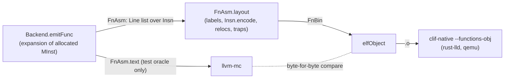

# Contract: the Lean machine-code encoder and object writer (`FV/Backend/{Encode,Obj}.lean`, M5, unproven)

Producer: M5 encoder. Consumers: the Lean backend pipeline (`docs/contracts/backend.md`),
`clif-native --functions-obj` (`docs/contracts/drivers.md`), `lean-backend-armrun`, the M5
proof (`decode ∘ encode`), M7 (`backend_correct`). Inputs: the final instruction list of the
backend (`Backend.Insn`, `FV/Backend/Asm.lean`) and the Lean Arm model's decoder
(`Arm.decode_raw_inst`, `docs/contracts/arm.md`).

Owner decision (PLAN.md §0): working end to end first, differentially tested, proofs after.
`llvm-mc` is no longer in the pipeline; it remains only as the test oracle.

## Status (kept current for resumption)

Complete (2026-09-27); no `sorry`, no `axiom`, no warnings in the new files.

- [x] `Backend.Insn`: one structured instruction type consumed by both the assembly printer
      (`Insn.asm`) and the encoder (`Insn.encode`) — `FV/Backend/Asm.lean`
- [x] `Insn.toArmInst` (fields per Arm ARM instruction page), `armBits` (C4.1 class diagrams),
      `Insn.encode`, `Insn.reloc?`, `Insn.decodeOk`, layout `FnAsm.layout` → `FnBin` —
      `FV/Backend/Encode.lean`
- [x] ELF64 relocatable object writer `elfObject` — `FV/Backend/Obj.lean`
- [x] `lean-backend IN.clif OUT.o` writes the object (no assembler); `--dump DIR` writes
      `name.bin`/`name.relocs.json`/`name.traps.json` (the `clif2obj` dump schema)
- [x] byte-for-byte check against `llvm-mc`: **845/845** functions identical (corpus +
      runtests), random operands for all 39 forms identical (`scripts/lean-backend-encode-check.sh`)
- [x] backend filetests through the no-assembler path (now the default): corpus **114/114**,
      extrt **22/22**, runtests **2791 pass / 0 fail / 0 disagree** (unchanged)
- [x] decode check: every encoded instruction of corpus + runtests (**59 683**) and of the
      random tests decodes to the intended `ArmInst`; 27 kernel-checked instances (`by decide`)
- [x] `lean-backend-armrun` runs Lean-encoded bytes on the Arm model (25/73, 221/883 agree)

## Pipeline



## API (namespace `Backend`)

### Shared instruction type (`FV/Backend/Asm.lean`)

- `Lbl := block l | trap n | jt n` (function-local labels; `Lbl.name k` = `.L<k>_b<l>` …).
- `Insn`: one line of assembly = one 4-byte word, over real registers (`Reg`: `x n`, `xzr`,
  `sp`, `v n`). Constructors follow the printed assembly, including aliases (`mov`, `cset`,
  `lsl/lsr/asr/ror #imm`), so `llvm-mc` checks the encoder's alias translation. Branch targets
  are `Lbl`s; symbol operands (`bl`, `adrp`, `:got:`, `:got_lo12:`, `:lo12:`) carry the symbol
  name (and addend).
- `Line := ins (i : Insn) (trap : Option TrapCode) | word (target base : Lbl) | label (l : Lbl)`
  (`word` = jump-table entry `.word target - base`, 4 bytes of data).
- `MInst.lines` (the `emit.rs` expansion of one allocated instruction), `emitFunc k af : FnAsm`
  (`name`, `k`, `lines`, `size`, `traps`), `FnAsm.text` (assembly; `.ifne` guards check
  offsets in `llvm-mc`).

### Encoder (`FV/Backend/Encode.lean`)

| Definition | Meaning |
| --- | --- |
| `Env := ⟨pc, lbl : Lbl → Option Nat⟩` | offset of the instruction and of the function's labels |
| `Insn.toArmInst env : Insn → Except String ArmInst` | encoding class + field values; rejects invalid operands |
| `armBits : ArmInst → BitVec 32` | fields concatenated per C4.1 diagram, fixed bits literal |
| `Insn.encode env i := armBits <$> i.toArmInst env` | the machine word |
| `Insn.decodeOk env i : Bool` | `decode_raw_inst (armBits a) == some a` for `a = toArmInst env i` |
| `Insn.reloc? : Insn → Option (RelocType × String × Int)` | relocation of a symbol operand |
| `bitmaskEnc? is64 v` | `N:immr:imms` (inverse of `DecodeBitMasks`) |
| `labelOffsets`, `FnAsm.layout : FnAsm → Except String FnBin` | label resolution, words, relocs, traps |
| `FnBin := ⟨name, words, relocs, traps, insns⟩`, `wordsBytes` | what `name.bin`/`relocs.json`/`traps.json` hold |

`Reg.encZR`/`Reg.encSP`/`Reg.encV` enforce the meaning of register 31 per operand (e.g.
`xzr` as the base of `add (immediate)` is an error, not silently `sp`). Immediates, shift
amounts, lane indexes and **branch ranges** are checked (`uField`, `sField`): an
out-of-range `b.cond` (±1 MiB), `tbz` (±32 KiB), `b` (±128 MiB), `adr` (±1 MiB) is an encoding
error, so no branch is ever silently truncated (PLAN.md §3.4: no relaxation; the error
reports the function and instruction).

### Object writer (`FV/Backend/Obj.lean`)

`elfObject : List (FnAsm × FnBin) → ByteArray`: ELF64, `ELFCLASS64`, little-endian,
`ET_REL`, `EM_AARCH64` (183). Sections: null, `.text` (`AX`, align 4, the functions
back to back), `.rela.text` (`SHT_RELA`, `SHF_INFO_LINK`, link `.symtab`, info `.text`,
24-byte entries), `.symtab` (null; local mapping symbols `$x`/`$d` at each switch between
instructions and jump-table data, as AAELF64 requires and `llvm-mc` emits; then one
`STT_FUNC`/`STB_GLOBAL` symbol per function with its size; then the undefined referenced
symbols, `STB_GLOBAL`), `.strtab`, `.shstrtab`. Relocations refer to the target's symbol
also for functions defined in the object (as `llvm-mc` does for global symbols), with the
RELA addend and a zero immediate field.

| Relocation | ELF code | Instruction | Cranelift name (`relocs.json`) |
| --- | --- | --- | --- |
| `R_AARCH64_CALL26` | 283 | `bl sym` | `Arm64Call` |
| `R_AARCH64_ADR_GOT_PAGE` | 311 | `adrp xd, :got:sym` | `Aarch64AdrGotPage21` |
| `R_AARCH64_LD64_GOT_LO12_NC` | 312 | `ldr xd, [xn, :got_lo12:sym]` | `Aarch64Ld64GotLo12Nc` |
| `R_AARCH64_ADR_PREL_PG_HI21` | 275 | `adrp xd, sym+a` | `Aarch64AdrPrelPgHi21` |
| `R_AARCH64_ADD_ABS_LO12_NC` | 277 | `add xd, xn, :lo12:sym+a` | `Aarch64AddAbsLo12Nc` |

Local branches, `adr` and jump-table words are resolved in Lean (no relocation), as
`llvm-mc` resolves them. Trap sites: `FnBin.traps` (offsets of `udf #0xc11f` and of
trapping loads/stores) go into the `--functions-table` JSON as before.

## Instruction / encoding table

"Class" is the Arm ARM (DDI 0487) C4.1 encoding class (= the model's `ArmInst` constructor,
encoded by `armBits`); "Page" is the instruction description in C6.2 (base) or C7.2
(SIMD&FP) whose field values `Insn.toArmInst` transcribes. Cranelift cross-reference:
`cranelift/codegen/src/isa/aarch64/inst/emit.rs`.

| `Insn` form (assembly) | Class (`ArmInst`) | Page / alias rule | Cranelift |
| --- | --- | --- | --- |
| `aluRRR add/sub/adds/subs` | `DPR.Add_sub_shifted_reg` (LSL #0) | ADD/SUB/ADDS/SUBS (shifted register) | `enc_arith_rrr` |
| `aluRRR and/orr/eor/ands/bic/orn/eon` | `DPR.Logical_shifted_reg` | AND/ORR/EOR/ANDS/BIC/ORN/EON (shifted register) | `enc_arith_rrr` |
| `aluRRR udiv/sdiv/lslv/lsrv/asrv/rorv` | `DPR.Data_processing_two_source` | UDIV, SDIV, LSLV, LSRV, ASRV, RORV | `enc_arith_rrr` |
| `aluRRR smulh/umulh` | `DPR.Data_processing_three_source` (Ra = 31) | SMULH, UMULH | `enc_arith_rrrr` |
| `aluRRR adc/adcs/sbc/sbcs` | `DPR.Add_sub_carry` | ADC, ADCS, SBC, SBCS | `enc_arith_rrr` |
| `aluRRRR madd/msub/smaddl/umaddl` | `DPR.Data_processing_three_source` | MADD, MSUB, SMADDL, UMADDL | `enc_arith_rrrr` |
| `aluImm12` | `DPI.Add_sub_imm` | ADD/ADDS/SUB/SUBS (immediate); CMP/CMN aliases | `enc_arith_rr_imm12` |
| `logicImm` | `DPI.Logical_imm` | AND/ORR/EOR/ANDS (immediate); `DecodeBitMasks` inverse | `enc_arith_rr_imml`, `ImmLogic::maybe_from_u64` |
| `shiftImm lsl/lsr/asr` | `DPI.Bitfield` | LSL/LSR/ASR (immediate) → UBFM/SBFM | `Inst::AluRRImmShift` |
| `shiftImm ror` | `DPI.Extract` | ROR (immediate) → EXTR Rd, Rs, Rs | `Inst::AluRRImmShift` |
| `aluRRRShift` | `DPR.Add_sub_shifted_reg` / `DPR.Logical_shifted_reg` | (shifted register) forms; ROR only for logical | `enc_arith_rrr` |
| `extr` | `DPI.Extract` | EXTR | `Inst::AluRRRShift` (`Extr`) |
| `aluRRRExtend` | `DPR.Add_sub_ext_reg` (imm3 = 0) | ADD/SUB/ADDS/SUBS (extended register) | `Inst::AluRRRExtend` |
| `bitRR` | `DPR.Data_processing_one_source` | RBIT, REV16, REV32, REV, CLZ, CLS | `enc_bit_rr` |
| `load`/`store` `unsignedOffset` | `LDST.Reg_unsigned_imm` | LDR*/STR* (immediate, unsigned offset) | `enc_ldst_uimm12` |
| `load`/`store` `unscaled` | `LDST.Reg_unscaled_imm` | LDUR*/STUR* | `enc_ldst_simm9` |
| `load`/`store` `spPreIndexed`/`spPostIndexed` | `LDST.Reg_imm_pre_indexed` / `Reg_imm_post_indexed` | LDR*/STR* (immediate, pre/post-index) | `enc_ldst_simm9` |
| `load`/`store` `regReg`/`regScaled`/`regScaledExtended`/`regExtended` | `LDST.Reg_reg_offset` | LDR*/STR* (register) | `enc_ldst_reg` |
| `ldp`/`stp` (sp pre/post-index) | `LDST.Reg_pair_pre_indexed` / `Reg_pair_post_indexed` | LDP/STP (64-bit) | `enc_ldst_pair` |
| `mov` (with `sp`) | `DPI.Add_sub_imm` (#0) | MOV (to/from SP) → ADD #0 | `Inst::Mov` |
| `mov` | `DPR.Logical_shifted_reg` (Rn = ZR) | MOV (register) → ORR | `Inst::Mov` |
| `movWide`, `movk` | `DPI.Move_wide_imm` | MOVZ, MOVN, MOVK | `enc_move_wide`, `enc_movk` |
| `bfm` | `DPI.Bitfield` | SBFM, UBFM | `enc_bfm` |
| `cset` | `DPR.Conditional_select` (op2 01) | CSET → CSINC Rd, ZR, ZR, invert(cond) | `enc_csel` |
| `csel` | `DPR.Conditional_select` | CSEL | `enc_csel` |
| `ccmp`, `ccmpImm` | `DPR.Conditional_compare_reg` / `_imm` | CCMP (register / immediate) | `enc_ccmp`, `enc_ccmp_imm` |
| `fmovToFp` | `DPSFP.Conversion_between_FP_and_Int` | FMOV (general) | `Inst::MovToFpu` |
| `umov` | `DPSFP.Advanced_simd_copy` | UMOV | `Inst::MovFromVec` |
| `cnt` | `DPSFP.Advanced_simd_two_reg_misc` | CNT | `Inst::VecMisc` |
| `vecLanes addv/uaddlv` | `DPSFP.Advanced_simd_across_lanes` | ADDV, UADDLV | `enc_vec_lanes` |
| `addp` | `DPSFP.Advanced_simd_three_same` | ADDP (vector) | `enc_vec_rrr` |
| `b`, `bl` | `BR.Uncond_branch_imm` | B, BL (+ `R_AARCH64_CALL26`) | `enc_jump26` |
| `bcond` | `BR.Cond_branch_imm` | B.cond | `enc_cbr` |
| `cbz` | `BR.Compare_branch` | CBZ, CBNZ | `enc_cmpbr` |
| `tbz` | `BR.Test_branch` | TBZ, TBNZ | `enc_test_bit_and_branch` |
| `blr`, `br`, `ret` | `BR.Uncond_branch_reg` | BLR, BR, RET | `enc_br` … |
| `udf` | `RES.Udf` | UDF | `Inst::Udf` |
| `adr` | `DPI.PC_rel_addressing` (op 0) | ADR | `enc_adr` |
| `adrpGot`, `adrp` | `DPI.PC_rel_addressing` (op 1, imm 0) | ADRP (+ relocation) | `Inst::LoadExtNameGot/Near` |
| `ldrGotLo12` | `LDST.Reg_unsigned_imm` (imm12 0) | LDR (immediate, 64-bit) (+ relocation) | `Inst::LoadExtNameGot` |
| `addLo12` | `DPI.Add_sub_imm` (imm12 0) | ADD (immediate) (+ relocation) | `Inst::LoadExtNameNear` |

## Tests and results (2026-09-27)

```sh
lake build FV.Backend lean-backend lean-backend-encode-test lean-backend-armrun
scripts/lean-backend-encode-check.sh [-v] [--corpus | --runtests | --random | --n N | --seed S | FILE.clif...]
.lake/build/bin/lean-backend-encode-test decode [FILE.clif...]   # default: corpus + extrt + runtests
.lake/build/bin/lean-backend-encode-test random OUT.s OUT.o [--n N] [--seed S]
scripts/lean-backend-filetests.sh [-v] [--asm] [--corpus | --runtests | FILE.clif...]
.lake/build/bin/lean-backend-armrun [FILE.clif...]
```

1. **Byte-for-byte vs `llvm-mc`** (`scripts/lean-backend-encode-check.sh`, default = corpus,
   extrt, runtests, random): per compiled function, `.text` bytes, relocations (offset, type,
   symbol, addend) and the function symbol (value, size, type, binding) are compared exactly;
   per file also the mapping symbols and the undefined symbols. `llvm-mc` gets
   `-mattr=+fullfp16` (only `fmov h, w` needs it).

   | Set | Files | Functions | Identical | Words | Relocations |
   | --- | --- | --- | --- | --- | --- |
   | corpus/clif + extrt + all 395 runtests | 445 (110 with compiled functions) | 845 | **845** | 59 698 | 473 |
   | random (`--n 200`, seed 24301) | 1 | 39 (one per form) | **39** | 8 151 | 600 |
   | random (`--n 1000`, seeds 1, 2, 3, 12345, 99991) | 5 | 5 × 39 | **195** | 5 × 39 351 | 5 × 3 000 |

   A deliberately broken encoder (CSET without the condition inversion) makes 105 of the
   156 corpus/clif functions differ, so the comparison is sensitive.
2. **No-assembler backend suite** (`scripts/lean-backend-filetests.sh`, exit 0): corpus
   114 pass / 0 fail, 114 agree with Cranelift-native; extrt 22/22; runtests 2791 pass, 0 fail,
   0 disagree (identical to the `--asm` path). `clif-native/tests/traps.clif`: same trap
   mapping as Cranelift (`int_divz`, `int_ovf`, `heap_oob`) with and without the assembler.
3. **Decode check** (`lean-backend-encode-test decode`): files 110, functions 845, 59 683
   instructions (72 mnemonics) — every one satisfies `decode_raw_inst (armBits a) = some a`.
   Random: 39 forms × N instances all satisfy it; the bitmask encoder accepts exactly the
   values `ImmLogic.ofNat?` accepts (4 000 samples at N = 200, 1 328 valid).
   `FVTest/Backend/Encode/Examples.lean`: 27 concrete instances (one or more per class,
   register 31 in both roles, backward/forward branches, relocated forms) proven by `decide`
   in the kernel, plus one exact word (`stp x29, x30, [sp, #-16]!` = `0xa9bf7bfd`) and one
   rejected operand.
4. **Arm model runs** (`lean-backend-armrun`, now from Lean-encoded bytes): corpus 25
   functions / 73 runs agree; 14 runtest files 221 functions / 883 runs agree.

The random generator covers every `Insn` constructor: all registers including 31 where the
role allows it (SP or ZR), every immediate range, all 16 conditions, all load/store modes
and sizes (GPR and Q), every arrangement, labels placed before and after branches, jump-table
words, and symbol operands with addends (also against a function defined in the object).

## Planned M5 theorem

Per instruction, over all operands the encoder accepts:

```lean
theorem Backend.encode_decode (env : Env) (i : Insn) (a : ArmInst) :
    i.toArmInst env = .ok a → Arm.decode_raw_inst (armBits a) = some a
```

i.e. `decode ∘ encode = toArmInst` (PLAN.md §3.4 "decode (encode i) = i"; `Insn` is not
itself the decoder's output type because of aliases such as `mov`/`orr`, so the statement goes
through `toArmInst`). Proof plan: one lemma per encoding class,
`decode_raw_inst (armBits (.C x)) = some (.C x)` under the class's side condition (the
`_fixed` fields have their defaults, and the fields do not select an earlier `match_bv`
pattern), proved by unfolding `decode_raw_inst` and discharging the `extractLsb'`-of-append
equations with `bv_decide`/`simp`; then per `Insn` constructor that `toArmInst` only produces
values satisfying it (case split on the operand enums; `decide` on the finite parts).
`Insn.decodeOk` is the executable form, and the `Examples.lean` instances show the kernel
already evaluates it. The semantic half (M7) relates `exec_inst (toArmInst env i)` to the
intended effect of `i`.

## Gaps

- Unproven (this is the working-first encoder): the theorem above is planned, checked only
  executably and on concrete instances.
- The object writer is trusted (PLAN.md §5 M7 row: object writing is in the trusted base);
  it is checked by linking with `rust-lld` and running (filetests), and by the byte, reloc and
  symbol comparison with `llvm-mc`'s object.
- Operand combinations the backend never produces are rejected, not encoded: `ldp`/`stp`
  other than `sp` pre/post-index, `AluRRImmLogic` with `bic`-style ops after inversion
  other than `and/orr/eor/ands`, `rev32` at 32 bits, `cset al/nv`, load/store extends other
  than `uxtw/uxtx/sxtw/sxtx`, unfinalized addressing modes. `toArmInst` throws with the
  reason and layout fails loudly (`lean-backend` exits 1 naming the function and instruction).
- `fmov h, w` needs FEAT_FP16 (the backend never emits it for E; encoded and tested anyway).
- `.word` jump-table entries are 32-bit signed differences; a function larger than 2 GiB is
  rejected.
