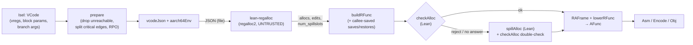

# Register allocation: regalloc2 + Lean checker (M6)

Modules: `FV/Backend/RegallocOps.lean` (operands, clobbers, machine environment, CFG
preparation), `FV/Backend/RegallocCheck.lean` (the checker), `FV/Backend/SpillAlloc.lean` (the
spill fallback, V4), `FV/Backend/Regalloc.lean`
(JSON glue, `RFunc` construction, frame, lowering to `AFunc`); oracle
`rust/crates/lean-regalloc`; tests `FVTest/Backend/Regalloc/Test.lean`
(`lake exe lean-backend-regalloc-test`); metrics `scripts/lean-backend-metrics.sh`.

## Status (2026-09-27)

- [x] `lean-regalloc`: regalloc2 **0.15.2, unchanged crate**, Cranelift 0.136.1's options
      (`Algorithm::Ion`, `validate_ssa`), regalloc2's own checker run as a cross-check;
      `cargo build -p lean-regalloc` warning-free
- [x] regalloc2 is the **default** allocator of `lean-backend`, `lean-backend-armrun`,
      `scripts/lean-backend-filetests.sh`, `scripts/lean-backend-encode-check.sh`
      (`--regalloc regalloc2|spill|stack|regalloc2-small`); the stack-slot allocator is kept as
      `--regalloc stack`; `--regalloc spill` forces the V4 fallback
- [x] every allocation is validated by the executable Lean checker `checkAlloc`; since V4
      (2026-10-05) a rejection (by it, or by regalloc2's checker), a failure of `lean-regalloc`
      or its absence is **no longer a compile error**: the function gets the spill allocation
      (`spillAlloc`, section "Fallback" below); `--regalloc spill` forces it for every function
- [x] results (a)–(g) below
- [x] soundness proof of `checkAlloc` for the abstract semantics (`checkAlloc_sound`,
      `docs/contracts/regalloc-proof.md`); operand-view and frame-lowering obligations proven for
      a representative set, the rest listed there

## Design



The allocator runs once per `.clif` file (one process, all functions). The binary is
`$LEAN_REGALLOC` or `rust/target/release/lean-regalloc`; `$LEAN_REGALLOC_KEEP=<path>`
keeps a copy of the input JSON.

### Operands and constraints (Cranelift `aarch64_get_operands`)

`MInst.visitOperands` visits the register occurrences of each instruction in the order of
`isa/aarch64/inst/mod.rs` `aarch64_get_operands`; the same traversal collects operands
(`MInst.operands`) and substitutes allocations (`MInst.assign`), so they cannot disagree.
Mapping of Cranelift's `OperandVisitor` calls (`machinst/reg.rs`):

| Cranelift | Operand (kind / position / constraint) | Used by |
| --- | --- | --- |
| `reg_use` | use / early / reg | ALU sources, store data, addressing-mode registers, `cbz`/`tbz` register, `ccmp`, `CallInd` target, `JTSequence` index |
| `reg_def` | def / late / reg | ALU/load/`mov`/`cset`/… destinations |
| `reg_early_def` | def / early / reg | `JTSequence` temporaries `t1`, `t2` |
| `reg_reuse_def(rd, 0)` | def / late / reuse 0 | `movk` (`rd` tied to `rn`) |
| `reg_fixed_use(v, p)` | use / early / fixed p | call arguments, `Rets` |
| `reg_fixed_def(v, p)` | def / late / fixed p | call results, `Args` |
| `reg_fixed_nonallocatable` | (no operand) | real registers in operand position; must not be allocatable |

Clobbers (`MInst.clobbers`): a call clobbers `DEFAULT_AAPCS_CLOBBERS` (x0–x17, v0–v31) minus
its result registers (`gen_call_info`). Terminators: `is_ret` = `Rets` or a block-ending `Udf`;
`is_branch` = `Jump`, `CondBr`, `TestBitAndBranch`, `JTSequence`. Block parameters and
branch arguments are regalloc2 block params / branch args (Cranelift's shape: one argument
list per block, the same for every successor; conditional branches with arguments get edge
blocks from `Isel`, so a branch with ≥2 successors carries no arguments after `prepare`).

### MachineEnv (`aarch64Env` = `create_reg_env(enable_pinned_reg = false)`)

| Class | Preferred | Non-preferred |
| --- | --- | --- |
| int | x0–x15 | x19, x20, x22–x28, x21 |
| float | v0–v7, v16–v31 | v8–v15 |
| vector | — | — |

No scratch registers, no fixed stack slots. Never allocatable: x16/x17 (spill/address
temporaries of the emitted code), x18 (platform), x29 (fp), x30 (lr), sp/xzr.
`smallEnv` (`--regalloc regalloc2-small`, stress only): x0–x7, x19, x20, v0–v3, v8 — a subset,
so the checker's allocatable set stays `aarch64Env`'s.

### JSON schema (`lean-regalloc IN.json [OUT.json]`)

Input:

```
{ "env": { "preferred":     [[int pregs], [float pregs], []],
           "non_preferred": [[...], [...], []],
           "scratch": [null, null, null], "fixed_stack": [] },
  "functions": [ {
    "name": str, "entry": 0,
    "vregs": "iif…",                     // class of vreg n = n-th char (i int, f float)
    "blocks": [ { "insts": [start, end), "succs": [blk], "preds": [blk], "params": [vreg] } ],
    "insts":  [ { "ops": [ { "v": vreg, "k": "use"|"def", "p": "early"|"late",
                             "c": "any"|"reg"|"stack"|"fixed:x0"|"reuse:0" } ],
                  "clobbers": ["x0", …], "kind": "ret"|"branch"|"other",
                  "args": [[vreg…] per successor] } ]   // branches only
  } ] }
```

pregs are `"x<n>"` / `"v<n>"`. Output: `{ "functions": [ … ] }`, per function either
`{ "name", "ok": false, "error" }` or

```
{ "name", "ok": true, "num_spillslots": n,
  "allocs": [[ "x3" | "v8" | "s2" (spill slot) | "none" ] per inst, one per operand],
  "edits":  [ { "inst": i, "pos": "before"|"after", "from": loc, "to": loc } ],  // program order
  "checker": "ok" | "<regalloc2 checker errors>", "stats": "<debug>" }
```

Exit status 0 when output was written (per-function failures are inside), 1 on
unreadable/malformed input, 2 on bad usage.

### Allocated function (`RFunc`) and frame

`buildRFunc`: per block, each original instruction `op k allocs` preceded/followed by
regalloc2's edits at its program points (`move src dst`; `Loc` = `reg r`, `stack slot cls`,
`save r`); every callee-saved register (x19–x28, v8–v15) that appears in any location gets a
save `move (reg r) (save r)` at the entry and a restore before every `Rets`.

`RAFrame.compute` / `lowerRFunc` (frame grows down, `sp` 16-aligned everywhere):

```
fp + 16 + off     incoming stack arguments
fp + 8, fp        saved lr, fp                                  <- x29
sp + fmoveTmp     16-byte temporary for float reg→reg moves (if any)
sp + saveBase     callee-save slots: float 16 bytes each, then int 8 bytes each
sp + floatBase    float spill slots, 16 bytes each (if any float value is spilled)
sp + intBase      int spill slots, 8 bytes each
sp + outgoing     explicit CLIF stack slots (Cranelift layout)
sp                outgoing stack arguments
```

Moves lower to `mov` (int reg→reg), `str`/`ldr` to/from frame slots, float reg→reg through
`fmoveTmp` (store+load). `Args` disappears; `Rets` becomes the epilogue. A leaf function with
an empty frame that never addresses `fp` has no prologue/epilogue (frameless). Only the low
64 bits of v8–v15 are callee-saved; the frame saves all 128.

## Fallback: the spill allocator (`spillAlloc`, V4)

`allocResult vcp ra` (`FV/Backend/Regalloc.lean`) is the allocation the backend lowers:
regalloc2's answer `ra` if `checkAlloc` accepts it and `lowerRFunc` lowers it, else
`spillAlloc vcp` (V5: a `lowerRFunc` rejection of regalloc2's allocation — e.g. its frame — is no
longer a compile error). The compiler's `lowerAlloc` (used by `allocateRegalloc2`) computes
`lowerRFunc vcp (allocResult vcp ra)` without lowering regalloc2's allocation twice
(`lowerAlloc_eq_lowerRFunc`). The spill allocation is lowered without a runtime `checkAlloc`
double-check (its acceptance is proven, `E2E.spillAccepted`; `lean-e2e-check` still decides
it). `lean-backend --regalloc spill` (and `scripts/lean-backend-filetests.sh --regalloc spill`)
uses the spill allocation for every function (`allocateSpill`).

`spillAlloc` is a total Lean function producing an ordinary `RFunc`, so the checker, its
soundness proof and the whole downstream proof apply unchanged:

- **homes**: every vreg (number, class) the prepared code mentions gets its own spill slot,
  numbered densely in order of first occurrence (`spillHomes`); the slots past them are the
  temporaries of block-argument copies;
- **callee-saved registers**: all 18 are saved at the entry (`reg r → save r`) and restored
  before every `Rets`;
- **one instruction** (`spillInst`, `spillLocs`): fixed operands in their register, reuse
  operands in the reused operand's register, every other operand in the next free register of
  its class (`spillPool`: x0–x15, x19–x28; v0–v31), avoiding the instruction's fixed registers
  and clobbers; a load from the home before the instruction for every use, a store to the home
  after it for every def the checker keeps (`keptDefs`); none after a terminator: a
  `try_call`'s results live on an edge are stored at the start of the successor
  (`spillEntryStores`, its only predecessor's edge block);
- **block arguments** (`spillArgMoves`): before a `jump` with arguments, every argument is copied
  (through x9/v16) into a temporary slot, then every temporary into the parameter's home (a
  parallel copy).

Proof status: `E2E.backend_correct_final_alloc` (`FV/E2E/AllocDirect.lean`) is the final
theorem for `rf := allocResult vcp ra`, for any answer `ra`, with no premise about `checkAlloc`;
its hypothesis `SpillAccepted` is proven (`E2E.spillAccepted`,
`E2E.backend_correct_final_alloc_proven`). `lowerRFunc` provably lowers the spill allocation of
every in-scope function (`E2E.lowerRFunc_spillAlloc`), so `lowerAlloc` succeeds for every answer
`ra` (`E2E.lowerAlloc_total`, `E2E.backend_correct_final_total`, V5). `lean-e2e-check` decides
`checkAlloc`'s acceptance on every in-scope function (**1149 of 1149 accepted**) and the lowering
("spill lowering" line: `lowerRFunc` lowers 1149 of 1149; a rejection contradicts
`E2E.lowerRFunc_spillAlloc` and fails the run). There is no frame-size limit (V5, 2026-10-05): a
slot at offset 32 KiB or more is addressed through x16 (`slotStoreAt`/`slotLoadAt`:
`movz`/`movk x16, #off`, `add x16, sp, x16, sxtx`, then `str`/`ldr` at `[x16]`; below 32 KiB the
single `[sp, #off]` access as before). x16 is in neither regalloc2's `MachineEnv` nor `spillPool`,
and outside the world of the proof (`Masked`), so a move may clobber it.
`corpus/clif-regress/large_frame.clif` (4500 values live at once) exercises it with both
allocators.

Filetests with the fallback forced (`scripts/lean-backend-filetests.sh --regalloc spill`): see
"Results" (g).

## Checker (`checkAlloc`, executable)

Forward symbolic dataflow after regalloc2's `src/checker.rs`. Abstract state: for each
location ℓ (allocatable register, spill slot × class, callee-save slot) a finite set `A ℓ` of
symbols — `vreg v` (current value of v) or `entry r` (value of callee-saved r at entry).
Order is inclusion, meet at joins is pointwise intersection; an unreached block is ⊤.

Transfer:

* `move src dst`: `A' = A[dst ↦ A src]`;
* `op k allocs` (operands `ops`, clobbers `C`), in order: (1) early uses `(v, ℓ)` require
  `vreg v ∈ A ℓ`; (2) early defs: remove `vreg v` everywhere, `A ℓ := {vreg v}`; (3) late
  uses require `vreg v ∈ A ℓ`; (4) each `c ∈ C`: `A c := A c ∩ {entry c}` (the callee
  preserves callee-saved entry values); (5) late defs as (2); (6) at `Rets`: every
  callee-saved r requires `entry r ∈ A (reg r)`;
* edge `b → s` with args `a⃗` for params `p⃗`: first the defs of `b`'s terminator dead on that
  edge leave every set (`CheckCtx.edgeForget`, `MInst.normalDead`: the exception payload defs of
  a `try_call`'s call past its `ti.rets` results, on the normal-return edge only; agent/trycall-contract),
  then `A' ℓ = (A ℓ \ {vreg p⃗}) ∪ {vreg pᵢ | vreg aᵢ ∈ A ℓ}`.

Entry state: `A (reg r) = {entry r}` for callee-saved r, all else ∅.

Static checks: each operand location is allocatable in `aarch64Env`, of the vreg's class,
spill slots `< num_spillslots`; the constraint holds (`reg`: a register; `stack`: not a
register; `fixed p`: exactly `reg p`; `reuse i`: operand i's register, operand i a use);
defs of one instruction have distinct locations; an early def is disjoint from every use and
clobber, a late def from every late use and clobber; late uses are not clobbered. Moves: at
least one side a register, same class, a save slot only with its own register, only for
saved callee-saved registers. Structure: same block count; each block contains its VCode
instructions in order, each exactly once, terminator last; entry block is no branch target
and has no params; every block is reached; save slots only for callee-saved registers.

Fixpoint: round-robin rounds, fuel `blocks × (locations × symbols + 1) + 1` (states only
shrink after first reach); fuel exhaustion is a rejection. The iteration is untrusted: its
result is checked by `CheckCtx.verify` (entry in-state ⊆ `entryState`; every block reached, its
items check from its in-state, every successor's in-state ⊆ the edge's state), which is all the
soundness proof uses. Block parameters must be pairwise distinct.

### Invariant and intended soundness theorem (M6 proof target)

Let `m` be the machine state of the lowered code (`m ℓ` for registers, spill and save
slots), `ρ` the VCode vreg environment of the source execution, `r₀` the register file at
function entry. Define `⟦vreg v⟧ = ρ v`, `⟦entry r⟧ = r₀ r` (low 64 bits for v8–v15).

**Invariant** `Inv A m ρ r₀ := ∀ ℓ s, s ∈ A ℓ → m ℓ = ⟦s⟧` at every item boundary of the
allocated function, with `A` the checker's fixpoint state there.

**Theorem (intended).** For every `vc : VCode` with `prepare`d CFG and `rf : RFunc`,
`checkAlloc vc rf = .ok ()` implies: for every initial state where argument registers hold
the `Args` values and callee-saved registers hold `r₀`, each execution of
`lowerRFunc vc rf` (under `Arm.run`) *simulates* the VCode execution of `vc` (with vregs
as an infinite register file and branch arguments as parallel copies): same sequence of
observable events (memory effects, calls with argument values, traps), same returned
values in x0.. on `Rets`, and at return `m (reg r) = r₀ r` for every callee-saved r and
`sp` restored. Proof shape: `Inv` holds at entry; each transfer preserves it given the
item's static checks (`move` by frame-slot disjointness, `op` by the use checks — the
instruction reads `ρ`'s values — plus the def/clobber disjointness; calls by AAPCS
callee-saved preservation of the callee); the meet preserves it at joins; the `Rets` check
gives callee-saved preservation. Assumptions: frame slots are disjoint from each other and
from CLIF stack slots / outgoing area (by `RAFrame.compute`), spill code does not touch
NZCV, x16/x17 are only emitter temporaries.

### Trusted pieces

Untrusted: regalloc2, `lean-regalloc`, the JSON serialisation and parsing (`vcodeJson`,
`parseRAOut`, `buildRFunc`) — anything they get wrong is either rejected by `checkAlloc` or
harmless. Trusted (until proven; see `regalloc-proof.md` for what is proven): the operand
view `MInst.visitOperands`/`clobbers` (must describe what the emitted instruction reads,
writes and clobbers), `prepare`, `RAFrame.compute`/`lowerRFunc` (move/frame lowering), and
the rest of the backend as in `docs/contracts/backend.md`. regalloc2's own checker is an
extra, not relied upon.

## Results (2026-09-27)

(a) `scripts/lean-backend-filetests.sh` (default `--regalloc regalloc2`; identical with
`--regalloc stack`):

| Set | regalloc2 | stack |
| --- | --- | --- |
| `corpus/clif` (42 files) | 114/114 pass, 114 agree, 0 disagree | 114/114, 0 disagree |
| `corpus/clif/extrt` + flat-runtime | 22/22, 0 disagree | 22/22, 0 disagree |
| runtests (395 files) | 2791 pass / 0 fail / 0 disagree (10935 unsupported, 7 harness errors identical to Cranelift) | same |

(b) `scripts/lean-backend-encode-check.sh` (regalloc2 output): 446 files, 884 functions
identical to `llvm-mc`, 0 differ; 25 921 words, 1 073 relocations compared.

(c)/(d) `lake exe lean-backend-regalloc-test` (corpus + extrt + runtests):

| Environment | Functions | Lean checker accepts | regalloc2 checker accepts | spills / reloads / moves | callee-saved save+restore |
| --- | --- | --- | --- | --- | --- |
| `aarch64Env` | 845 | 845 (100 %) | 845 | 180 / 611 / 1407 | 888 |
| `smallEnv` (`--small`) | 845 | 845 (100 %) | 845 | 915 / 1171 / 672 | 437 |

| Mutation | `aarch64Env` mutants / rejected | `smallEnv` |
| --- | --- | --- |
| swap registers | 2404 / 2404 | 2378 / 2378 |
| drop reload | 10 / 10 | 173 / 173 |
| drop callee-saved restore | 253 / 253 | 158 / 158 |
| clobber live reg across call | 166 / 166 | 88 / 88 |

(e) `lean-backend-armrun` (Arm model vs `Clif.run`, callee-saved and `sp` preservation
checked):

| Inputs | regalloc2 | stack |
| --- | --- | --- |
| `corpus/clif`: 25 functions | 73 runs agree, 0 disagree | 73 / 0 |
| runtests br_table, brif, popcnt, div-checks, extend, clz, ctz, umulhi, smulhi, fibonacci, const, shifts, rotl, icmp: 221 functions (16 not compiled, outside E) | 883 agree, 0 disagree | 883 / 0 |

(f) `scripts/lean-backend-metrics.sh`. Code size (bytes, all functions of each corpus file):

| file | functions | stack | regalloc2 | Cranelift | regalloc2 / Cranelift | stack / regalloc2 |
| --- | ---: | ---: | ---: | ---: | ---: | ---: |
| absDiff | 1 | 204 | 40 | 28 | 1.43 | 5.10 |
| addU8 | 1 | 188 | 56 | 44 | 1.27 | 3.36 |
| answer | 1 | 76 | 12 | 12 | 1.00 | 6.33 |
| arith8 | 1 | 684 | 200 | 140 | 1.43 | 3.42 |
| bits16 | 1 | 364 | 116 | 104 | 1.12 | 3.14 |
| bumpAll | 3 | 3552 | 988 | 648 | 1.52 | 3.60 |
| bumpCopy | 1 | 724 | 220 | 144 | 1.53 | 3.29 |
| bumpFirst | 3 | 8220 | 2116 | 1264 | 1.67 | 3.88 |
| casts | 1 | 124 | 24 | 20 | 1.20 | 5.17 |
| chacha20Block | 4 | 99856 | 24656 | 11940 | 2.06 | 4.05 |
| classify | 1 | 360 | 128 | 80 | 1.60 | 2.81 |
| countIn | 12 | 3104 | 1572 | 1084 | 1.45 | 1.97 |
| divMod | 1 | 352 | 104 | 80 | 1.30 | 3.38 |
| dot | 1 | 1324 | 356 | 192 | 1.85 | 3.72 |
| findIdx | 1 | 1432 | 380 | 228 | 1.67 | 3.77 |
| histogram | 12 | 4576 | 1944 | 1452 | 1.34 | 2.35 |
| incr | 1 | 188 | 60 | 44 | 1.36 | 3.13 |
| incrTwice | 2 | 428 | 148 | 124 | 1.19 | 2.89 |
| lookup | 12 | 3096 | 1488 | 1168 | 1.27 | 2.08 |
| macU16 | 1 | 376 | 100 | 76 | 1.32 | 3.76 |
| mapClone | 13 | 6116 | 3216 | 2168 | 1.48 | 1.90 |
| mapGrow | 12 | 3756 | 1604 | 1244 | 1.29 | 2.34 |
| markSeen | 12 | 3736 | 1936 | 1368 | 1.42 | 1.93 |
| max3 | 1 | 456 | 128 | 100 | 1.28 | 3.56 |
| meanSquare | 4 | 1624 | 604 | 408 | 1.48 | 2.69 |
| minMax | 1 | 1032 | 252 | 148 | 1.70 | 4.10 |
| nested | 1 | 1084 | 280 | 160 | 1.75 | 3.87 |
| passMap | 12 | 3824 | 1876 | 1308 | 1.43 | 2.04 |
| prefixSum | 1 | 1684 | 368 | 204 | 1.80 | 4.58 |
| reverse8 | 3 | 3444 | 1068 | 720 | 1.48 | 3.22 |
| safeDiv | 1 | 240 | 80 | 52 | 1.54 | 3.00 |
| signedMix | 1 | 2272 | 752 | 392 | 1.92 | 3.02 |
| square | 1 | 204 | 56 | 44 | 1.27 | 3.64 |
| squares | 2 | 1768 | 512 | 308 | 1.66 | 3.45 |
| sub3 | 1 | 280 | 72 | 56 | 1.29 | 3.89 |
| sumChecked | 1 | 800 | 208 | 124 | 1.68 | 3.85 |
| sumSquares | 2 | 1100 | 412 | 260 | 1.58 | 2.67 |
| swapAt | 1 | 1812 | 560 | 272 | 2.06 | 3.24 |
| tableSum | 1 | 864 | 196 | 120 | 1.63 | 4.41 |
| useCallee | 13 | 3276 | 1532 | 1184 | 1.29 | 2.14 |
| validate | 1 | 592 | 180 | 124 | 1.45 | 3.29 |
| runtime | 10 | 2284 | 1068 | 788 | 1.36 | 2.14 |
| **total** | 156 | **171476** | **51668** | **30424** | **1.70** | **3.32** |

Dynamic instruction counts (Arm model, summed over each function's run lines; loop-heavy
functions: dot, findIdx, minMax, prefixSum, sumChecked, tableSum, signedMix):

| function | runs | stack | regalloc2 | Cranelift | regalloc2 / Cranelift | stack / regalloc2 |
| --- | ---: | ---: | ---: | ---: | ---: | ---: |
| absDiff | 3 | 100 | 26 | 17 | 1.53 | 3.85 |
| addU8 | 3 | 106 | 34 | 25 | 1.36 | 3.12 |
| answer | 1 | 12 | 3 | 3 | 1.00 | 4.00 |
| arith8 | 5 | 518 | 169 | 121 | 1.40 | 3.07 |
| bits16 | 3 | 223 | 76 | 67 | 1.13 | 2.93 |
| bumpCopy | 2 | 207 | 74 | 47 | 1.57 | 2.80 |
| casts | 3 | 72 | 18 | 15 | 1.20 | 4.00 |
| classify | 4 | 189 | 71 | 35 | 2.03 | 2.66 |
| divMod | 3 | 156 | 49 | 36 | 1.36 | 3.18 |
| dot | 2 | 1103 | 366 | 173 | 2.12 | 3.01 |
| findIdx | 2 | 3541 | 1095 | 512 | 2.14 | 3.23 |
| incr | 2 | 73 | 25 | 17 | 1.47 | 2.92 |
| macU16 | 4 | 286 | 82 | 57 | 1.44 | 3.49 |
| max3 | 3 | 259 | 83 | 63 | 1.32 | 3.12 |
| minMax | 2 | 1360 | 400 | 192 | 2.08 | 3.40 |
| nested | 3 | 424 | 130 | 74 | 1.76 | 3.26 |
| prefixSum | 2 | 1981 | 540 | 251 | 2.15 | 3.67 |
| safeDiv | 2 | 65 | 23 | 14 | 1.64 | 2.83 |
| signedMix | 5 | 1968 | 778 | 393 | 1.98 | 2.53 |
| square | 3 | 118 | 36 | 27 | 1.33 | 3.28 |
| sub3 | 3 | 140 | 38 | 28 | 1.36 | 3.68 |
| sumChecked | 3 | 1552 | 502 | 256 | 1.96 | 3.09 |
| swapAt | 3 | 462 | 173 | 83 | 2.08 | 2.67 |
| tableSum | 2 | 2704 | 794 | 456 | 1.74 | 3.41 |
| validate | 5 | 311 | 106 | 70 | 1.51 | 2.93 |
| **total** | | **17930** | **5691** | **3032** | **1.88** | **3.15** |

Runtest Arm-model totals (the 14 files of (e)): stack 16 837, regalloc2 3 735 executed
instructions.

[INFERENCE] Much of the remaining gap to Cranelift is lowering rather than allocation: the
backend lowers top-down without sinking or dead-code skipping (2820 of 14 889 instructions
have only unused results), and float reg→reg moves go through memory.

(g) The spill fallback (V4, 2026-10-05). `scripts/lean-backend-filetests.sh --regalloc spill`
(every function allocated by `spillAlloc`): `corpus/clif` 114 pass / 0 fail (114 agree with
Cranelift-native), `corpus/clif/extrt` 22 / 0, runtests 4672 pass / 0 fail / 0 error (7
not-runnable, 9054 unsupported: the same counts as with regalloc2). `lean-e2e-check`:
`checkAlloc` accepts the spill allocation of 1148 / 1148 in-scope functions and `lowerRFunc`
lowers all of them (one home per vreg *number* instead of the dense numbering made
`Corpus__chacha20Block`'s allocator frame 37840 bytes, over the 32 KiB limit; dense: 2778 slots).
`lake exe lean-backend-regalloc-test`: each of the 3913 mutants `checkAlloc` rejects is lowered
through the spill allocation by `RAResult.finish` ("fallback" line). With `LEAN_REGALLOC`
pointing to a missing binary, `lean-backend` compiles every function with the fallback.

(h) Large frames (V5, 2026-10-05). `corpus/clif-regress/large_frame.clif` (4500 values live at
once, plus a `popcnt` for float-class vregs): allocator frame 35888 bytes with regalloc2, 216336
with the spill allocation (float slots beyond 64 KiB). Before V5 `lean-backend` rejected both
("allocator frame area of … bytes is too large"); now 4/4 runs pass and agree with
Cranelift-native with `--regalloc regalloc2` and `spill` (780 resp. 10259 x16 address
sequences). Filetests, both allocators: `corpus/clif` 114/114, extrt 22/22, runtests 4672 pass /
0 fail / 0 error. `lean-backend-encode-check.sh`: 1292 functions identical, 0 differ (with the new
forms of `large_frame`). `lean-e2e-check`: 1149 in scope; `lowerRFunc` lowers all 1149 spill
allocations.

## Gaps

- No proof yet (theorem above is the M6 target); `MInst.visitOperands`/`clobbers`,
  `prepare`, the frame layout and move lowering are trusted.
- The spill fallback saves all 18 callee-saved registers and keeps nothing in registers across
  instructions (code quality only matters when regalloc2 is rejected, unlowerable or absent).
- Float register-to-register moves go through a stack temporary (`fmoveTmp`: store + load)
  instead of a register move instruction.
- All 128 bits of v8–v15 are saved although only the low 64 must be.
- `Arm.run` samples exclude calls and memory accesses (qemu covers them).
